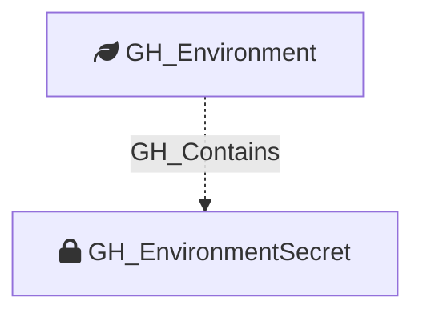

Represents an environment-level GitHub Actions secret. These secrets are scoped to a specific deployment environment and are only available to workflow jobs that reference that environment.

Created by: `Git-HoundEnvironment`

## Edges

<Note>
The tables below list edges defined by the GitHound extension only. Additional edges to or from this node may be created by other extensions.
</Note>

### Inbound Edges

| Edge Type | Source Node Types | Traversable |
| --------- | ----------------- | ----------- |
| [GH_Contains](https://github.com/SpecterOps/bloodhound-docs/blob/main//opengraph/extensions/github/edges/gh_contains) | [GH_Organization](https://github.com/SpecterOps/bloodhound-docs/blob/main//opengraph/extensions/github/nodes/gh_organization), [GH_Repository](https://github.com/SpecterOps/bloodhound-docs/blob/main//opengraph/extensions/github/nodes/gh_repository), [GH_Environment](https://github.com/SpecterOps/bloodhound-docs/blob/main//opengraph/extensions/github/nodes/gh_environment) | ❌ |
| [GH_HasSecret](https://github.com/SpecterOps/bloodhound-docs/blob/main//opengraph/extensions/github/edges/gh_hassecret) | [GH_Repository](https://github.com/SpecterOps/bloodhound-docs/blob/main//opengraph/extensions/github/nodes/gh_repository), [GH_Environment](https://github.com/SpecterOps/bloodhound-docs/blob/main//opengraph/extensions/github/nodes/gh_environment) | ✅ |

### Outbound Edges

No outbound edges are defined by the GitHound extension for this node.

## Properties

| Property Name               | Data Type | Description                                                                       |
| --------------------------- | --------- | --------------------------------------------------------------------------------- |
| objectid                    | string    | A deterministic ID in the format `GH_EnvironmentSecret_{envNodeId}_{secretName}`. |
| id                          | string    | Same as objectid.                                                                 |
| name                        | string    | The name of the secret.                                                           |
| environment_name            | string    | The name of the environment (GitHub organization)                                 |
| environmentid               | string    | The node_id of the environment (GitHub organization)                              |
| deployment_environment_name | string    | The name of the containing deployment environment.                                |
| deployment_environmentid    | string    | The node_id of the containing deployment environment.                             |
| created_at                  | datetime  | When the secret was created.                                                      |
| updated_at                  | datetime  | When the secret was last updated.                                                 |

## Diagram

