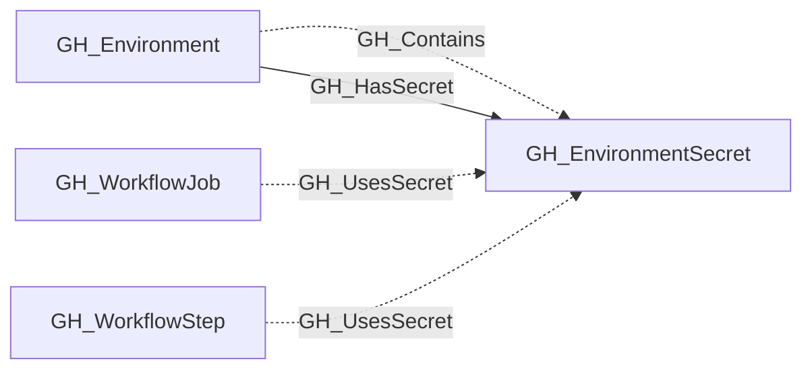
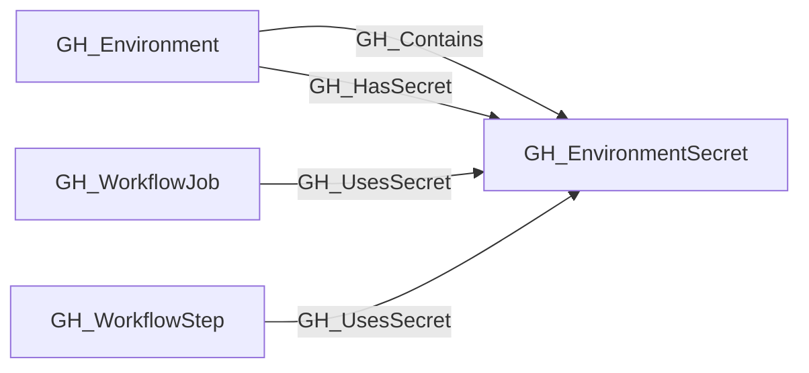

## General Information

Represents an environment-level GitHub Actions secret. These secrets are scoped to a specific deployment environment and are only available to workflow jobs that reference that environment.

The containing environment is linked to the secret with [GH_Contains](https://github.com/SpecterOps/bloodhound-docs/blob/main//opengraph/extensions/github/edges/gh_contains) and [GH_HasSecret](https://github.com/SpecterOps/bloodhound-docs/blob/main//opengraph/extensions/github/edges/gh_hassecret) edges. Workflow steps that reference the secret by name receive [GH_UsesSecret](https://github.com/SpecterOps/bloodhound-docs/blob/main//opengraph/extensions/github/edges/gh_usessecret) edges when their job targets the same environment.

## Properties

| Property | Type | Description |
| --- | --- | --- |
| `name` | `string` | The node name used for matching and display. |
| `displayname` | `string` | The human-readable display name. |
| `environmentid` | `string` | The identifier of the GitHub environment where this node was collected. |
| `last_seen` | `datetime` | The timestamp when this node was last observed during collection. |
| `node_id` | `string` | The stable identifier used as the OpenGraph node ID; this is the native GitHub node ID where available. |
| `deployment_environment_name` | `string` | The name of the containing deployment environment. |
| `deployment_environmentid` | `string` | The node_id of the containing deployment environment. |
| `repository_name` | `string` | The repository name property. |
| `repository_id` | `string` | The repository id property. |
| `environment_name` | `string` | The name of the environment (GitHub organization). |
| `created_at` | `string` | When the secret was created. |
| `updated_at` | `string` | When the secret was last updated. |

## Diagram

```mermaid
graph LR
    n0["GH_Environment"]
    n1["GH_EnvironmentSecret"]
    n2["GH_WorkflowJob"]
    n3["GH_WorkflowStep"]
    n0 -.->|GH_Contains| n1
    n0 -->|GH_HasSecret| n1
    n2 -.->|GH_UsesSecret| n1
    n3 -.->|GH_UsesSecret| n1
```

## Edges

<Note>
The tables below list edges defined by the GitHub extension only. Additional edges to or from this node may be created by other extensions.
</Note>

```mermaid
flowchart LR

    GH_Environment["GH_Environment"]
    GH_EnvironmentSecret["GH_EnvironmentSecret"]
    GH_WorkflowJob["GH_WorkflowJob"]
    GH_WorkflowStep["GH_WorkflowStep"]
    GH_Environment -- GH_Contains --> GH_EnvironmentSecret
    GH_Environment -- GH_HasSecret --> GH_EnvironmentSecret
    GH_WorkflowJob -- GH_UsesSecret --> GH_EnvironmentSecret
    GH_WorkflowStep -- GH_UsesSecret --> GH_EnvironmentSecret
```

### Inbound Edges

| Edge Type | Source Node Types | Traversable |
| --------- | ----------------- | ----------- |
| [GH_Contains](https://github.com/SpecterOps/bloodhound-docs/blob/main//opengraph/extensions/github/edges/gh_contains) | [GH_Environment](https://github.com/SpecterOps/bloodhound-docs/blob/main//opengraph/extensions/github/nodes/gh_environment) | ❌ |
| [GH_HasSecret](https://github.com/SpecterOps/bloodhound-docs/blob/main//opengraph/extensions/github/edges/gh_hassecret) | [GH_Environment](https://github.com/SpecterOps/bloodhound-docs/blob/main//opengraph/extensions/github/nodes/gh_environment) | ✅ |
| [GH_UsesSecret](https://github.com/SpecterOps/bloodhound-docs/blob/main//opengraph/extensions/github/edges/gh_usessecret) | [GH_WorkflowJob](https://github.com/SpecterOps/bloodhound-docs/blob/main//opengraph/extensions/github/nodes/gh_workflowjob), [GH_WorkflowStep](https://github.com/SpecterOps/bloodhound-docs/blob/main//opengraph/extensions/github/nodes/gh_workflowstep) | ❌ |

### Outbound Edges

No outbound edges are defined by the GitHub extension for this node.

## Properties

| Property | Type | Description |
| -------- | ---- | ----------- |
| `name` | `str` | - |
| `displayname` | `str` | - |
| `environmentid` | `str` | - |
| `last_seen` | `datetime` | - |
| `node_id` | `str` | - |
| `deployment_environment_name` | `str \| None` | The name of the containing deployment environment. |
| `deployment_environmentid` | `str \| None` | The node_id of the containing deployment environment. |
| `repository_name` | `str \| None` | The repository name property. |
| `repository_id` | `str \| None` | The repository id property. |
| `environment_name` | `str \| None` | The name of the environment (GitHub organization). |
| `created_at` | `str \| None` | When the secret was created. |
| `updated_at` | `str \| None` | When the secret was last updated. |
