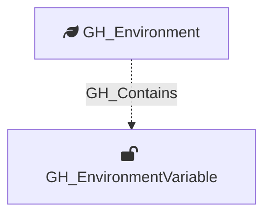

Represents an environment-level GitHub Actions variable. These variables are scoped to a specific deployment environment and are only available to workflow jobs that reference that environment. Unlike secrets, variable values are readable via the API.

Created by: `Git-HoundEnvironment`

## Edges

<Note>
The tables below list edges defined by the GitHound extension only. Additional edges to or from this node may be created by other extensions.
</Note>

### Inbound Edges

No inbound edges are defined by the GitHound extension for this node.

### Outbound Edges

No outbound edges are defined by the GitHound extension for this node.

## Properties

| Property Name               | Data Type | Description                                                                           |
| --------------------------- | --------- | ------------------------------------------------------------------------------------- |
| objectid                    | string    | A deterministic ID in the format `GH_EnvironmentVariable_{envNodeId}_{variableName}`. |
| id                          | string    | Same as objectid.                                                                     |
| name                        | string    | The name of the variable.                                                             |
| environment_name            | string    | The name of the environment (GitHub organization).                                    |
| environmentid               | string    | The node_id of the environment (GitHub organization).                                 |
| repository_name             | string    | The name of the containing repository.                                                |
| repository_id               | string    | The node_id of the containing repository.                                             |
| deployment_environment_name | string    | The name of the containing deployment environment.                                    |
| deployment_environmentid    | string    | The node_id of the containing deployment environment.                                 |
| value                       | string    | The plaintext value of the variable.                                                  |
| created_at                  | datetime  | When the variable was created.                                                        |
| updated_at                  | datetime  | When the variable was last updated.                                                   |

## Diagram

