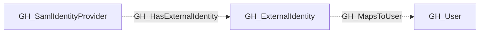
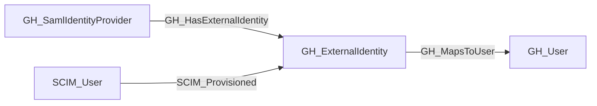

## General Information

Represents an external identity from a SAML or SCIM identity provider that is linked to a GitHub user. External identities map corporate user accounts (from providers like Okta, Azure AD, etc.) to GitHub user accounts, enabling single sign-on authentication. Each external identity can have both SAML and SCIM identity attributes.

## Properties

| Property | Type | Description |
| --- | --- | --- |
| `name` | `string` | The node name used for matching and display. |
| `displayname` | `string` | The human-readable display name. |
| `environmentid` | `string` | The identifier of the GitHub environment where this node was collected. |
| `last_seen` | `datetime` | The timestamp when this node was last observed during collection. |
| `node_id` | `string` | The stable identifier used as the OpenGraph node ID; this is the native GitHub node ID where available. |
| `guid` | `string` | The GUID of the external identity. |
| `saml_identity_username` | `string` | The username from the SAML identity. |
| `saml_identity_name_id` | `string` | The SAML NameID attribute. |
| `saml_identity_given_name` | `string` | The given name from the SAML identity. |
| `saml_identity_family_name` | `string` | The family name from the SAML identity. |
| `scim_identity_username` | `string` | The username from the SCIM identity. |
| `scim_identity_given_name` | `string` | The given name from the SCIM identity. |
| `scim_identity_family_name` | `string` | The family name from the SCIM identity. |
| `github_username` | `string` | The GitHub login of the linked user. |
| `github_user_id` | `string` | The GraphQL ID of the linked GitHub user. |
| `environment_name` | `string` | The name of the environment (GitHub organization or enterprise). |
| `query_mapped_users` | `string` | Query for mapped users. |

## Diagram

## Edges

<Note>
The tables below list edges defined by the GitHub extension only. Additional edges to or from this node may be created by other extensions.
</Note>

### Inbound Edges

| Edge Type | Source Node Types | Traversable |
| --------- | ----------------- | ----------- |
| [GH_HasExternalIdentity](https://github.com/SpecterOps/bloodhound-docs/blob/main//opengraph/extensions/github/edges/gh_hasexternalidentity) | [GH_SamlIdentityProvider](https://github.com/SpecterOps/bloodhound-docs/blob/main//opengraph/extensions/github/nodes/gh_samlidentityprovider) | ❌ |
| SCIM_Provisioned | SCIM_User | ❌ |

### Outbound Edges

| Edge Type | Destination Node Types | Traversable |
| --------- | ---------------------- | ----------- |
| [GH_MapsToUser](https://github.com/SpecterOps/bloodhound-docs/blob/main//opengraph/extensions/github/edges/gh_mapstouser) | [GH_User](https://github.com/SpecterOps/bloodhound-docs/blob/main//opengraph/extensions/github/nodes/gh_user) | ❌ |

## Properties

| Property | Type | Description |
| -------- | ---- | ----------- |
| `name` | `str` | - |
| `displayname` | `str` | - |
| `environmentid` | `str` | - |
| `last_seen` | `datetime` | - |
| `node_id` | `str` | - |
| `guid` | `str \| None` | The GUID of the external identity. |
| `saml_identity_username` | `str \| None` | The username from the SAML identity. |
| `saml_identity_name_id` | `str \| None` | The SAML NameID attribute. |
| `saml_identity_given_name` | `str \| None` | The given name from the SAML identity. |
| `saml_identity_family_name` | `str \| None` | The family name from the SAML identity. |
| `scim_identity_username` | `str \| None` | The username from the SCIM identity. |
| `scim_identity_given_name` | `str \| None` | The given name from the SCIM identity. |
| `scim_identity_family_name` | `str \| None` | The family name from the SCIM identity. |
| `github_username` | `str \| None` | The GitHub login of the linked user. |
| `github_user_id` | `str \| None` | The GraphQL ID of the linked GitHub user. |
| `environment_name` | `str \| None` | The name of the environment (GitHub organization or enterprise). |
| `query_mapped_users` | `str \| None` | Query for mapped users. |
