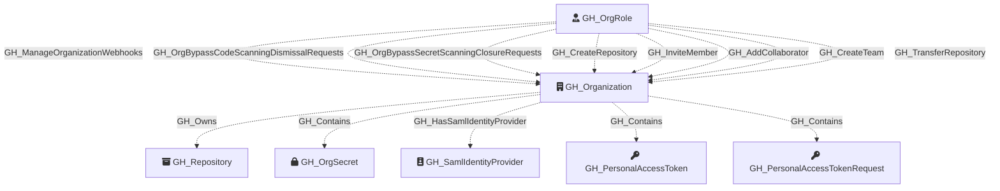

Represents a GitHub organization. This is the root node of the graph and serves as the primary container for all other nodes. Organization-level settings such as default repository permissions, Actions configuration, and security features are captured as properties on this node.

Created by: `Git-HoundOrganization`

## Edges

<Note>
The tables below list edges defined by the GitHound extension only. Additional edges to or from this node may be created by other extensions.
</Note>

### Inbound Edges

| Edge Type | Source Node Types | Traversable |
| --------- | ----------------- | ----------- |
| [GH_AddCollaborator](https://github.com/SpecterOps/bloodhound-docs/blob/main//opengraph/extensions/github/edges/gh_addcollaborator) | [GH_OrgRole](https://github.com/SpecterOps/bloodhound-docs/blob/main//opengraph/extensions/github/nodes/gh_orgrole) | ❌ |
| [GH_CreateRepository](https://github.com/SpecterOps/bloodhound-docs/blob/main//opengraph/extensions/github/edges/gh_createrepository) | [GH_OrgRole](https://github.com/SpecterOps/bloodhound-docs/blob/main//opengraph/extensions/github/nodes/gh_orgrole) | ❌ |
| [GH_CreateTeam](https://github.com/SpecterOps/bloodhound-docs/blob/main//opengraph/extensions/github/edges/gh_createteam) | [GH_OrgRole](https://github.com/SpecterOps/bloodhound-docs/blob/main//opengraph/extensions/github/nodes/gh_orgrole) | ❌ |
| [GH_InviteMember](https://github.com/SpecterOps/bloodhound-docs/blob/main//opengraph/extensions/github/edges/gh_invitemember) | [GH_OrgRole](https://github.com/SpecterOps/bloodhound-docs/blob/main//opengraph/extensions/github/nodes/gh_orgrole) | ❌ |
| [GH_ManageOrganizationWebhooks](https://github.com/SpecterOps/bloodhound-docs/blob/main//opengraph/extensions/github/edges/gh_manageorganizationwebhooks) | [GH_OrgRole](https://github.com/SpecterOps/bloodhound-docs/blob/main//opengraph/extensions/github/nodes/gh_orgrole) | ❌ |
| [GH_OrgBypassCodeScanningDismissalRequests](https://github.com/SpecterOps/bloodhound-docs/blob/main//opengraph/extensions/github/edges/gh_orgbypasscodescanningdismissalrequests) | [GH_OrgRole](https://github.com/SpecterOps/bloodhound-docs/blob/main//opengraph/extensions/github/nodes/gh_orgrole) | ❌ |
| [GH_OrgBypassSecretScanningClosureRequests](https://github.com/SpecterOps/bloodhound-docs/blob/main//opengraph/extensions/github/edges/gh_orgbypasssecretscanningclosurerequests) | [GH_OrgRole](https://github.com/SpecterOps/bloodhound-docs/blob/main//opengraph/extensions/github/nodes/gh_orgrole) | ❌ |
| [GH_OrgReviewAndManageSecretScanningBypassRequests](https://github.com/SpecterOps/bloodhound-docs/blob/main//opengraph/extensions/github/edges/gh_orgreviewandmanagesecretscanningbypassrequests) | [GH_OrgRole](https://github.com/SpecterOps/bloodhound-docs/blob/main//opengraph/extensions/github/nodes/gh_orgrole) | ❌ |
| [GH_OrgReviewAndManageSecretScanningClosureRequests](https://github.com/SpecterOps/bloodhound-docs/blob/main//opengraph/extensions/github/edges/gh_orgreviewandmanagesecretscanningclosurerequests) | [GH_OrgRole](https://github.com/SpecterOps/bloodhound-docs/blob/main//opengraph/extensions/github/nodes/gh_orgrole) | ❌ |
| [GH_ReadOrganizationActionsUsageMetrics](https://github.com/SpecterOps/bloodhound-docs/blob/main//opengraph/extensions/github/edges/gh_readorganizationactionsusagemetrics) | [GH_OrgRole](https://github.com/SpecterOps/bloodhound-docs/blob/main//opengraph/extensions/github/nodes/gh_orgrole) | ❌ |
| [GH_ReadOrganizationCustomOrgRole](https://github.com/SpecterOps/bloodhound-docs/blob/main//opengraph/extensions/github/edges/gh_readorganizationcustomorgrole) | [GH_OrgRole](https://github.com/SpecterOps/bloodhound-docs/blob/main//opengraph/extensions/github/nodes/gh_orgrole) | ❌ |
| [GH_ReadOrganizationCustomRepoRole](https://github.com/SpecterOps/bloodhound-docs/blob/main//opengraph/extensions/github/edges/gh_readorganizationcustomreporole) | [GH_OrgRole](https://github.com/SpecterOps/bloodhound-docs/blob/main//opengraph/extensions/github/nodes/gh_orgrole) | ❌ |
| [GH_ResolveSecretScanningAlerts](https://github.com/SpecterOps/bloodhound-docs/blob/main//opengraph/extensions/github/edges/gh_resolvesecretscanningalerts) | [GH_OrgRole](https://github.com/SpecterOps/bloodhound-docs/blob/main//opengraph/extensions/github/nodes/gh_orgrole) | ❌ |
| [GH_TransferRepository](https://github.com/SpecterOps/bloodhound-docs/blob/main//opengraph/extensions/github/edges/gh_transferrepository) | [GH_OrgRole](https://github.com/SpecterOps/bloodhound-docs/blob/main//opengraph/extensions/github/nodes/gh_orgrole) | ❌ |
| [GH_ViewSecretScanningAlerts](https://github.com/SpecterOps/bloodhound-docs/blob/main//opengraph/extensions/github/edges/gh_viewsecretscanningalerts) | [GH_OrgRole](https://github.com/SpecterOps/bloodhound-docs/blob/main//opengraph/extensions/github/nodes/gh_orgrole), [GH_RepoRole](https://github.com/SpecterOps/bloodhound-docs/blob/main//opengraph/extensions/github/nodes/gh_reporole) | ❌ |
| [GH_WriteOrganizationActionsSecrets](https://github.com/SpecterOps/bloodhound-docs/blob/main//opengraph/extensions/github/edges/gh_writeorganizationactionssecrets) | [GH_OrgRole](https://github.com/SpecterOps/bloodhound-docs/blob/main//opengraph/extensions/github/nodes/gh_orgrole) | ❌ |
| [GH_WriteOrganizationActionsSettings](https://github.com/SpecterOps/bloodhound-docs/blob/main//opengraph/extensions/github/edges/gh_writeorganizationactionssettings) | [GH_OrgRole](https://github.com/SpecterOps/bloodhound-docs/blob/main//opengraph/extensions/github/nodes/gh_orgrole) | ❌ |
| [GH_WriteOrganizationActionsVariables](https://github.com/SpecterOps/bloodhound-docs/blob/main//opengraph/extensions/github/edges/gh_writeorganizationactionsvariables) | [GH_OrgRole](https://github.com/SpecterOps/bloodhound-docs/blob/main//opengraph/extensions/github/nodes/gh_orgrole) | ❌ |
| [GH_WriteOrganizationCustomOrgRole](https://github.com/SpecterOps/bloodhound-docs/blob/main//opengraph/extensions/github/edges/gh_writeorganizationcustomorgrole) | [GH_OrgRole](https://github.com/SpecterOps/bloodhound-docs/blob/main//opengraph/extensions/github/nodes/gh_orgrole) | ✅ |
| [GH_WriteOrganizationCustomRepoRole](https://github.com/SpecterOps/bloodhound-docs/blob/main//opengraph/extensions/github/edges/gh_writeorganizationcustomreporole) | [GH_OrgRole](https://github.com/SpecterOps/bloodhound-docs/blob/main//opengraph/extensions/github/nodes/gh_orgrole) | ❌ |
| [GH_WriteOrganizationNetworkConfigurations](https://github.com/SpecterOps/bloodhound-docs/blob/main//opengraph/extensions/github/edges/gh_writeorganizationnetworkconfigurations) | [GH_OrgRole](https://github.com/SpecterOps/bloodhound-docs/blob/main//opengraph/extensions/github/nodes/gh_orgrole) | ❌ |

### Outbound Edges

| Edge Type | Destination Node Types | Traversable |
| --------- | ---------------------- | ----------- |
| [GH_Contains](https://github.com/SpecterOps/bloodhound-docs/blob/main//opengraph/extensions/github/edges/gh_contains) | [GH_User](https://github.com/SpecterOps/bloodhound-docs/blob/main//opengraph/extensions/github/nodes/gh_user), [GH_Team](https://github.com/SpecterOps/bloodhound-docs/blob/main//opengraph/extensions/github/nodes/gh_team), [GH_Repository](https://github.com/SpecterOps/bloodhound-docs/blob/main//opengraph/extensions/github/nodes/gh_repository), [GH_OrgRole](https://github.com/SpecterOps/bloodhound-docs/blob/main//opengraph/extensions/github/nodes/gh_orgrole), [GH_RepoRole](https://github.com/SpecterOps/bloodhound-docs/blob/main//opengraph/extensions/github/nodes/gh_reporole), [GH_TeamRole](https://github.com/SpecterOps/bloodhound-docs/blob/main//opengraph/extensions/github/nodes/gh_teamrole), [GH_OrgSecret](https://github.com/SpecterOps/bloodhound-docs/blob/main//opengraph/extensions/github/nodes/gh_orgsecret), [GH_AppInstallation](https://github.com/SpecterOps/bloodhound-docs/blob/main//opengraph/extensions/github/nodes/gh_appinstallation), [GH_PersonalAccessToken](https://github.com/SpecterOps/bloodhound-docs/blob/main//opengraph/extensions/github/nodes/gh_personalaccesstoken), [GH_PersonalAccessTokenRequest](https://github.com/SpecterOps/bloodhound-docs/blob/main//opengraph/extensions/github/nodes/gh_personalaccesstokenrequest), [GH_RepoSecret](https://github.com/SpecterOps/bloodhound-docs/blob/main//opengraph/extensions/github/nodes/gh_reposecret), [GH_EnvironmentSecret](https://github.com/SpecterOps/bloodhound-docs/blob/main//opengraph/extensions/github/nodes/gh_environmentsecret), [GH_SecretScanningAlert](https://github.com/SpecterOps/bloodhound-docs/blob/main//opengraph/extensions/github/nodes/gh_secretscanningalert) | ❌ |
| [GH_HasSamlIdentityProvider](https://github.com/SpecterOps/bloodhound-docs/blob/main//opengraph/extensions/github/edges/gh_hassamlidentityprovider) | [GH_SamlIdentityProvider](https://github.com/SpecterOps/bloodhound-docs/blob/main//opengraph/extensions/github/nodes/gh_samlidentityprovider) | ❌ |
| [GH_Owns](https://github.com/SpecterOps/bloodhound-docs/blob/main//opengraph/extensions/github/edges/gh_owns) | [GH_Repository](https://github.com/SpecterOps/bloodhound-docs/blob/main//opengraph/extensions/github/nodes/gh_repository) | ✅ |

## Properties

| Property Name                                                | Data Type | Description                                                                                                                                                                                   |
| ------------------------------------------------------------ | --------- | --------------------------------------------------------------------------------------------------------------------------------------------------------------------------------------------- |
| objectid                                                     | string    | The GitHub `node_id` of the organization, used as the unique graph identifier.                                                                                                                |
| id                                                           | integer   | The numeric GitHub ID of the organization.                                                                                                                                                    |
| name                                                         | string    | The organization's login handle, used as the display name.                                                                                                                                    |
| login                                                        | string    | The organization's login handle (URL slug).                                                                                                                                                   |
| node_id                                                      | string    | The GitHub GraphQL node ID. Redundant with objectid.                                                                                                                                          |
| description                                                  | string    | The organization's description.                                                                                                                                                               |
| org_name                                                     | string    | The organization's display name (from the `name` field in the GitHub API).                                                                                                                    |
| company                                                      | string    | The company associated with the organization.                                                                                                                                                 |
| blog                                                         | string    | The organization's blog URL.                                                                                                                                                                  |
| location                                                     | string    | The organization's location.                                                                                                                                                                  |
| email                                                        | string    | The organization's public email address.                                                                                                                                                      |
| is_verified                                                  | boolean   | Whether the organization's domain is verified by GitHub.                                                                                                                                      |
| has_organization_projects                                    | boolean   | Whether the organization has projects enabled.                                                                                                                                                |
| has_repository_projects                                      | boolean   | Whether repository projects are enabled.                                                                                                                                                      |
| public_repos                                                 | integer   | Number of public repositories in the organization.                                                                                                                                            |
| public_gists                                                 | integer   | Number of public gists.                                                                                                                                                                       |
| followers                                                    | integer   | Number of followers the organization has.                                                                                                                                                     |
| following                                                    | integer   | Number of accounts the organization is following.                                                                                                                                             |
| html_url                                                     | string    | URL to the organization's GitHub profile page.                                                                                                                                                |
| created_at                                                   | datetime  | When the organization was created.                                                                                                                                                            |
| updated_at                                                   | datetime  | When the organization was last updated.                                                                                                                                                       |
| type                                                         | string    | The account type (e.g., `Organization`).                                                                                                                                                      |
| total_private_repos                                          | integer   | Total number of private repositories.                                                                                                                                                         |
| owned_private_repos                                          | integer   | Number of private repositories owned directly by the organization.                                                                                                                            |
| private_gists                                                | integer   | Number of private gists.                                                                                                                                                                      |
| collaborators                                                | integer   | Number of outside collaborators across the organization.                                                                                                                                      |
| default_repository_permission                                | string    | Default permission level granted to members on all repositories (e.g., `read`, `write`, `admin`, `none`). Used to associate the Members org role with the appropriate `all_repo_*` role node. |
| members_can_create_repositories                              | boolean   | Whether members can create repositories.                                                                                                                                                      |
| two_factor_requirement_enabled                               | boolean   | Whether two-factor authentication is required for all members.                                                                                                                                |
| members_can_create_public_repositories                       | boolean   | Whether members can create public repositories.                                                                                                                                               |
| members_can_create_private_repositories                      | boolean   | Whether members can create private repositories.                                                                                                                                              |
| members_can_create_internal_repositories                     | boolean   | Whether members can create internal repositories.                                                                                                                                             |
| members_can_create_pages                                     | boolean   | Whether members can create GitHub Pages sites.                                                                                                                                                |
| members_can_fork_private_repositories                        | boolean   | Whether members can fork private repositories.                                                                                                                                                |
| web_commit_signoff_required                                  | boolean   | Whether web-based commits require sign-off.                                                                                                                                                   |
| deploy_keys_enabled_for_repositories                         | string    | Which repositories allow deploy keys.                                                                                                                                                         |
| members_can_delete_repositories                              | boolean   | Whether members can delete repositories.                                                                                                                                                      |
| members_can_change_repo_visibility                           | boolean   | Whether members can change repository visibility.                                                                                                                                             |
| members_can_invite_outside_collaborators                     | boolean   | Whether members can invite outside collaborators.                                                                                                                                             |
| members_can_delete_issues                                    | boolean   | Whether members can delete issues.                                                                                                                                                            |
| display_commenter_full_name_setting_enabled                  | boolean   | Whether commenter full names are displayed.                                                                                                                                                   |
| readers_can_create_discussions                               | boolean   | Whether readers can create discussions.                                                                                                                                                       |
| members_can_create_teams                                     | boolean   | Whether members can create teams.                                                                                                                                                             |
| members_can_view_dependency_insights                         | boolean   | Whether members can view dependency insights.                                                                                                                                                 |
| default_repository_branch                                    | string    | The default branch name for new repositories.                                                                                                                                                 |
| members_can_create_public_pages                              | boolean   | Whether members can create public GitHub Pages sites.                                                                                                                                         |
| members_can_create_private_pages                             | boolean   | Whether members can create private GitHub Pages sites.                                                                                                                                        |
| advanced_security_enabled_for_new_repositories               | boolean   | Whether GitHub Advanced Security is automatically enabled for new repositories.                                                                                                               |
| dependabot_alerts_enabled_for_new_repositories               | boolean   | Whether Dependabot alerts are enabled for new repositories.                                                                                                                                   |
| dependabot_security_updates_enabled_for_new_repositories     | boolean   | Whether Dependabot security updates are enabled for new repositories.                                                                                                                         |
| dependency_graph_enabled_for_new_repositories                | boolean   | Whether the dependency graph is enabled for new repositories.                                                                                                                                 |
| secret_scanning_enabled_for_new_repositories                 | boolean   | Whether secret scanning is enabled for new repositories.                                                                                                                                      |
| secret_scanning_push_protection_enabled_for_new_repositories | boolean   | Whether secret scanning push protection is enabled for new repositories.                                                                                                                      |
| secret_scanning_push_protection_custom_link_enabled          | boolean   | Whether a custom link is enabled for secret scanning push protection.                                                                                                                         |
| secret_scanning_push_protection_custom_link                  | boolean   | The custom link for secret scanning push protection.                                                                                                                                          |
| secret_scanning_validity_checks_enabled                      | boolean   | Whether secret scanning validity checks are enabled.                                                                                                                                          |
| actions_enabled_repositories                                 | string    | Which repositories have GitHub Actions enabled: `all`, `selected`, or `none`.                                                                                                                 |
| actions_allowed_actions                                      | string    | Which Actions are allowed to run: `all`, `local_only`, or `selected`.                                                                                                                         |
| actions_sha_pinning_required                                 | boolean   | Whether SHA pinning is required for GitHub Actions.                                                                                                                                           |

## Diagram

