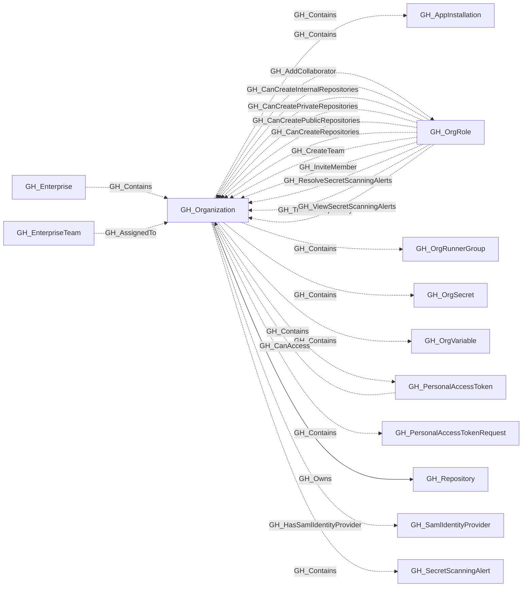
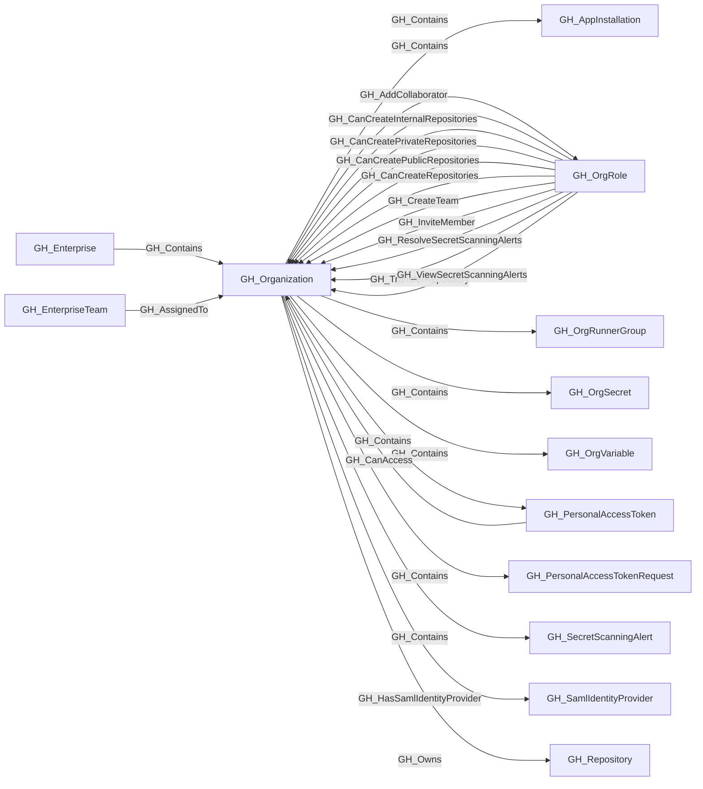

## General Information

Represents a GitHub organization. This is the root node of the graph and serves as the primary container for all other nodes. Organization-level settings such as default repository permissions, Actions configuration, and security features are captured as properties on this node.

## Properties

| Property | Type | Description |
| --- | --- | --- |
| `name` | `string` | The node name used for matching and display. |
| `displayname` | `string` | The human-readable display name. |
| `environmentid` | `string` | The identifier of the GitHub environment where this node was collected. |
| `last_seen` | `datetime` | The timestamp when this node was last observed during collection. |
| `node_id` | `string` | The stable identifier used as the OpenGraph node ID; this is the native GitHub node ID where available. |
| `login` | `string` | The organization's login handle (URL slug). |
| `org_name` | `string` | The organization's display name (from the `name` field in the GitHub API). |
| `description` | `string` | The organization's description. |
| `company` | `string` | The company associated with the organization. |
| `blog` | `string` | The organization's blog URL. |
| `location` | `string` | The organization's location. |
| `email` | `string` | The organization's public email address. |
| `is_verified` | `boolean` | Whether the organization's domain is verified by GitHub. |
| `has_organization_projects` | `boolean` | Whether the organization has projects enabled. |
| `has_repository_projects` | `boolean` | Whether repository projects are enabled. |
| `public_repos` | `integer` | Number of public repositories in the organization. |
| `public_gists` | `integer` | Number of public gists. |
| `followers` | `integer` | Number of followers the organization has. |
| `following` | `integer` | Number of accounts the organization is following. |
| `html_url` | `string` | URL to the organization's GitHub profile page. |
| `created_at` | `string` | When the organization was created. |
| `updated_at` | `string` | When the organization was last updated. |
| `type` | `string` | The account type (e.g., `Organization`). |
| `total_private_repos` | `integer` | Total number of private repositories. |
| `owned_private_repos` | `integer` | Number of private repositories owned directly by the organization. |
| `private_gists` | `integer` | Number of private gists. |
| `collaborators` | `integer` | Number of outside collaborators across the organization. |
| `environment_name` | `string` | The name of the environment (GitHub organization). |
| `default_repository_permission` | `string` | Default permission level granted to members on all repositories (e.g., `read`, `write`, `admin`, `none`). Used to associate the Members org role with the appropriate `all_repo_*` role node. |
| `members_can_create_repositories` | `boolean` | Whether members can create repositories. |
| `two_factor_requirement_enabled` | `boolean` | Whether two-factor authentication is required for all members. |
| `members_can_create_public_repositories` | `boolean` | Whether members can create public repositories. |
| `members_can_create_private_repositories` | `boolean` | Whether members can create private repositories. |
| `members_can_create_internal_repositories` | `boolean` | Whether members can create internal repositories. |
| `members_can_create_pages` | `boolean` | Whether members can create GitHub Pages sites. |
| `members_can_fork_private_repositories` | `boolean` | Whether members can fork private repositories. |
| `web_commit_signoff_required` | `boolean` | Whether web-based commits require sign-off. |
| `deploy_keys_enabled_for_repositories` | `boolean` | Which repositories allow deploy keys. |
| `members_can_delete_repositories` | `boolean` | Whether members can delete repositories. |
| `members_can_change_repo_visibility` | `boolean` | Whether members can change repository visibility. |
| `members_can_invite_outside_collaborators` | `boolean` | Whether members can invite outside collaborators. |
| `members_can_delete_issues` | `boolean` | Whether members can delete issues. |
| `display_commenter_full_name_setting_enabled` | `boolean` | Whether commenter full names are displayed. |
| `readers_can_create_discussions` | `boolean` | Whether readers can create discussions. |
| `members_can_create_teams` | `boolean` | Whether members can create teams. |
| `members_can_view_dependency_insights` | `boolean` | Whether members can view dependency insights. |
| `default_repository_branch` | `string` | The default branch name for new repositories. |
| `members_can_create_public_pages` | `boolean` | Whether members can create public GitHub Pages sites. |
| `members_can_create_private_pages` | `boolean` | Whether members can create private GitHub Pages sites. |
| `advanced_security_enabled_for_new_repositories` | `boolean` | Whether GitHub Advanced Security is automatically enabled for new repositories. |
| `dependabot_alerts_enabled_for_new_repositories` | `boolean` | Whether Dependabot alerts are enabled for new repositories. |
| `dependabot_security_updates_enabled_for_new_repositories` | `boolean` | Whether Dependabot security updates are enabled for new repositories. |
| `dependency_graph_enabled_for_new_repositories` | `boolean` | Whether the dependency graph is enabled for new repositories. |
| `secret_scanning_enabled_for_new_repositories` | `boolean` | Whether secret scanning is enabled for new repositories. |
| `secret_scanning_push_protection_enabled_for_new_repositories` | `boolean` | Whether secret scanning push protection is enabled for new repositories. |
| `secret_scanning_push_protection_custom_link_enabled` | `boolean` | Whether a custom link is enabled for secret scanning push protection. |
| `secret_scanning_push_protection_custom_link` | `string` | The custom link for secret scanning push protection. |
| `secret_scanning_validity_checks_enabled` | `boolean` | Whether secret scanning validity checks are enabled. |
| `actions_enabled_repositories` | `string` | Which repositories have GitHub Actions enabled: `all`, `selected`, or `none`. |
| `actions_allowed_actions` | `string` | Which Actions are allowed to run: `all`, `local_only`, or `selected`. |
| `actions_sha_pinning_required` | `boolean` | Whether SHA pinning is required for GitHub Actions. |
| `self_hosted_runners_enabled_repositories` | `string` | Which repositories may use self-hosted runners: `all`, `selected`, or `none`. |
| `default_workflow_permissions` | `string` | The default workflow permissions property. |
| `can_approve_pull_request_reviews` | `boolean` | The can approve pull request reviews property. |
| `query_organization_roles` | `string` | Query for organization roles. |
| `query_users` | `string` | Query for users. |
| `query_teams` | `string` | Query for teams. |
| `query_repositories` | `string` | Query for repositories. |
| `query_personal_access_tokens` | `string` | Query for personal access tokens. |
| `query_secret_scanning_alerts` | `string` | Query for secret scanning alerts. |
| `query_identity_provider` | `string` | Query for identity provider. |
| `query_app_installations` | `string` | Query for app installations. |
| `query_organization_secrets` | `string` | Query for organization secrets. |
| `collected` | `boolean` | The collected property. |

## Diagram

```mermaid
graph LR
    n0["GH_Enterprise"]
    n1["GH_Organization"]
    n2["GH_EnterpriseTeam"]
    n3["GH_OrgRole"]
    n4["GH_AppInstallation"]
    n5["GH_OrgRunnerGroup"]
    n6["GH_OrgSecret"]
    n7["GH_OrgVariable"]
    n8["GH_PersonalAccessToken"]
    n9["GH_PersonalAccessTokenRequest"]
    n10["GH_Repository"]
    n11["GH_SamlIdentityProvider"]
    n12["GH_SecretScanningAlert"]
    n0 -.->|GH_Contains| n1
    n2 -.->|GH_AssignedTo| n1
    n3 -.->|GH_AddCollaborator| n1
    n3 -.->|GH_CanCreateInternalRepositories| n1
    n3 -.->|GH_CanCreatePrivateRepositories| n1
    n3 -.->|GH_CanCreatePublicRepositories| n1
    n3 -.->|GH_CanCreateRepositories| n1
    n3 -.->|GH_CreateTeam| n1
    n3 -.->|GH_InviteMember| n1
    n3 -.->|GH_ResolveSecretScanningAlerts| n1
    n3 -.->|GH_TransferRepository| n1
    n3 -.->|GH_ViewSecretScanningAlerts| n1
    n1 -.->|GH_Contains| n4
    n1 -.->|GH_Contains| n3
    n1 -.->|GH_Contains| n5
    n1 -.->|GH_Contains| n6
    n1 -.->|GH_Contains| n7
    n1 -.->|GH_Contains| n8
    n1 -.->|GH_Contains| n9
    n1 -->|GH_Owns| n10
    n1 -.->|GH_HasSamlIdentityProvider| n11
    n1 -.->|GH_Contains| n12
    n8 -.->|GH_CanAccess| n1
```

## Edges

<Note>
The tables below list edges defined by the GitHub extension only. Additional edges to or from this node may be created by other extensions.
</Note>

```mermaid
flowchart LR

    GH_AppInstallation["GH_AppInstallation"]
    GH_Enterprise["GH_Enterprise"]
    GH_EnterpriseTeam["GH_EnterpriseTeam"]
    GH_Organization["GH_Organization"]
    GH_OrgRole["GH_OrgRole"]
    GH_OrgRunnerGroup["GH_OrgRunnerGroup"]
    GH_OrgSecret["GH_OrgSecret"]
    GH_OrgVariable["GH_OrgVariable"]
    GH_PersonalAccessToken["GH_PersonalAccessToken"]
    GH_PersonalAccessTokenRequest["GH_PersonalAccessTokenRequest"]
    GH_Repository["GH_Repository"]
    GH_SamlIdentityProvider["GH_SamlIdentityProvider"]
    GH_SecretScanningAlert["GH_SecretScanningAlert"]
    GH_Enterprise -- GH_Contains --> GH_Organization
    GH_EnterpriseTeam -- GH_AssignedTo --> GH_Organization
    GH_Organization -- GH_Contains --> GH_AppInstallation
    GH_Organization -- GH_Contains --> GH_OrgRole
    GH_Organization -- GH_Contains --> GH_OrgRunnerGroup
    GH_Organization -- GH_Contains --> GH_OrgSecret
    GH_Organization -- GH_Contains --> GH_OrgVariable
    GH_Organization -- GH_Contains --> GH_PersonalAccessToken
    GH_Organization -- GH_Contains --> GH_PersonalAccessTokenRequest
    GH_Organization -- GH_Contains --> GH_SecretScanningAlert
    GH_Organization -- GH_HasSamlIdentityProvider --> GH_SamlIdentityProvider
    GH_Organization -- GH_Owns --> GH_Repository
    GH_OrgRole -- GH_AddCollaborator --> GH_Organization
    GH_OrgRole -- GH_CanCreateInternalRepositories --> GH_Organization
    GH_OrgRole -- GH_CanCreatePrivateRepositories --> GH_Organization
    GH_OrgRole -- GH_CanCreatePublicRepositories --> GH_Organization
    GH_OrgRole -- GH_CanCreateRepositories --> GH_Organization
    GH_OrgRole -- GH_CreateTeam --> GH_Organization
    GH_OrgRole -- GH_InviteMember --> GH_Organization
    GH_OrgRole -- GH_ResolveSecretScanningAlerts --> GH_Organization
    GH_OrgRole -- GH_TransferRepository --> GH_Organization
    GH_OrgRole -- GH_ViewSecretScanningAlerts --> GH_Organization
    GH_PersonalAccessToken -- GH_CanAccess --> GH_Organization
```

### Inbound Edges

| Edge Type | Source Node Types | Traversable |
| --------- | ----------------- | ----------- |
| [GH_AddCollaborator](https://github.com/SpecterOps/bloodhound-docs/blob/main//opengraph/extensions/github/edges/gh_addcollaborator) | [GH_OrgRole](https://github.com/SpecterOps/bloodhound-docs/blob/main//opengraph/extensions/github/nodes/gh_orgrole) | ❌ |
| [GH_AssignedTo](https://github.com/SpecterOps/bloodhound-docs/blob/main//opengraph/extensions/github/edges/gh_assignedto) | [GH_EnterpriseTeam](https://github.com/SpecterOps/bloodhound-docs/blob/main//opengraph/extensions/github/nodes/gh_enterpriseteam) | ❌ |
| [GH_CanAccess](https://github.com/SpecterOps/bloodhound-docs/blob/main//opengraph/extensions/github/edges/gh_canaccess) | [GH_PersonalAccessToken](https://github.com/SpecterOps/bloodhound-docs/blob/main//opengraph/extensions/github/nodes/gh_personalaccesstoken) | ❌ |
| [GH_CanCreateInternalRepositories](https://github.com/SpecterOps/bloodhound-docs/blob/main//opengraph/extensions/github/edges/gh_cancreateinternalrepositories) | [GH_OrgRole](https://github.com/SpecterOps/bloodhound-docs/blob/main//opengraph/extensions/github/nodes/gh_orgrole) | ❌ |
| [GH_CanCreatePrivateRepositories](https://github.com/SpecterOps/bloodhound-docs/blob/main//opengraph/extensions/github/edges/gh_cancreateprivaterepositories) | [GH_OrgRole](https://github.com/SpecterOps/bloodhound-docs/blob/main//opengraph/extensions/github/nodes/gh_orgrole) | ❌ |
| [GH_CanCreatePublicRepositories](https://github.com/SpecterOps/bloodhound-docs/blob/main//opengraph/extensions/github/edges/gh_cancreatepublicrepositories) | [GH_OrgRole](https://github.com/SpecterOps/bloodhound-docs/blob/main//opengraph/extensions/github/nodes/gh_orgrole) | ❌ |
| [GH_CanCreateRepositories](https://github.com/SpecterOps/bloodhound-docs/blob/main//opengraph/extensions/github/edges/gh_cancreaterepositories) | [GH_OrgRole](https://github.com/SpecterOps/bloodhound-docs/blob/main//opengraph/extensions/github/nodes/gh_orgrole) | ❌ |
| [GH_Contains](https://github.com/SpecterOps/bloodhound-docs/blob/main//opengraph/extensions/github/edges/gh_contains) | [GH_Enterprise](https://github.com/SpecterOps/bloodhound-docs/blob/main//opengraph/extensions/github/nodes/gh_enterprise) | ❌ |
| [GH_CreateTeam](https://github.com/SpecterOps/bloodhound-docs/blob/main//opengraph/extensions/github/edges/gh_createteam) | [GH_OrgRole](https://github.com/SpecterOps/bloodhound-docs/blob/main//opengraph/extensions/github/nodes/gh_orgrole) | ❌ |
| [GH_InviteMember](https://github.com/SpecterOps/bloodhound-docs/blob/main//opengraph/extensions/github/edges/gh_invitemember) | [GH_OrgRole](https://github.com/SpecterOps/bloodhound-docs/blob/main//opengraph/extensions/github/nodes/gh_orgrole) | ❌ |
| [GH_ResolveSecretScanningAlerts](https://github.com/SpecterOps/bloodhound-docs/blob/main//opengraph/extensions/github/edges/gh_resolvesecretscanningalerts) | [GH_OrgRole](https://github.com/SpecterOps/bloodhound-docs/blob/main//opengraph/extensions/github/nodes/gh_orgrole) | ❌ |
| [GH_TransferRepository](https://github.com/SpecterOps/bloodhound-docs/blob/main//opengraph/extensions/github/edges/gh_transferrepository) | [GH_OrgRole](https://github.com/SpecterOps/bloodhound-docs/blob/main//opengraph/extensions/github/nodes/gh_orgrole) | ❌ |
| [GH_ViewSecretScanningAlerts](https://github.com/SpecterOps/bloodhound-docs/blob/main//opengraph/extensions/github/edges/gh_viewsecretscanningalerts) | [GH_OrgRole](https://github.com/SpecterOps/bloodhound-docs/blob/main//opengraph/extensions/github/nodes/gh_orgrole) | ❌ |

### Outbound Edges

| Edge Type | Destination Node Types | Traversable |
| --------- | ---------------------- | ----------- |
| [GH_Contains](https://github.com/SpecterOps/bloodhound-docs/blob/main//opengraph/extensions/github/edges/gh_contains) | [GH_AppInstallation](https://github.com/SpecterOps/bloodhound-docs/blob/main//opengraph/extensions/github/nodes/gh_appinstallation), [GH_OrgRole](https://github.com/SpecterOps/bloodhound-docs/blob/main//opengraph/extensions/github/nodes/gh_orgrole), [GH_OrgRunnerGroup](https://github.com/SpecterOps/bloodhound-docs/blob/main//opengraph/extensions/github/nodes/gh_orgrunnergroup), [GH_OrgSecret](https://github.com/SpecterOps/bloodhound-docs/blob/main//opengraph/extensions/github/nodes/gh_orgsecret), [GH_OrgVariable](https://github.com/SpecterOps/bloodhound-docs/blob/main//opengraph/extensions/github/nodes/gh_orgvariable), [GH_PersonalAccessToken](https://github.com/SpecterOps/bloodhound-docs/blob/main//opengraph/extensions/github/nodes/gh_personalaccesstoken), [GH_PersonalAccessTokenRequest](https://github.com/SpecterOps/bloodhound-docs/blob/main//opengraph/extensions/github/nodes/gh_personalaccesstokenrequest), [GH_SecretScanningAlert](https://github.com/SpecterOps/bloodhound-docs/blob/main//opengraph/extensions/github/nodes/gh_secretscanningalert) | ❌ |
| [GH_HasSamlIdentityProvider](https://github.com/SpecterOps/bloodhound-docs/blob/main//opengraph/extensions/github/edges/gh_hassamlidentityprovider) | [GH_SamlIdentityProvider](https://github.com/SpecterOps/bloodhound-docs/blob/main//opengraph/extensions/github/nodes/gh_samlidentityprovider) | ❌ |
| [GH_Owns](https://github.com/SpecterOps/bloodhound-docs/blob/main//opengraph/extensions/github/edges/gh_owns) | [GH_Repository](https://github.com/SpecterOps/bloodhound-docs/blob/main//opengraph/extensions/github/nodes/gh_repository) | ✅ |

## Properties

| Property | Type | Description |
| -------- | ---- | ----------- |
| `name` | `str` | - |
| `displayname` | `str` | - |
| `environmentid` | `str` | - |
| `last_seen` | `datetime` | - |
| `node_id` | `str` | - |
| `login` | `str \| None` | The organization's login handle (URL slug). |
| `org_name` | `str \| None` | The organization's display name (from the `name` field in the GitHub API). |
| `description` | `str \| None` | The organization's description. |
| `company` | `str \| None` | The company associated with the organization. |
| `blog` | `str \| None` | The organization's blog URL. |
| `location` | `str \| None` | The organization's location. |
| `email` | `str \| None` | The organization's public email address. |
| `is_verified` | `bool \| None` | Whether the organization's domain is verified by GitHub. |
| `has_organization_projects` | `bool \| None` | Whether the organization has projects enabled. |
| `has_repository_projects` | `bool \| None` | Whether repository projects are enabled. |
| `public_repos` | `int \| None` | Number of public repositories in the organization. |
| `public_gists` | `int \| None` | Number of public gists. |
| `followers` | `int \| None` | Number of followers the organization has. |
| `following` | `int \| None` | Number of accounts the organization is following. |
| `html_url` | `str \| None` | URL to the organization's GitHub profile page. |
| `created_at` | `str \| None` | When the organization was created. |
| `updated_at` | `str \| None` | When the organization was last updated. |
| `type` | `str \| None` | The account type (e.g., `Organization`). |
| `total_private_repos` | `int \| None` | Total number of private repositories. |
| `owned_private_repos` | `int \| None` | Number of private repositories owned directly by the organization. |
| `private_gists` | `int \| None` | Number of private gists. |
| `collaborators` | `int \| None` | Number of outside collaborators across the organization. |
| `environment_name` | `str \| None` | The name of the environment (GitHub organization). |
| `default_repository_permission` | `str \| None` | Default permission level granted to members on all repositories (e.g., `read`, `write`, `admin`, `none`). Used to associate the Members org role with the appropriate `all_repo_*` role node. |
| `members_can_create_repositories` | `bool \| None` | Whether members can create repositories. |
| `two_factor_requirement_enabled` | `bool \| None` | Whether two-factor authentication is required for all members. |
| `members_can_create_public_repositories` | `bool \| None` | Whether members can create public repositories. |
| `members_can_create_private_repositories` | `bool \| None` | Whether members can create private repositories. |
| `members_can_create_internal_repositories` | `bool \| None` | Whether members can create internal repositories. |
| `members_can_create_pages` | `bool \| None` | Whether members can create GitHub Pages sites. |
| `members_can_fork_private_repositories` | `bool \| None` | Whether members can fork private repositories. |
| `web_commit_signoff_required` | `bool \| None` | Whether web-based commits require sign-off. |
| `deploy_keys_enabled_for_repositories` | `bool \| None` | Which repositories allow deploy keys. |
| `members_can_delete_repositories` | `bool \| None` | Whether members can delete repositories. |
| `members_can_change_repo_visibility` | `bool \| None` | Whether members can change repository visibility. |
| `members_can_invite_outside_collaborators` | `bool \| None` | Whether members can invite outside collaborators. |
| `members_can_delete_issues` | `bool \| None` | Whether members can delete issues. |
| `display_commenter_full_name_setting_enabled` | `bool \| None` | Whether commenter full names are displayed. |
| `readers_can_create_discussions` | `bool \| None` | Whether readers can create discussions. |
| `members_can_create_teams` | `bool \| None` | Whether members can create teams. |
| `members_can_view_dependency_insights` | `bool \| None` | Whether members can view dependency insights. |
| `default_repository_branch` | `str \| None` | The default branch name for new repositories. |
| `members_can_create_public_pages` | `bool \| None` | Whether members can create public GitHub Pages sites. |
| `members_can_create_private_pages` | `bool \| None` | Whether members can create private GitHub Pages sites. |
| `advanced_security_enabled_for_new_repositories` | `bool \| None` | Whether GitHub Advanced Security is automatically enabled for new repositories. |
| `dependabot_alerts_enabled_for_new_repositories` | `bool \| None` | Whether Dependabot alerts are enabled for new repositories. |
| `dependabot_security_updates_enabled_for_new_repositories` | `bool \| None` | Whether Dependabot security updates are enabled for new repositories. |
| `dependency_graph_enabled_for_new_repositories` | `bool \| None` | Whether the dependency graph is enabled for new repositories. |
| `secret_scanning_enabled_for_new_repositories` | `bool \| None` | Whether secret scanning is enabled for new repositories. |
| `secret_scanning_push_protection_enabled_for_new_repositories` | `bool \| None` | Whether secret scanning push protection is enabled for new repositories. |
| `secret_scanning_push_protection_custom_link_enabled` | `bool \| None` | Whether a custom link is enabled for secret scanning push protection. |
| `secret_scanning_push_protection_custom_link` | `str \| None` | The custom link for secret scanning push protection. |
| `secret_scanning_validity_checks_enabled` | `bool \| None` | Whether secret scanning validity checks are enabled. |
| `actions_enabled_repositories` | `str \| None` | Which repositories have GitHub Actions enabled: `all`, `selected`, or `none`. |
| `actions_allowed_actions` | `str \| None` | Which Actions are allowed to run: `all`, `local_only`, or `selected`. |
| `actions_sha_pinning_required` | `bool \| None` | Whether SHA pinning is required for GitHub Actions. |
| `self_hosted_runners_enabled_repositories` | `str \| None` | Which repositories may use self-hosted runners: `all`, `selected`, or `none`. |
| `default_workflow_permissions` | `str \| None` | The default workflow permissions property. |
| `can_approve_pull_request_reviews` | `bool \| None` | The can approve pull request reviews property. |
| `query_organization_roles` | `str \| None` | Query for organization roles. |
| `query_users` | `str \| None` | Query for users. |
| `query_teams` | `str \| None` | Query for teams. |
| `query_repositories` | `str \| None` | Query for repositories. |
| `query_personal_access_tokens` | `str \| None` | Query for personal access tokens. |
| `query_secret_scanning_alerts` | `str \| None` | Query for secret scanning alerts. |
| `query_identity_provider` | `str \| None` | Query for identity provider. |
| `query_app_installations` | `str \| None` | Query for app installations. |
| `query_organization_secrets` | `str \| None` | Query for organization secrets. |
| `collected` | `bool` | The collected property. |
