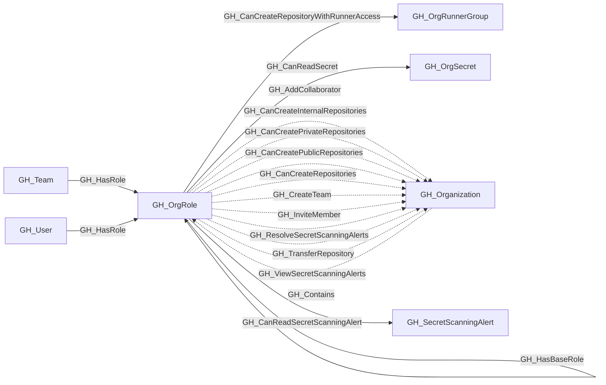
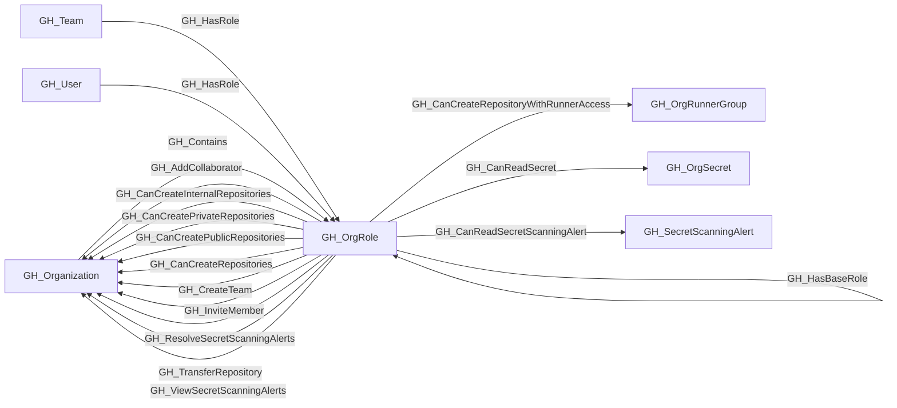

## General Information

Represents an organization-level role such as Owner, Member, or a custom organization role. Org roles define what permissions a user or team has at the organization level. The Owner and Member roles are default (built-in), while custom roles inherit from a base role and can have additional permissions.

## Properties

| Property | Type | Description |
| --- | --- | --- |
| `name` | `string` | The node name used for matching and display. |
| `displayname` | `string` | The human-readable display name. |
| `environmentid` | `string` | The identifier of the GitHub environment where this node was collected. |
| `last_seen` | `datetime` | The timestamp when this node was last observed during collection. |
| `node_id` | `string` | The stable identifier used as the OpenGraph node ID; this is the native GitHub node ID where available. |
| `short_name` | `string` | The short display name of the role (e.g., `Owners`, `Members`, or the custom role name). |
| `type` | `string` | `default` for built-in roles (Owner, Member) or `custom` for custom organization roles. |
| `environment_name` | `string` | The name of the environment (GitHub organization). |
| `query_explicit_members` | `string` | Query for explicit members. |
| `query_unrolled_members` | `string` | Query for unrolled members. |
| `query_org_permissions` | `string` | Query for org permissions. |
| `query_repo_permissions` | `string` | Query for repo permissions. |

## Diagram

```mermaid
graph LR
    n0["GH_OrgRole"]
    n1["GH_OrgRunnerGroup"]
    n2["GH_OrgSecret"]
    n3["GH_Organization"]
    n4["GH_SecretScanningAlert"]
    n5["GH_Team"]
    n6["GH_User"]
    n0 -->|GH_HasBaseRole| n0
    n0 -->|GH_CanCreateRepositoryWithRunnerAccess| n1
    n0 -->|GH_CanReadSecret| n2
    n0 -.->|GH_AddCollaborator| n3
    n0 -.->|GH_CanCreateInternalRepositories| n3
    n0 -.->|GH_CanCreatePrivateRepositories| n3
    n0 -.->|GH_CanCreatePublicRepositories| n3
    n0 -.->|GH_CanCreateRepositories| n3
    n0 -.->|GH_CreateTeam| n3
    n0 -.->|GH_InviteMember| n3
    n0 -.->|GH_ResolveSecretScanningAlerts| n3
    n0 -.->|GH_TransferRepository| n3
    n0 -.->|GH_ViewSecretScanningAlerts| n3
    n0 -->|GH_CanReadSecretScanningAlert| n4
    n3 -.->|GH_Contains| n0
    n5 -->|GH_HasRole| n0
    n6 -->|GH_HasRole| n0
```

## Edges

<Note>
The tables below list edges defined by the GitHub extension only. Additional edges to or from this node may be created by other extensions.
</Note>

```mermaid
flowchart LR

    GH_Organization["GH_Organization"]
    GH_OrgRole["GH_OrgRole"]
    GH_OrgRunnerGroup["GH_OrgRunnerGroup"]
    GH_OrgSecret["GH_OrgSecret"]
    GH_SecretScanningAlert["GH_SecretScanningAlert"]
    GH_Team["GH_Team"]
    GH_User["GH_User"]
    GH_Organization -- GH_Contains --> GH_OrgRole
    GH_OrgRole -- GH_AddCollaborator --> GH_Organization
    GH_OrgRole -- GH_CanCreateInternalRepositories --> GH_Organization
    GH_OrgRole -- GH_CanCreatePrivateRepositories --> GH_Organization
    GH_OrgRole -- GH_CanCreatePublicRepositories --> GH_Organization
    GH_OrgRole -- GH_CanCreateRepositories --> GH_Organization
    GH_OrgRole -- GH_CanCreateRepositoryWithRunnerAccess --> GH_OrgRunnerGroup
    GH_OrgRole -- GH_CanReadSecret --> GH_OrgSecret
    GH_OrgRole -- GH_CanReadSecretScanningAlert --> GH_SecretScanningAlert
    GH_OrgRole -- GH_CreateTeam --> GH_Organization
    GH_OrgRole -- GH_HasBaseRole --> GH_OrgRole
    GH_OrgRole -- GH_InviteMember --> GH_Organization
    GH_OrgRole -- GH_ResolveSecretScanningAlerts --> GH_Organization
    GH_OrgRole -- GH_TransferRepository --> GH_Organization
    GH_OrgRole -- GH_ViewSecretScanningAlerts --> GH_Organization
    GH_Team -- GH_HasRole --> GH_OrgRole
    GH_User -- GH_HasRole --> GH_OrgRole
```

### Inbound Edges

| Edge Type | Source Node Types | Traversable |
| --------- | ----------------- | ----------- |
| [GH_Contains](https://github.com/SpecterOps/bloodhound-docs/blob/main//opengraph/extensions/github/edges/gh_contains) | [GH_Organization](https://github.com/SpecterOps/bloodhound-docs/blob/main//opengraph/extensions/github/nodes/gh_organization) | ❌ |
| [GH_HasBaseRole](https://github.com/SpecterOps/bloodhound-docs/blob/main//opengraph/extensions/github/edges/gh_hasbaserole) | [GH_OrgRole](https://github.com/SpecterOps/bloodhound-docs/blob/main//opengraph/extensions/github/nodes/gh_orgrole) | ✅ |
| [GH_HasRole](https://github.com/SpecterOps/bloodhound-docs/blob/main//opengraph/extensions/github/edges/gh_hasrole) | [GH_Team](https://github.com/SpecterOps/bloodhound-docs/blob/main//opengraph/extensions/github/nodes/gh_team), [GH_User](https://github.com/SpecterOps/bloodhound-docs/blob/main//opengraph/extensions/github/nodes/gh_user) | ✅ |

### Outbound Edges

| Edge Type | Destination Node Types | Traversable |
| --------- | ---------------------- | ----------- |
| [GH_AddCollaborator](https://github.com/SpecterOps/bloodhound-docs/blob/main//opengraph/extensions/github/edges/gh_addcollaborator) | [GH_Organization](https://github.com/SpecterOps/bloodhound-docs/blob/main//opengraph/extensions/github/nodes/gh_organization) | ❌ |
| [GH_CanCreateInternalRepositories](https://github.com/SpecterOps/bloodhound-docs/blob/main//opengraph/extensions/github/edges/gh_cancreateinternalrepositories) | [GH_Organization](https://github.com/SpecterOps/bloodhound-docs/blob/main//opengraph/extensions/github/nodes/gh_organization) | ❌ |
| [GH_CanCreatePrivateRepositories](https://github.com/SpecterOps/bloodhound-docs/blob/main//opengraph/extensions/github/edges/gh_cancreateprivaterepositories) | [GH_Organization](https://github.com/SpecterOps/bloodhound-docs/blob/main//opengraph/extensions/github/nodes/gh_organization) | ❌ |
| [GH_CanCreatePublicRepositories](https://github.com/SpecterOps/bloodhound-docs/blob/main//opengraph/extensions/github/edges/gh_cancreatepublicrepositories) | [GH_Organization](https://github.com/SpecterOps/bloodhound-docs/blob/main//opengraph/extensions/github/nodes/gh_organization) | ❌ |
| [GH_CanCreateRepositories](https://github.com/SpecterOps/bloodhound-docs/blob/main//opengraph/extensions/github/edges/gh_cancreaterepositories) | [GH_Organization](https://github.com/SpecterOps/bloodhound-docs/blob/main//opengraph/extensions/github/nodes/gh_organization) | ❌ |
| [GH_CanCreateRepositoryWithRunnerAccess](https://github.com/SpecterOps/bloodhound-docs/blob/main//opengraph/extensions/github/edges/gh_cancreaterepositorywithrunneraccess) | [GH_OrgRunnerGroup](https://github.com/SpecterOps/bloodhound-docs/blob/main//opengraph/extensions/github/nodes/gh_orgrunnergroup) | ✅ |
| [GH_CanReadSecret](https://github.com/SpecterOps/bloodhound-docs/blob/main//opengraph/extensions/github/edges/gh_canreadsecret) | [GH_OrgSecret](https://github.com/SpecterOps/bloodhound-docs/blob/main//opengraph/extensions/github/nodes/gh_orgsecret) | ✅ |
| [GH_CanReadSecretScanningAlert](https://github.com/SpecterOps/bloodhound-docs/blob/main//opengraph/extensions/github/edges/gh_canreadsecretscanningalert) | [GH_SecretScanningAlert](https://github.com/SpecterOps/bloodhound-docs/blob/main//opengraph/extensions/github/nodes/gh_secretscanningalert) | ✅ |
| [GH_CreateTeam](https://github.com/SpecterOps/bloodhound-docs/blob/main//opengraph/extensions/github/edges/gh_createteam) | [GH_Organization](https://github.com/SpecterOps/bloodhound-docs/blob/main//opengraph/extensions/github/nodes/gh_organization) | ❌ |
| [GH_HasBaseRole](https://github.com/SpecterOps/bloodhound-docs/blob/main//opengraph/extensions/github/edges/gh_hasbaserole) | [GH_OrgRole](https://github.com/SpecterOps/bloodhound-docs/blob/main//opengraph/extensions/github/nodes/gh_orgrole) | ✅ |
| [GH_InviteMember](https://github.com/SpecterOps/bloodhound-docs/blob/main//opengraph/extensions/github/edges/gh_invitemember) | [GH_Organization](https://github.com/SpecterOps/bloodhound-docs/blob/main//opengraph/extensions/github/nodes/gh_organization) | ❌ |
| [GH_ResolveSecretScanningAlerts](https://github.com/SpecterOps/bloodhound-docs/blob/main//opengraph/extensions/github/edges/gh_resolvesecretscanningalerts) | [GH_Organization](https://github.com/SpecterOps/bloodhound-docs/blob/main//opengraph/extensions/github/nodes/gh_organization) | ❌ |
| [GH_TransferRepository](https://github.com/SpecterOps/bloodhound-docs/blob/main//opengraph/extensions/github/edges/gh_transferrepository) | [GH_Organization](https://github.com/SpecterOps/bloodhound-docs/blob/main//opengraph/extensions/github/nodes/gh_organization) | ❌ |
| [GH_ViewSecretScanningAlerts](https://github.com/SpecterOps/bloodhound-docs/blob/main//opengraph/extensions/github/edges/gh_viewsecretscanningalerts) | [GH_Organization](https://github.com/SpecterOps/bloodhound-docs/blob/main//opengraph/extensions/github/nodes/gh_organization) | ❌ |

## Properties

| Property | Type | Description |
| -------- | ---- | ----------- |
| `name` | `str` | - |
| `displayname` | `str` | - |
| `environmentid` | `str` | - |
| `last_seen` | `datetime` | - |
| `node_id` | `str` | - |
| `short_name` | `str` | The short display name of the role (e.g., `Owners`, `Members`, or the custom role name). |
| `type` | `str` | `default` for built-in roles (Owner, Member) or `custom` for custom organization roles. |
| `environment_name` | `str \| None` | The name of the environment (GitHub organization). |
| `query_explicit_members` | `str \| None` | Query for explicit members. |
| `query_unrolled_members` | `str \| None` | Query for unrolled members. |
| `query_org_permissions` | `str \| None` | Query for org permissions. |
| `query_repo_permissions` | `str \| None` | Query for repo permissions. |
