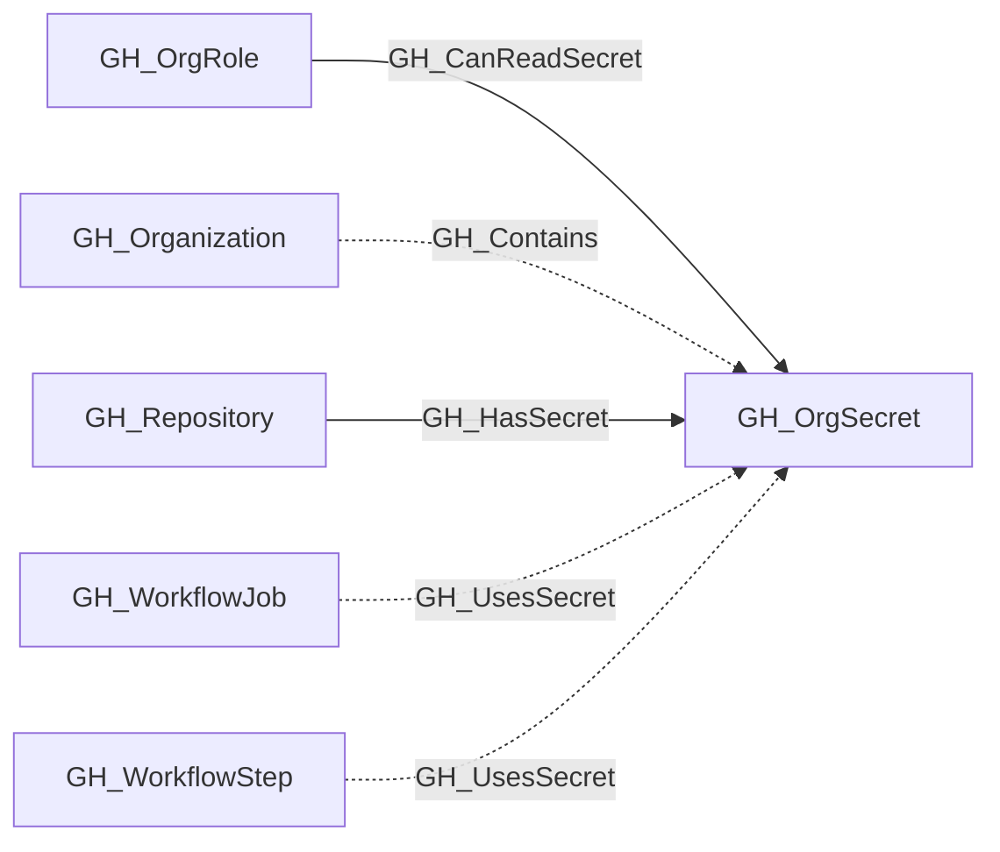
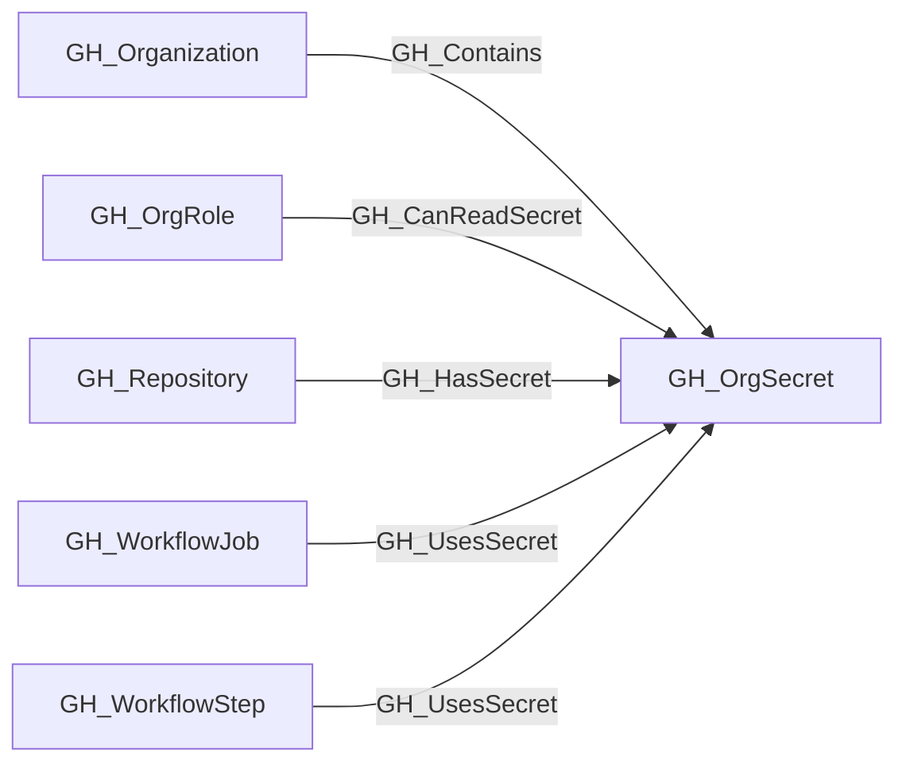

## General Information

Represents an organization-level GitHub Actions secret. Organization secrets can be scoped to all repositories, only private/internal repositories, or a specific set of selected repositories. The visibility property determines how [GH_HasSecret](https://github.com/SpecterOps/bloodhound-docs/blob/main//opengraph/extensions/github/edges/gh_hassecret) edges are resolved to repository nodes.

## Properties

| Property | Type | Description |
| --- | --- | --- |
| `name` | `string` | The node name used for matching and display. |
| `displayname` | `string` | The human-readable display name. |
| `environmentid` | `string` | The identifier of the GitHub environment where this node was collected. |
| `last_seen` | `datetime` | The timestamp when this node was last observed during collection. |
| `node_id` | `string` | The stable identifier used as the OpenGraph node ID; this is the native GitHub node ID where available. |
| `visibility` | `string` | The secret's visibility scope: `all` (all repos), `private` (private and internal repos), or `selected` (specific repos). |
| `environment_name` | `string` | The name of the environment (GitHub organization). |
| `created_at` | `string` | When the secret was created. |
| `updated_at` | `string` | When the secret was last updated. |
| `query_visible_repositories` | `string` | Query for visible repositories. |
| `selected_repositories_url` | `string` | The selected repositories url property. |

## Diagram

## Edges

<Note>
The tables below list edges defined by the GitHub extension only. Additional edges to or from this node may be created by other extensions.
</Note>

### Inbound Edges

| Edge Type | Source Node Types | Traversable |
| --------- | ----------------- | ----------- |
| [GH_CanReadSecret](https://github.com/SpecterOps/bloodhound-docs/blob/main//opengraph/extensions/github/edges/gh_canreadsecret) | [GH_OrgRole](https://github.com/SpecterOps/bloodhound-docs/blob/main//opengraph/extensions/github/nodes/gh_orgrole) | ✅ |
| [GH_Contains](https://github.com/SpecterOps/bloodhound-docs/blob/main//opengraph/extensions/github/edges/gh_contains) | [GH_Organization](https://github.com/SpecterOps/bloodhound-docs/blob/main//opengraph/extensions/github/nodes/gh_organization) | ❌ |
| [GH_HasSecret](https://github.com/SpecterOps/bloodhound-docs/blob/main//opengraph/extensions/github/edges/gh_hassecret) | [GH_Repository](https://github.com/SpecterOps/bloodhound-docs/blob/main//opengraph/extensions/github/nodes/gh_repository) | ✅ |
| [GH_UsesSecret](https://github.com/SpecterOps/bloodhound-docs/blob/main//opengraph/extensions/github/edges/gh_usessecret) | [GH_WorkflowJob](https://github.com/SpecterOps/bloodhound-docs/blob/main//opengraph/extensions/github/nodes/gh_workflowjob), [GH_WorkflowStep](https://github.com/SpecterOps/bloodhound-docs/blob/main//opengraph/extensions/github/nodes/gh_workflowstep) | ❌ |

### Outbound Edges

No outbound edges are defined by the GitHub extension for this node.

## Properties

| Property | Type | Description |
| -------- | ---- | ----------- |
| `name` | `str` | - |
| `displayname` | `str` | - |
| `environmentid` | `str` | - |
| `last_seen` | `datetime` | - |
| `node_id` | `str` | - |
| `visibility` | `str \| None` | The secret's visibility scope: `all` (all repos), `private` (private and internal repos), or `selected` (specific repos). |
| `environment_name` | `str \| None` | The name of the environment (GitHub organization). |
| `created_at` | `str \| None` | When the secret was created. |
| `updated_at` | `str \| None` | When the secret was last updated. |
| `query_visible_repositories` | `str \| None` | Query for visible repositories. |
| `selected_repositories_url` | `str \| None` | The selected repositories url property. |
