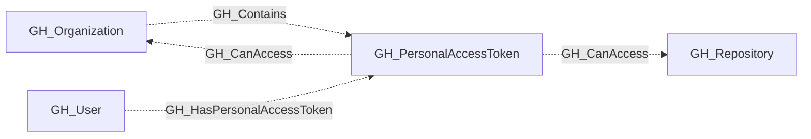

## General Information

Represents a fine-grained personal access token that has been granted access to organization resources. PATs are linked to their owning user, the organization, and the repositories they can access. The permissions granted to the token are captured as a JSON string in the properties.

## Properties

| Property | Type | Description |
| --- | --- | --- |
| `name` | `string` | The node name used for matching and display. |
| `displayname` | `string` | The human-readable display name. |
| `environmentid` | `string` | The identifier of the GitHub environment where this node was collected. |
| `last_seen` | `datetime` | The timestamp when this node was last observed during collection. |
| `node_id` | `string` | The stable identifier used as the OpenGraph node ID; this is the native GitHub node ID where available. |
| `environment_name` | `string` | The name of the environment (GitHub organization) where the token has access. |
| `owner_id` | `string` | The GitHub ID of the token owner. |
| `owner_node_id` | `string` | The GraphQL node ID of the token owner. |
| `token_expires_at` | `datetime` | The ISO 8601 timestamp of when the token expires. |
| `token_last_used_at` | `datetime` | The ISO 8601 timestamp of when the token was last used. |
| `access_granted_at` | `datetime` | The ISO 8601 timestamp of when the token was granted to the organization. |. |
| `organization_permissions` | `string` | JSON string of the PAT's organization-scoped permissions. |
| `repository_permissions` | `string` | JSON string of the PAT's repository-scoped permissions. |
| `token_name` | `string` | The user-assigned display name of the token. |
| `owner_login` | `string` | The login handle of the user who owns the token. |
| `repository_selection` | `string` | Whether the token has access to `all`, `subset`, or `none` of the organization's repositories. |
| `token_expired` | `boolean` | Whether the token has expired. |
| `query_organization_permissions` | `string` | Query for organization permissions. |
| `query_user` | `string` | Query for user. |
| `query_repositories` | `string` | Query for repositories. |

## Diagram

## Edges

<Note>
The tables below list edges defined by the GitHub extension only. Additional edges to or from this node may be created by other extensions.
</Note>

### Inbound Edges

| Edge Type | Source Node Types | Traversable |
| --------- | ----------------- | ----------- |
| [GH_Contains](https://github.com/SpecterOps/bloodhound-docs/blob/main//opengraph/extensions/github/edges/gh_contains) | [GH_Organization](https://github.com/SpecterOps/bloodhound-docs/blob/main//opengraph/extensions/github/nodes/gh_organization) | ❌ |
| [GH_HasPersonalAccessToken](https://github.com/SpecterOps/bloodhound-docs/blob/main//opengraph/extensions/github/edges/gh_haspersonalaccesstoken) | [GH_User](https://github.com/SpecterOps/bloodhound-docs/blob/main//opengraph/extensions/github/nodes/gh_user) | ❌ |

### Outbound Edges

| Edge Type | Destination Node Types | Traversable |
| --------- | ---------------------- | ----------- |
| [GH_CanAccess](https://github.com/SpecterOps/bloodhound-docs/blob/main//opengraph/extensions/github/edges/gh_canaccess) | [GH_Organization](https://github.com/SpecterOps/bloodhound-docs/blob/main//opengraph/extensions/github/nodes/gh_organization), [GH_Repository](https://github.com/SpecterOps/bloodhound-docs/blob/main//opengraph/extensions/github/nodes/gh_repository) | ❌ |

## Properties

| Property | Type | Description |
| -------- | ---- | ----------- |
| `name` | `str` | - |
| `displayname` | `str` | - |
| `environmentid` | `str` | - |
| `last_seen` | `datetime` | - |
| `node_id` | `str` | - |
| `environment_name` | `str` | The name of the environment (GitHub organization) where the token has access. |
| `owner_id` | `str \| None` | The GitHub ID of the token owner. |
| `owner_node_id` | `str \| None` | The GraphQL node ID of the token owner. |
| `token_expires_at` | `datetime \| None` | The ISO 8601 timestamp of when the token expires. |
| `token_last_used_at` | `datetime \| None` | The ISO 8601 timestamp of when the token was last used. |
| `access_granted_at` | `datetime \| None` | The ISO 8601 timestamp of when the token was granted to the organization. \| |
| `organization_permissions` | `str \| None` | JSON string of the PAT's organization-scoped permissions. |
| `repository_permissions` | `str \| None` | JSON string of the PAT's repository-scoped permissions. |
| `token_name` | `str \| None` | The user-assigned display name of the token. |
| `owner_login` | `str \| None` | The login handle of the user who owns the token. |
| `repository_selection` | `str \| None` | Whether the token has access to `all`, `subset`, or `none` of the organization's repositories. |
| `token_expired` | `bool \| None` | Whether the token has expired. |
| `query_organization_permissions` | `str \| None` | Query for organization permissions. |
| `query_user` | `str \| None` | Query for user. |
| `query_repositories` | `str \| None` | Query for repositories. |
