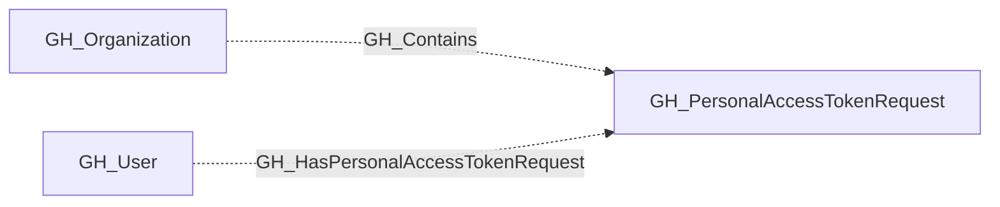
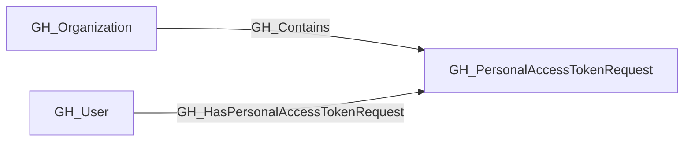

## General Information

Represents a pending request from an organization member to access organization resources with a fine-grained personal access token. PAT requests are linked to their owning user and the organization. The requested permissions are captured as a JSON string in the properties.

## Properties

| Property | Type | Description |
| --- | --- | --- |
| `name` | `string` | The node name used for matching and display. |
| `displayname` | `string` | The human-readable display name. |
| `environmentid` | `string` | The identifier of the GitHub environment where this node was collected. |
| `last_seen` | `datetime` | The timestamp when this node was last observed during collection. |
| `node_id` | `string` | The stable identifier used as the OpenGraph node ID; this is the native GitHub node ID where available. |
| `token_name` | `string` | The user-assigned display name of the token. |
| `owner_login` | `string` | The login handle of the user who submitted the request. |
| `repository_selection` | `string` | Whether the request targets `all`, `subset`, or `none` of the organization's repositories. |
| `reason` | `string` | The rationale provided by the requester for the access request. |
| `org_name` | `string` | The org name property. |
| `query_organization_permissions` | `string` | Query for organization permissions. |
| `query_user` | `string` | Query for user. |
| `query_repositories` | `string` | Query for repositories. |

## Diagram

## Edges

<Note>
The tables below list edges defined by the GitHub extension only. Additional edges to or from this node may be created by other extensions.
</Note>

### Inbound Edges

| Edge Type | Source Node Types | Traversable |
| --------- | ----------------- | ----------- |
| [GH_Contains](https://github.com/SpecterOps/bloodhound-docs/blob/main//opengraph/extensions/github/edges/gh_contains) | [GH_Organization](https://github.com/SpecterOps/bloodhound-docs/blob/main//opengraph/extensions/github/nodes/gh_organization) | ❌ |
| [GH_HasPersonalAccessTokenRequest](https://github.com/SpecterOps/bloodhound-docs/blob/main//opengraph/extensions/github/edges/gh_haspersonalaccesstokenrequest) | [GH_User](https://github.com/SpecterOps/bloodhound-docs/blob/main//opengraph/extensions/github/nodes/gh_user) | ❌ |

### Outbound Edges

No outbound edges are defined by the GitHub extension for this node.

## Properties

| Property | Type | Description |
| -------- | ---- | ----------- |
| `name` | `str` | - |
| `displayname` | `str` | - |
| `environmentid` | `str` | - |
| `last_seen` | `datetime` | - |
| `node_id` | `str` | - |
| `token_name` | `str \| None` | The user-assigned display name of the token. |
| `owner_login` | `str \| None` | The login handle of the user who submitted the request. |
| `repository_selection` | `str \| None` | Whether the request targets `all`, `subset`, or `none` of the organization's repositories. |
| `reason` | `str \| None` | The rationale provided by the requester for the access request. |
| `org_name` | `str \| None` | The org name property. |
| `query_organization_permissions` | `str \| None` | Query for organization permissions. |
| `query_user` | `str \| None` | Query for user. |
| `query_repositories` | `str \| None` | Query for repositories. |
