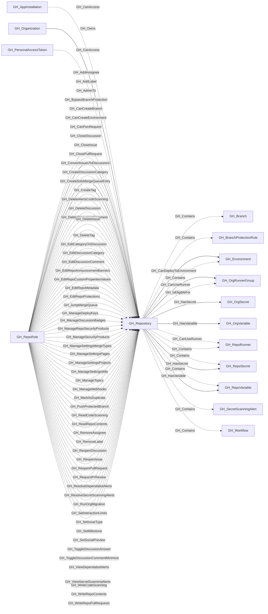

## General Information

Represents a GitHub repository within the organization. Repository nodes capture metadata about the repo including visibility, Actions enablement status, and security configuration. Repository role nodes ([GH_RepoRole](https://github.com/SpecterOps/bloodhound-docs/blob/main//opengraph/extensions/github/nodes/gh_reporole)) are created alongside each repository to represent the permission levels available.

## Properties

| Property | Type | Description |
| --- | --- | --- |
| `name` | `string` | The node name used for matching and display. |
| `displayname` | `string` | The human-readable display name. |
| `environmentid` | `string` | The identifier of the GitHub environment where this node was collected. |
| `last_seen` | `datetime` | The timestamp when this node was last observed during collection. |
| `node_id` | `string` | The stable identifier used as the OpenGraph node ID; this is the native GitHub node ID where available. |
| `collected` | `boolean` | Collected/generated by OpenHound. |
| `full_name` | `string` | The fully qualified name (e.g., `org/repo`). |
| `private` | `boolean` | Whether the repository is private. |
| `html_url` | `string` | URL to the repository on GitHub. |
| `description` | `string` | The repository description. |
| `created_at` | `string` | When the repository was created. |
| `updated_at` | `string` | When the repository was last updated. |
| `pushed_at` | `string` | When the repository last had a push. |
| `archived` | `boolean` | Whether the repository is archived. |
| `disabled` | `boolean` | Whether the repository is disabled. |
| `visibility` | `string` | The visibility level: `public`, `private`, or `internal`. |
| `default_branch` | `string` | The name of the default branch (e.g., `main`). |
| `size` | `integer` | Repository size in kilobytes as reported by GitHub. |
| `open_issues_count` | `integer` | Number of open issues. |
| `allow_forking` | `boolean` | Whether forking is allowed. |
| `web_commit_signoff_required` | `boolean` | Whether web-based commits require sign-off. |
| `forks` | `integer` | Number of forks. |
| `open_issues` | `integer` | Number of open issues (includes pull requests). |
| `watchers` | `integer` | Number of watchers. |
| `owner_name` | `string` | The login of the repository owner. |
| `owner_id` | `string` | The owner id property. |
| `environment_name` | `string` | The name of the environment (GitHub organization). |
| `actions_enabled` | `boolean` | Whether GitHub Actions is enabled for this repository. |
| `self_hosted_runners_enabled` | `boolean` | Whether the repository may use self-hosted runners. |
| `secret_scanning` | `string` | Status of secret scanning (e.g., `enabled`, `disabled`). |
| `branch_ruleset_count` | `integer` | Number of branch-targeted rulesets that apply to this repository. |
| `has_branch_rulesets` | `boolean` | Whether at least one branch-targeted ruleset applies to this repository. |
| `query_branches` | `string` | Query for branches. |
| `query_protected_branches` | `string` | Query for protected branches. |
| `query_branch_protection_rules` | `string` | Query for branch protection rules. |
| `query_roles` | `string` | Query for roles. |
| `query_teams` | `string` | Query for teams. |
| `query_workflows` | `string` | Query for workflows. |
| `query_runners` | `string` | Query for runners. |
| `query_environments` | `string` | Query for environments. |
| `query_secrets` | `string` | Query for secrets. |
| `query_variables` | `string` | Query for variables. |
| `query_secret_scanning_alerts` | `string` | Query for secret scanning alerts. |
| `query_explicit_readers` | `string` | Query for explicit readers. |
| `query_unrolled_readers` | `string` | Query for unrolled readers. |
| `query_explicit_writers` | `string` | Query for explicit writers. |
| `query_unrolled_writers` | `string` | Query for unrolled writers. |

## Diagram

```mermaid
graph LR
    n0["GH_AppInstallation"]
    n1["GH_Repository"]
    n2["GH_Organization"]
    n3["GH_PersonalAccessToken"]
    n4["GH_RepoRole"]
    n5["GH_Branch"]
    n6["GH_BranchProtectionRule"]
    n7["GH_Environment"]
    n8["GH_OrgRunnerGroup"]
    n9["GH_OrgSecret"]
    n10["GH_OrgVariable"]
    n11["GH_RepoRunner"]
    n12["GH_RepoSecret"]
    n13["GH_RepoVariable"]
    n14["GH_SecretScanningAlert"]
    n15["GH_Workflow"]
    n0 -.->|GH_CanAccess| n1
    n2 -->|GH_Owns| n1
    n3 -.->|GH_CanAccess| n1
    n4 -.->|GH_AddAssignee| n1
    n4 -.->|GH_AddLabel| n1
    n4 -->|GH_AdminTo| n1
    n4 -.->|GH_BypassBranchProtection| n1
    n4 -.->|GH_CanCreateBranch| n1
    n4 -->|GH_CanCreateEnvironment| n1
    n4 -->|GH_CanPwnRequest| n1
    n4 -.->|GH_CloseDiscussion| n1
    n4 -.->|GH_CloseIssue| n1
    n4 -.->|GH_ClosePullRequest| n1
    n4 -.->|GH_ConvertIssuesToDiscussions| n1
    n4 -.->|GH_CreateDiscussionCategory| n1
    n4 -.->|GH_CreateSoloMergeQueueEntry| n1
    n4 -.->|GH_CreateTag| n1
    n4 -.->|GH_DeleteAlertsCodeScanning| n1
    n4 -.->|GH_DeleteDiscussion| n1
    n4 -.->|GH_DeleteDiscussionComment| n1
    n4 -.->|GH_DeleteIssue| n1
    n4 -.->|GH_DeleteTag| n1
    n4 -.->|GH_EditCategoryOnDiscussion| n1
    n4 -.->|GH_EditDiscussionCategory| n1
    n4 -.->|GH_EditDiscussionComment| n1
    n4 -.->|GH_EditRepoAnnouncementBanners| n1
    n4 -.->|GH_EditRepoCustomPropertiesValues| n1
    n4 -.->|GH_EditRepoMetadata| n1
    n4 -.->|GH_EditRepoProtections| n1
    n4 -.->|GH_JumpMergeQueue| n1
    n4 -.->|GH_ManageDeployKeys| n1
    n4 -.->|GH_ManageDiscussionBadges| n1
    n4 -.->|GH_ManageRepoSecurityProducts| n1
    n4 -.->|GH_ManageSecurityProducts| n1
    n4 -.->|GH_ManageSettingsMergeTypes| n1
    n4 -.->|GH_ManageSettingsPages| n1
    n4 -.->|GH_ManageSettingsProjects| n1
    n4 -.->|GH_ManageSettingsWiki| n1
    n4 -.->|GH_ManageTopics| n1
    n4 -.->|GH_ManageWebhooks| n1
    n4 -.->|GH_MarkAsDuplicate| n1
    n4 -.->|GH_PushProtectedBranch| n1
    n4 -.->|GH_ReadCodeScanning| n1
    n4 -.->|GH_ReadRepoContents| n1
    n4 -.->|GH_RemoveAssignee| n1
    n4 -.->|GH_RemoveLabel| n1
    n4 -.->|GH_ReopenDiscussion| n1
    n4 -.->|GH_ReopenIssue| n1
    n4 -.->|GH_ReopenPullRequest| n1
    n4 -.->|GH_RequestPrReview| n1
    n4 -.->|GH_ResolveDependabotAlerts| n1
    n4 -.->|GH_ResolveSecretScanningAlerts| n1
    n4 -.->|GH_RunOrgMigration| n1
    n4 -.->|GH_SetInteractionLimits| n1
    n4 -.->|GH_SetIssueType| n1
    n4 -.->|GH_SetMilestone| n1
    n4 -.->|GH_SetSocialPreview| n1
    n4 -.->|GH_ToggleDiscussionAnswer| n1
    n4 -.->|GH_ToggleDiscussionCommentMinimize| n1
    n4 -.->|GH_ViewDependabotAlerts| n1
    n4 -.->|GH_ViewSecretScanningAlerts| n1
    n4 -.->|GH_WriteCodeScanning| n1
    n4 -.->|GH_WriteRepoContents| n1
    n4 -.->|GH_WriteRepoPullRequests| n1
    n1 -.->|GH_Contains| n5
    n1 -.->|GH_Contains| n6
    n1 -->|GH_CanDeployToEnvironment| n7
    n1 -.->|GH_Contains| n7
    n1 -->|GH_CanUseRunner| n8
    n1 -.->|GH_IsEligibleFor| n8
    n1 -->|GH_HasSecret| n9
    n1 -->|GH_HasVariable| n10
    n1 -.->|GH_CanUseRunner| n11
    n1 -.->|GH_Contains| n11
    n1 -.->|GH_Contains| n12
    n1 -->|GH_HasSecret| n12
    n1 -.->|GH_Contains| n13
    n1 -->|GH_HasVariable| n13
    n1 -.->|GH_Contains| n14
    n1 -.->|GH_Contains| n15
```

## Edges

<Note>
The tables below list edges defined by the GitHub extension only. Additional edges to or from this node may be created by other extensions.
</Note>

```mermaid
flowchart LR

    GH_AppInstallation["GH_AppInstallation"]
    GH_Branch["GH_Branch"]
    GH_BranchProtectionRule["GH_BranchProtectionRule"]
    GH_Environment["GH_Environment"]
    GH_Organization["GH_Organization"]
    GH_OrgRunnerGroup["GH_OrgRunnerGroup"]
    GH_OrgSecret["GH_OrgSecret"]
    GH_OrgVariable["GH_OrgVariable"]
    GH_PersonalAccessToken["GH_PersonalAccessToken"]
    GH_RepoRole["GH_RepoRole"]
    GH_RepoRunner["GH_RepoRunner"]
    GH_RepoSecret["GH_RepoSecret"]
    GH_Repository["GH_Repository"]
    GH_RepoVariable["GH_RepoVariable"]
    GH_SecretScanningAlert["GH_SecretScanningAlert"]
    GH_Workflow["GH_Workflow"]
    GH_AppInstallation -- GH_CanAccess --> GH_Repository
    GH_Organization -- GH_Owns --> GH_Repository
    GH_PersonalAccessToken -- GH_CanAccess --> GH_Repository
    GH_RepoRole -- GH_AddAssignee --> GH_Repository
    GH_RepoRole -- GH_AddLabel --> GH_Repository
    GH_RepoRole -- GH_AdminTo --> GH_Repository
    GH_RepoRole -- GH_BypassBranchProtection --> GH_Repository
    GH_RepoRole -- GH_CanCreateBranch --> GH_Repository
    GH_RepoRole -- GH_CanCreateEnvironment --> GH_Repository
    GH_RepoRole -- GH_CanPwnRequest --> GH_Repository
    GH_RepoRole -- GH_CloseDiscussion --> GH_Repository
    GH_RepoRole -- GH_CloseIssue --> GH_Repository
    GH_RepoRole -- GH_ClosePullRequest --> GH_Repository
    GH_RepoRole -- GH_ConvertIssuesToDiscussions --> GH_Repository
    GH_RepoRole -- GH_CreateDiscussionCategory --> GH_Repository
    GH_RepoRole -- GH_CreateSoloMergeQueueEntry --> GH_Repository
    GH_RepoRole -- GH_CreateTag --> GH_Repository
    GH_RepoRole -- GH_DeleteAlertsCodeScanning --> GH_Repository
    GH_RepoRole -- GH_DeleteDiscussion --> GH_Repository
    GH_RepoRole -- GH_DeleteDiscussionComment --> GH_Repository
    GH_RepoRole -- GH_DeleteIssue --> GH_Repository
    GH_RepoRole -- GH_DeleteTag --> GH_Repository
    GH_RepoRole -- GH_EditCategoryOnDiscussion --> GH_Repository
    GH_RepoRole -- GH_EditDiscussionCategory --> GH_Repository
    GH_RepoRole -- GH_EditDiscussionComment --> GH_Repository
    GH_RepoRole -- GH_EditRepoAnnouncementBanners --> GH_Repository
    GH_RepoRole -- GH_EditRepoCustomPropertiesValues --> GH_Repository
    GH_RepoRole -- GH_EditRepoMetadata --> GH_Repository
    GH_RepoRole -- GH_EditRepoProtections --> GH_Repository
    GH_RepoRole -- GH_JumpMergeQueue --> GH_Repository
    GH_RepoRole -- GH_ManageDeployKeys --> GH_Repository
    GH_RepoRole -- GH_ManageDiscussionBadges --> GH_Repository
    GH_RepoRole -- GH_ManageRepoSecurityProducts --> GH_Repository
    GH_RepoRole -- GH_ManageSecurityProducts --> GH_Repository
    GH_RepoRole -- GH_ManageSettingsMergeTypes --> GH_Repository
    GH_RepoRole -- GH_ManageSettingsPages --> GH_Repository
    GH_RepoRole -- GH_ManageSettingsProjects --> GH_Repository
    GH_RepoRole -- GH_ManageSettingsWiki --> GH_Repository
    GH_RepoRole -- GH_ManageTopics --> GH_Repository
    GH_RepoRole -- GH_ManageWebhooks --> GH_Repository
    GH_RepoRole -- GH_MarkAsDuplicate --> GH_Repository
    GH_RepoRole -- GH_PushProtectedBranch --> GH_Repository
    GH_RepoRole -- GH_ReadCodeScanning --> GH_Repository
    GH_RepoRole -- GH_ReadRepoContents --> GH_Repository
    GH_RepoRole -- GH_RemoveAssignee --> GH_Repository
    GH_RepoRole -- GH_RemoveLabel --> GH_Repository
    GH_RepoRole -- GH_ReopenDiscussion --> GH_Repository
    GH_RepoRole -- GH_ReopenIssue --> GH_Repository
    GH_RepoRole -- GH_ReopenPullRequest --> GH_Repository
    GH_RepoRole -- GH_RequestPrReview --> GH_Repository
    GH_RepoRole -- GH_ResolveDependabotAlerts --> GH_Repository
    GH_RepoRole -- GH_ResolveSecretScanningAlerts --> GH_Repository
    GH_RepoRole -- GH_RunOrgMigration --> GH_Repository
    GH_RepoRole -- GH_SetInteractionLimits --> GH_Repository
    GH_RepoRole -- GH_SetIssueType --> GH_Repository
    GH_RepoRole -- GH_SetMilestone --> GH_Repository
    GH_RepoRole -- GH_SetSocialPreview --> GH_Repository
    GH_RepoRole -- GH_ToggleDiscussionAnswer --> GH_Repository
    GH_RepoRole -- GH_ToggleDiscussionCommentMinimize --> GH_Repository
    GH_RepoRole -- GH_ViewDependabotAlerts --> GH_Repository
    GH_RepoRole -- GH_ViewSecretScanningAlerts --> GH_Repository
    GH_RepoRole -- GH_WriteCodeScanning --> GH_Repository
    GH_RepoRole -- GH_WriteRepoContents --> GH_Repository
    GH_RepoRole -- GH_WriteRepoPullRequests --> GH_Repository
    GH_Repository -- GH_CanDeployToEnvironment --> GH_Environment
    GH_Repository -- GH_CanUseRunner --> GH_OrgRunnerGroup
    GH_Repository -- GH_CanUseRunner --> GH_RepoRunner
    GH_Repository -- GH_Contains --> GH_Branch
    GH_Repository -- GH_Contains --> GH_BranchProtectionRule
    GH_Repository -- GH_Contains --> GH_Environment
    GH_Repository -- GH_Contains --> GH_RepoRunner
    GH_Repository -- GH_Contains --> GH_RepoSecret
    GH_Repository -- GH_Contains --> GH_RepoVariable
    GH_Repository -- GH_Contains --> GH_SecretScanningAlert
    GH_Repository -- GH_Contains --> GH_Workflow
    GH_Repository -- GH_HasSecret --> GH_OrgSecret
    GH_Repository -- GH_HasSecret --> GH_RepoSecret
    GH_Repository -- GH_HasVariable --> GH_OrgVariable
    GH_Repository -- GH_HasVariable --> GH_RepoVariable
    GH_Repository -- GH_IsEligibleFor --> GH_OrgRunnerGroup
```

### Inbound Edges

| Edge Type | Source Node Types | Traversable |
| --------- | ----------------- | ----------- |
| [GH_AddAssignee](https://github.com/SpecterOps/bloodhound-docs/blob/main//opengraph/extensions/github/edges/gh_addassignee) | [GH_RepoRole](https://github.com/SpecterOps/bloodhound-docs/blob/main//opengraph/extensions/github/nodes/gh_reporole) | ❌ |
| [GH_AddLabel](https://github.com/SpecterOps/bloodhound-docs/blob/main//opengraph/extensions/github/edges/gh_addlabel) | [GH_RepoRole](https://github.com/SpecterOps/bloodhound-docs/blob/main//opengraph/extensions/github/nodes/gh_reporole) | ❌ |
| [GH_AdminTo](https://github.com/SpecterOps/bloodhound-docs/blob/main//opengraph/extensions/github/edges/gh_adminto) | [GH_RepoRole](https://github.com/SpecterOps/bloodhound-docs/blob/main//opengraph/extensions/github/nodes/gh_reporole) | ✅ |
| [GH_BypassBranchProtection](https://github.com/SpecterOps/bloodhound-docs/blob/main//opengraph/extensions/github/edges/gh_bypassbranchprotection) | [GH_RepoRole](https://github.com/SpecterOps/bloodhound-docs/blob/main//opengraph/extensions/github/nodes/gh_reporole) | ❌ |
| [GH_CanAccess](https://github.com/SpecterOps/bloodhound-docs/blob/main//opengraph/extensions/github/edges/gh_canaccess) | [GH_AppInstallation](https://github.com/SpecterOps/bloodhound-docs/blob/main//opengraph/extensions/github/nodes/gh_appinstallation), [GH_PersonalAccessToken](https://github.com/SpecterOps/bloodhound-docs/blob/main//opengraph/extensions/github/nodes/gh_personalaccesstoken) | ❌ |
| [GH_CanCreateBranch](https://github.com/SpecterOps/bloodhound-docs/blob/main//opengraph/extensions/github/edges/gh_cancreatebranch) | [GH_RepoRole](https://github.com/SpecterOps/bloodhound-docs/blob/main//opengraph/extensions/github/nodes/gh_reporole) | ✅ |
| [GH_CanCreateEnvironment](https://github.com/SpecterOps/bloodhound-docs/blob/main//opengraph/extensions/github/edges/gh_cancreateenvironment) | [GH_RepoRole](https://github.com/SpecterOps/bloodhound-docs/blob/main//opengraph/extensions/github/nodes/gh_reporole) | ✅ |
| [GH_CanPwnRequest](https://github.com/SpecterOps/bloodhound-docs/blob/main//opengraph/extensions/github/edges/gh_canpwnrequest) | [GH_RepoRole](https://github.com/SpecterOps/bloodhound-docs/blob/main//opengraph/extensions/github/nodes/gh_reporole) | ✅ |
| [GH_CloseDiscussion](https://github.com/SpecterOps/bloodhound-docs/blob/main//opengraph/extensions/github/edges/gh_closediscussion) | [GH_RepoRole](https://github.com/SpecterOps/bloodhound-docs/blob/main//opengraph/extensions/github/nodes/gh_reporole) | ❌ |
| [GH_CloseIssue](https://github.com/SpecterOps/bloodhound-docs/blob/main//opengraph/extensions/github/edges/gh_closeissue) | [GH_RepoRole](https://github.com/SpecterOps/bloodhound-docs/blob/main//opengraph/extensions/github/nodes/gh_reporole) | ❌ |
| [GH_ClosePullRequest](https://github.com/SpecterOps/bloodhound-docs/blob/main//opengraph/extensions/github/edges/gh_closepullrequest) | [GH_RepoRole](https://github.com/SpecterOps/bloodhound-docs/blob/main//opengraph/extensions/github/nodes/gh_reporole) | ❌ |
| [GH_ConvertIssuesToDiscussions](https://github.com/SpecterOps/bloodhound-docs/blob/main//opengraph/extensions/github/edges/gh_convertissuestodiscussions) | [GH_RepoRole](https://github.com/SpecterOps/bloodhound-docs/blob/main//opengraph/extensions/github/nodes/gh_reporole) | ❌ |
| [GH_CreateDiscussionCategory](https://github.com/SpecterOps/bloodhound-docs/blob/main//opengraph/extensions/github/edges/gh_creatediscussioncategory) | [GH_RepoRole](https://github.com/SpecterOps/bloodhound-docs/blob/main//opengraph/extensions/github/nodes/gh_reporole) | ❌ |
| [GH_CreateSoloMergeQueueEntry](https://github.com/SpecterOps/bloodhound-docs/blob/main//opengraph/extensions/github/edges/gh_createsolomergequeueentry) | [GH_RepoRole](https://github.com/SpecterOps/bloodhound-docs/blob/main//opengraph/extensions/github/nodes/gh_reporole) | ❌ |
| [GH_CreateTag](https://github.com/SpecterOps/bloodhound-docs/blob/main//opengraph/extensions/github/edges/gh_createtag) | [GH_RepoRole](https://github.com/SpecterOps/bloodhound-docs/blob/main//opengraph/extensions/github/nodes/gh_reporole) | ❌ |
| [GH_DeleteAlertsCodeScanning](https://github.com/SpecterOps/bloodhound-docs/blob/main//opengraph/extensions/github/edges/gh_deletealertscodescanning) | [GH_RepoRole](https://github.com/SpecterOps/bloodhound-docs/blob/main//opengraph/extensions/github/nodes/gh_reporole) | ❌ |
| [GH_DeleteDiscussion](https://github.com/SpecterOps/bloodhound-docs/blob/main//opengraph/extensions/github/edges/gh_deletediscussion) | [GH_RepoRole](https://github.com/SpecterOps/bloodhound-docs/blob/main//opengraph/extensions/github/nodes/gh_reporole) | ❌ |
| [GH_DeleteDiscussionComment](https://github.com/SpecterOps/bloodhound-docs/blob/main//opengraph/extensions/github/edges/gh_deletediscussioncomment) | [GH_RepoRole](https://github.com/SpecterOps/bloodhound-docs/blob/main//opengraph/extensions/github/nodes/gh_reporole) | ❌ |
| [GH_DeleteIssue](https://github.com/SpecterOps/bloodhound-docs/blob/main//opengraph/extensions/github/edges/gh_deleteissue) | [GH_RepoRole](https://github.com/SpecterOps/bloodhound-docs/blob/main//opengraph/extensions/github/nodes/gh_reporole) | ❌ |
| [GH_DeleteTag](https://github.com/SpecterOps/bloodhound-docs/blob/main//opengraph/extensions/github/edges/gh_deletetag) | [GH_RepoRole](https://github.com/SpecterOps/bloodhound-docs/blob/main//opengraph/extensions/github/nodes/gh_reporole) | ❌ |
| [GH_EditCategoryOnDiscussion](https://github.com/SpecterOps/bloodhound-docs/blob/main//opengraph/extensions/github/edges/gh_editcategoryondiscussion) | [GH_RepoRole](https://github.com/SpecterOps/bloodhound-docs/blob/main//opengraph/extensions/github/nodes/gh_reporole) | ❌ |
| [GH_EditDiscussionCategory](https://github.com/SpecterOps/bloodhound-docs/blob/main//opengraph/extensions/github/edges/gh_editdiscussioncategory) | [GH_RepoRole](https://github.com/SpecterOps/bloodhound-docs/blob/main//opengraph/extensions/github/nodes/gh_reporole) | ❌ |
| [GH_EditDiscussionComment](https://github.com/SpecterOps/bloodhound-docs/blob/main//opengraph/extensions/github/edges/gh_editdiscussioncomment) | [GH_RepoRole](https://github.com/SpecterOps/bloodhound-docs/blob/main//opengraph/extensions/github/nodes/gh_reporole) | ❌ |
| [GH_EditRepoAnnouncementBanners](https://github.com/SpecterOps/bloodhound-docs/blob/main//opengraph/extensions/github/edges/gh_editrepoannouncementbanners) | [GH_RepoRole](https://github.com/SpecterOps/bloodhound-docs/blob/main//opengraph/extensions/github/nodes/gh_reporole) | ❌ |
| [GH_EditRepoCustomPropertiesValues](https://github.com/SpecterOps/bloodhound-docs/blob/main//opengraph/extensions/github/edges/gh_editrepocustompropertiesvalues) | [GH_RepoRole](https://github.com/SpecterOps/bloodhound-docs/blob/main//opengraph/extensions/github/nodes/gh_reporole) | ❌ |
| [GH_EditRepoMetadata](https://github.com/SpecterOps/bloodhound-docs/blob/main//opengraph/extensions/github/edges/gh_editrepometadata) | [GH_RepoRole](https://github.com/SpecterOps/bloodhound-docs/blob/main//opengraph/extensions/github/nodes/gh_reporole) | ❌ |
| [GH_EditRepoProtections](https://github.com/SpecterOps/bloodhound-docs/blob/main//opengraph/extensions/github/edges/gh_editrepoprotections) | [GH_RepoRole](https://github.com/SpecterOps/bloodhound-docs/blob/main//opengraph/extensions/github/nodes/gh_reporole) | ❌ |
| [GH_JumpMergeQueue](https://github.com/SpecterOps/bloodhound-docs/blob/main//opengraph/extensions/github/edges/gh_jumpmergequeue) | [GH_RepoRole](https://github.com/SpecterOps/bloodhound-docs/blob/main//opengraph/extensions/github/nodes/gh_reporole) | ❌ |
| [GH_ManageDeployKeys](https://github.com/SpecterOps/bloodhound-docs/blob/main//opengraph/extensions/github/edges/gh_managedeploykeys) | [GH_RepoRole](https://github.com/SpecterOps/bloodhound-docs/blob/main//opengraph/extensions/github/nodes/gh_reporole) | ❌ |
| [GH_ManageDiscussionBadges](https://github.com/SpecterOps/bloodhound-docs/blob/main//opengraph/extensions/github/edges/gh_managediscussionbadges) | [GH_RepoRole](https://github.com/SpecterOps/bloodhound-docs/blob/main//opengraph/extensions/github/nodes/gh_reporole) | ❌ |
| [GH_ManageRepoSecurityProducts](https://github.com/SpecterOps/bloodhound-docs/blob/main//opengraph/extensions/github/edges/gh_managereposecurityproducts) | [GH_RepoRole](https://github.com/SpecterOps/bloodhound-docs/blob/main//opengraph/extensions/github/nodes/gh_reporole) | ❌ |
| [GH_ManageSecurityProducts](https://github.com/SpecterOps/bloodhound-docs/blob/main//opengraph/extensions/github/edges/gh_managesecurityproducts) | [GH_RepoRole](https://github.com/SpecterOps/bloodhound-docs/blob/main//opengraph/extensions/github/nodes/gh_reporole) | ❌ |
| [GH_ManageSettingsMergeTypes](https://github.com/SpecterOps/bloodhound-docs/blob/main//opengraph/extensions/github/edges/gh_managesettingsmergetypes) | [GH_RepoRole](https://github.com/SpecterOps/bloodhound-docs/blob/main//opengraph/extensions/github/nodes/gh_reporole) | ❌ |
| [GH_ManageSettingsPages](https://github.com/SpecterOps/bloodhound-docs/blob/main//opengraph/extensions/github/edges/gh_managesettingspages) | [GH_RepoRole](https://github.com/SpecterOps/bloodhound-docs/blob/main//opengraph/extensions/github/nodes/gh_reporole) | ❌ |
| [GH_ManageSettingsProjects](https://github.com/SpecterOps/bloodhound-docs/blob/main//opengraph/extensions/github/edges/gh_managesettingsprojects) | [GH_RepoRole](https://github.com/SpecterOps/bloodhound-docs/blob/main//opengraph/extensions/github/nodes/gh_reporole) | ❌ |
| [GH_ManageSettingsWiki](https://github.com/SpecterOps/bloodhound-docs/blob/main//opengraph/extensions/github/edges/gh_managesettingswiki) | [GH_RepoRole](https://github.com/SpecterOps/bloodhound-docs/blob/main//opengraph/extensions/github/nodes/gh_reporole) | ❌ |
| [GH_ManageTopics](https://github.com/SpecterOps/bloodhound-docs/blob/main//opengraph/extensions/github/edges/gh_managetopics) | [GH_RepoRole](https://github.com/SpecterOps/bloodhound-docs/blob/main//opengraph/extensions/github/nodes/gh_reporole) | ❌ |
| [GH_ManageWebhooks](https://github.com/SpecterOps/bloodhound-docs/blob/main//opengraph/extensions/github/edges/gh_managewebhooks) | [GH_RepoRole](https://github.com/SpecterOps/bloodhound-docs/blob/main//opengraph/extensions/github/nodes/gh_reporole) | ❌ |
| [GH_MarkAsDuplicate](https://github.com/SpecterOps/bloodhound-docs/blob/main//opengraph/extensions/github/edges/gh_markasduplicate) | [GH_RepoRole](https://github.com/SpecterOps/bloodhound-docs/blob/main//opengraph/extensions/github/nodes/gh_reporole) | ❌ |
| [GH_Owns](https://github.com/SpecterOps/bloodhound-docs/blob/main//opengraph/extensions/github/edges/gh_owns) | [GH_Organization](https://github.com/SpecterOps/bloodhound-docs/blob/main//opengraph/extensions/github/nodes/gh_organization) | ✅ |
| [GH_PushProtectedBranch](https://github.com/SpecterOps/bloodhound-docs/blob/main//opengraph/extensions/github/edges/gh_pushprotectedbranch) | [GH_RepoRole](https://github.com/SpecterOps/bloodhound-docs/blob/main//opengraph/extensions/github/nodes/gh_reporole) | ❌ |
| [GH_ReadCodeScanning](https://github.com/SpecterOps/bloodhound-docs/blob/main//opengraph/extensions/github/edges/gh_readcodescanning) | [GH_RepoRole](https://github.com/SpecterOps/bloodhound-docs/blob/main//opengraph/extensions/github/nodes/gh_reporole) | ❌ |
| [GH_ReadRepoContents](https://github.com/SpecterOps/bloodhound-docs/blob/main//opengraph/extensions/github/edges/gh_readrepocontents) | [GH_RepoRole](https://github.com/SpecterOps/bloodhound-docs/blob/main//opengraph/extensions/github/nodes/gh_reporole) | ❌ |
| [GH_RemoveAssignee](https://github.com/SpecterOps/bloodhound-docs/blob/main//opengraph/extensions/github/edges/gh_removeassignee) | [GH_RepoRole](https://github.com/SpecterOps/bloodhound-docs/blob/main//opengraph/extensions/github/nodes/gh_reporole) | ❌ |
| [GH_RemoveLabel](https://github.com/SpecterOps/bloodhound-docs/blob/main//opengraph/extensions/github/edges/gh_removelabel) | [GH_RepoRole](https://github.com/SpecterOps/bloodhound-docs/blob/main//opengraph/extensions/github/nodes/gh_reporole) | ❌ |
| [GH_ReopenDiscussion](https://github.com/SpecterOps/bloodhound-docs/blob/main//opengraph/extensions/github/edges/gh_reopendiscussion) | [GH_RepoRole](https://github.com/SpecterOps/bloodhound-docs/blob/main//opengraph/extensions/github/nodes/gh_reporole) | ❌ |
| [GH_ReopenIssue](https://github.com/SpecterOps/bloodhound-docs/blob/main//opengraph/extensions/github/edges/gh_reopenissue) | [GH_RepoRole](https://github.com/SpecterOps/bloodhound-docs/blob/main//opengraph/extensions/github/nodes/gh_reporole) | ❌ |
| [GH_ReopenPullRequest](https://github.com/SpecterOps/bloodhound-docs/blob/main//opengraph/extensions/github/edges/gh_reopenpullrequest) | [GH_RepoRole](https://github.com/SpecterOps/bloodhound-docs/blob/main//opengraph/extensions/github/nodes/gh_reporole) | ❌ |
| [GH_RequestPrReview](https://github.com/SpecterOps/bloodhound-docs/blob/main//opengraph/extensions/github/edges/gh_requestprreview) | [GH_RepoRole](https://github.com/SpecterOps/bloodhound-docs/blob/main//opengraph/extensions/github/nodes/gh_reporole) | ❌ |
| [GH_ResolveDependabotAlerts](https://github.com/SpecterOps/bloodhound-docs/blob/main//opengraph/extensions/github/edges/gh_resolvedependabotalerts) | [GH_RepoRole](https://github.com/SpecterOps/bloodhound-docs/blob/main//opengraph/extensions/github/nodes/gh_reporole) | ❌ |
| [GH_ResolveSecretScanningAlerts](https://github.com/SpecterOps/bloodhound-docs/blob/main//opengraph/extensions/github/edges/gh_resolvesecretscanningalerts) | [GH_RepoRole](https://github.com/SpecterOps/bloodhound-docs/blob/main//opengraph/extensions/github/nodes/gh_reporole) | ❌ |
| [GH_RunOrgMigration](https://github.com/SpecterOps/bloodhound-docs/blob/main//opengraph/extensions/github/edges/gh_runorgmigration) | [GH_RepoRole](https://github.com/SpecterOps/bloodhound-docs/blob/main//opengraph/extensions/github/nodes/gh_reporole) | ❌ |
| [GH_SetInteractionLimits](https://github.com/SpecterOps/bloodhound-docs/blob/main//opengraph/extensions/github/edges/gh_setinteractionlimits) | [GH_RepoRole](https://github.com/SpecterOps/bloodhound-docs/blob/main//opengraph/extensions/github/nodes/gh_reporole) | ❌ |
| [GH_SetIssueType](https://github.com/SpecterOps/bloodhound-docs/blob/main//opengraph/extensions/github/edges/gh_setissuetype) | [GH_RepoRole](https://github.com/SpecterOps/bloodhound-docs/blob/main//opengraph/extensions/github/nodes/gh_reporole) | ❌ |
| [GH_SetMilestone](https://github.com/SpecterOps/bloodhound-docs/blob/main//opengraph/extensions/github/edges/gh_setmilestone) | [GH_RepoRole](https://github.com/SpecterOps/bloodhound-docs/blob/main//opengraph/extensions/github/nodes/gh_reporole) | ❌ |
| [GH_SetSocialPreview](https://github.com/SpecterOps/bloodhound-docs/blob/main//opengraph/extensions/github/edges/gh_setsocialpreview) | [GH_RepoRole](https://github.com/SpecterOps/bloodhound-docs/blob/main//opengraph/extensions/github/nodes/gh_reporole) | ❌ |
| [GH_ToggleDiscussionAnswer](https://github.com/SpecterOps/bloodhound-docs/blob/main//opengraph/extensions/github/edges/gh_togglediscussionanswer) | [GH_RepoRole](https://github.com/SpecterOps/bloodhound-docs/blob/main//opengraph/extensions/github/nodes/gh_reporole) | ❌ |
| [GH_ToggleDiscussionCommentMinimize](https://github.com/SpecterOps/bloodhound-docs/blob/main//opengraph/extensions/github/edges/gh_togglediscussioncommentminimize) | [GH_RepoRole](https://github.com/SpecterOps/bloodhound-docs/blob/main//opengraph/extensions/github/nodes/gh_reporole) | ❌ |
| [GH_ViewDependabotAlerts](https://github.com/SpecterOps/bloodhound-docs/blob/main//opengraph/extensions/github/edges/gh_viewdependabotalerts) | [GH_RepoRole](https://github.com/SpecterOps/bloodhound-docs/blob/main//opengraph/extensions/github/nodes/gh_reporole) | ❌ |
| [GH_ViewSecretScanningAlerts](https://github.com/SpecterOps/bloodhound-docs/blob/main//opengraph/extensions/github/edges/gh_viewsecretscanningalerts) | [GH_RepoRole](https://github.com/SpecterOps/bloodhound-docs/blob/main//opengraph/extensions/github/nodes/gh_reporole) | ❌ |
| [GH_WriteCodeScanning](https://github.com/SpecterOps/bloodhound-docs/blob/main//opengraph/extensions/github/edges/gh_writecodescanning) | [GH_RepoRole](https://github.com/SpecterOps/bloodhound-docs/blob/main//opengraph/extensions/github/nodes/gh_reporole) | ❌ |
| [GH_WriteRepoContents](https://github.com/SpecterOps/bloodhound-docs/blob/main//opengraph/extensions/github/edges/gh_writerepocontents) | [GH_RepoRole](https://github.com/SpecterOps/bloodhound-docs/blob/main//opengraph/extensions/github/nodes/gh_reporole) | ❌ |
| [GH_WriteRepoPullRequests](https://github.com/SpecterOps/bloodhound-docs/blob/main//opengraph/extensions/github/edges/gh_writerepopullrequests) | [GH_RepoRole](https://github.com/SpecterOps/bloodhound-docs/blob/main//opengraph/extensions/github/nodes/gh_reporole) | ❌ |

### Outbound Edges

| Edge Type | Destination Node Types | Traversable |
| --------- | ---------------------- | ----------- |
| [GH_CanDeployToEnvironment](https://github.com/SpecterOps/bloodhound-docs/blob/main//opengraph/extensions/github/edges/gh_candeploytoenvironment) | [GH_Environment](https://github.com/SpecterOps/bloodhound-docs/blob/main//opengraph/extensions/github/nodes/gh_environment) | ✅ |
| [GH_CanUseRunner](https://github.com/SpecterOps/bloodhound-docs/blob/main//opengraph/extensions/github/edges/gh_canuserunner) | [GH_OrgRunnerGroup](https://github.com/SpecterOps/bloodhound-docs/blob/main//opengraph/extensions/github/nodes/gh_orgrunnergroup), [GH_RepoRunner](https://github.com/SpecterOps/bloodhound-docs/blob/main//opengraph/extensions/github/nodes/gh_reporunner) | ✅ |
| [GH_Contains](https://github.com/SpecterOps/bloodhound-docs/blob/main//opengraph/extensions/github/edges/gh_contains) | [GH_Branch](https://github.com/SpecterOps/bloodhound-docs/blob/main//opengraph/extensions/github/nodes/gh_branch), [GH_BranchProtectionRule](https://github.com/SpecterOps/bloodhound-docs/blob/main//opengraph/extensions/github/nodes/gh_branchprotectionrule), [GH_Environment](https://github.com/SpecterOps/bloodhound-docs/blob/main//opengraph/extensions/github/nodes/gh_environment), [GH_RepoRunner](https://github.com/SpecterOps/bloodhound-docs/blob/main//opengraph/extensions/github/nodes/gh_reporunner), [GH_RepoSecret](https://github.com/SpecterOps/bloodhound-docs/blob/main//opengraph/extensions/github/nodes/gh_reposecret), [GH_RepoVariable](https://github.com/SpecterOps/bloodhound-docs/blob/main//opengraph/extensions/github/nodes/gh_repovariable), [GH_SecretScanningAlert](https://github.com/SpecterOps/bloodhound-docs/blob/main//opengraph/extensions/github/nodes/gh_secretscanningalert), [GH_Workflow](https://github.com/SpecterOps/bloodhound-docs/blob/main//opengraph/extensions/github/nodes/gh_workflow) | ❌ |
| [GH_HasSecret](https://github.com/SpecterOps/bloodhound-docs/blob/main//opengraph/extensions/github/edges/gh_hassecret) | [GH_OrgSecret](https://github.com/SpecterOps/bloodhound-docs/blob/main//opengraph/extensions/github/nodes/gh_orgsecret), [GH_RepoSecret](https://github.com/SpecterOps/bloodhound-docs/blob/main//opengraph/extensions/github/nodes/gh_reposecret) | ✅ |
| [GH_HasVariable](https://github.com/SpecterOps/bloodhound-docs/blob/main//opengraph/extensions/github/edges/gh_hasvariable) | [GH_OrgVariable](https://github.com/SpecterOps/bloodhound-docs/blob/main//opengraph/extensions/github/nodes/gh_orgvariable), [GH_RepoVariable](https://github.com/SpecterOps/bloodhound-docs/blob/main//opengraph/extensions/github/nodes/gh_repovariable) | ✅ |
| [GH_IsEligibleFor](https://github.com/SpecterOps/bloodhound-docs/blob/main//opengraph/extensions/github/edges/gh_iseligiblefor) | [GH_OrgRunnerGroup](https://github.com/SpecterOps/bloodhound-docs/blob/main//opengraph/extensions/github/nodes/gh_orgrunnergroup) | ❌ |

## Properties

| Property | Type | Description |
| -------- | ---- | ----------- |
| `name` | `str` | - |
| `displayname` | `str` | - |
| `environmentid` | `str` | - |
| `last_seen` | `datetime` | - |
| `node_id` | `str` | - |
| `collected` | `bool` | Collected/generated by OpenHound |
| `full_name` | `str \| None` | The fully qualified name (e.g., `org/repo`). |
| `private` | `bool \| None` | Whether the repository is private. |
| `html_url` | `str \| None` | URL to the repository on GitHub. |
| `description` | `str \| None` | The repository description. |
| `created_at` | `str \| None` | When the repository was created. |
| `updated_at` | `str \| None` | When the repository was last updated. |
| `pushed_at` | `str \| None` | When the repository last had a push. |
| `archived` | `bool \| None` | Whether the repository is archived. |
| `disabled` | `bool \| None` | Whether the repository is disabled. |
| `visibility` | `str \| None` | The visibility level: `public`, `private`, or `internal`. |
| `default_branch` | `str \| None` | The name of the default branch (e.g., `main`). |
| `size` | `int \| None` | Repository size in kilobytes as reported by GitHub. |
| `open_issues_count` | `int \| None` | Number of open issues. |
| `allow_forking` | `bool \| None` | Whether forking is allowed. |
| `web_commit_signoff_required` | `bool \| None` | Whether web-based commits require sign-off. |
| `forks` | `int \| None` | Number of forks. |
| `open_issues` | `int \| None` | Number of open issues (includes pull requests). |
| `watchers` | `int \| None` | Number of watchers. |
| `owner_name` | `str \| None` | The login of the repository owner. |
| `owner_id` | `str \| None` | The owner id property. |
| `environment_name` | `str \| None` | The name of the environment (GitHub organization). |
| `actions_enabled` | `bool \| None` | Whether GitHub Actions is enabled for this repository. |
| `self_hosted_runners_enabled` | `bool \| None` | Whether the repository may use self-hosted runners. |
| `secret_scanning` | `str \| None` | Status of secret scanning (e.g., `enabled`, `disabled`). |
| `branch_ruleset_count` | `int \| None` | Number of branch-targeted rulesets that apply to this repository. |
| `has_branch_rulesets` | `bool \| None` | Whether at least one branch-targeted ruleset applies to this repository. |
| `query_branches` | `str \| None` | Query for branches. |
| `query_protected_branches` | `str \| None` | Query for protected branches. |
| `query_branch_protection_rules` | `str \| None` | Query for branch protection rules. |
| `query_roles` | `str \| None` | Query for roles. |
| `query_teams` | `str \| None` | Query for teams. |
| `query_workflows` | `str \| None` | Query for workflows. |
| `query_runners` | `str \| None` | Query for runners. |
| `query_environments` | `str \| None` | Query for environments. |
| `query_secrets` | `str \| None` | Query for secrets. |
| `query_variables` | `str \| None` | Query for variables. |
| `query_secret_scanning_alerts` | `str \| None` | Query for secret scanning alerts. |
| `query_explicit_readers` | `str \| None` | Query for explicit readers. |
| `query_unrolled_readers` | `str \| None` | Query for unrolled readers. |
| `query_explicit_writers` | `str \| None` | Query for explicit writers. |
| `query_unrolled_writers` | `str \| None` | Query for unrolled writers. |
