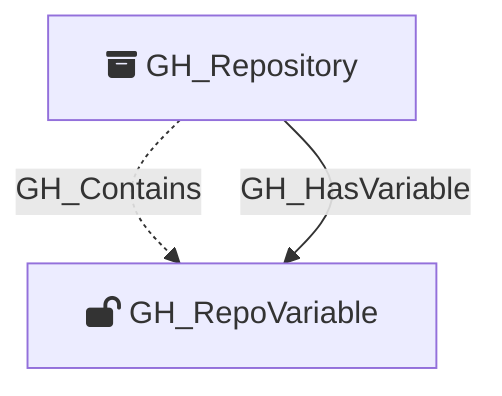

Represents a repository-level GitHub Actions variable. These are variables defined directly on a specific repository and are only accessible to workflows running in that repository. Unlike secrets, variable values are readable via the API.

Created by: `Git-HoundVariable`

## Edges

<Note>
The tables below list edges defined by the GitHound extension only. Additional edges to or from this node may be created by other extensions.
</Note>

### Inbound Edges

| Edge Type | Source Node Types | Traversable |
| --------- | ----------------- | ----------- |
| [GH_HasVariable](https://github.com/SpecterOps/bloodhound-docs/blob/main//opengraph/extensions/github/edges/gh_hasvariable) | [GH_Repository](https://github.com/SpecterOps/bloodhound-docs/blob/main//opengraph/extensions/github/nodes/gh_repository) | ✅ |

### Outbound Edges

No outbound edges are defined by the GitHound extension for this node.

## Properties

| Property Name    | Data Type | Description                                                                 |
| ---------------- | --------- | --------------------------------------------------------------------------- |
| objectid         | string    | A deterministic ID in the format `GH_Variable_{repoNodeId}_{variableName}`. |
| id               | string    | Same as objectid.                                                           |
| name             | string    | The name of the variable.                                                   |
| environment_name | string    | The name of the environment (GitHub organization).                          |
| environmentid    | string    | The node_id of the environment (GitHub organization).                       |
| repository_name  | string    | The name of the containing repository.                                      |
| repository_id    | string    | The node_id of the containing repository.                                   |
| value            | string    | The plaintext value of the variable.                                        |
| created_at       | datetime  | When the variable was created.                                              |
| updated_at       | datetime  | When the variable was last updated.                                         |

## Diagram

