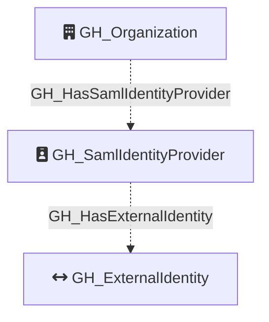

Represents a SAML identity provider configured for the organization. This node captures the SAML SSO configuration details and serves as the parent container for external identity mappings. Through external identities, it enables linking GitHub users to their corporate identities in the identity provider.

Created by: `Git-HoundGraphQlSamlProvider`

## Edges

<Note>
The tables below list edges defined by the GitHound extension only. Additional edges to or from this node may be created by other extensions.
</Note>

### Inbound Edges

| Edge Type | Source Node Types | Traversable |
| --------- | ----------------- | ----------- |
| [GH_HasSamlIdentityProvider](https://github.com/SpecterOps/bloodhound-docs/blob/main//opengraph/extensions/github/edges/gh_hassamlidentityprovider) | [GH_Organization](https://github.com/SpecterOps/bloodhound-docs/blob/main//opengraph/extensions/github/nodes/gh_organization) | ❌ |

### Outbound Edges

| Edge Type | Destination Node Types | Traversable |
| --------- | ---------------------- | ----------- |
| [GH_HasExternalIdentity](https://github.com/SpecterOps/bloodhound-docs/blob/main//opengraph/extensions/github/edges/gh_hasexternalidentity) | [GH_ExternalIdentity](https://github.com/SpecterOps/bloodhound-docs/blob/main//opengraph/extensions/github/nodes/gh_externalidentity) | ❌ |

## Properties

| Property Name         | Data Type | Description                                                |
| --------------------- | --------- | ---------------------------------------------------------- |
| objectid              | string    | The GraphQL ID of the SAML identity provider.              |
| name                  | string    | Same as objectid.                                          |
| node_id               | string    | Same as objectid.                                          |
| environment_name      | string    | The name of the environment (GitHub organization).         |
| environmentid         | string    | The GraphQL ID of the environment (GitHub organization).   |
| foreign_environmentid | string    | The ID of the foreign environment linked to this provider. |
| digest_method         | string    | The digest method used by the SAML provider.               |
| idp_certificate       | string    | The identity provider's X.509 certificate.                 |
| issuer                | string    | The SAML issuer URL.                                       |
| signature_method      | string    | The signature method used by the SAML provider.            |
| sso_url               | string    | The SAML single sign-on URL.                               |

## Diagram

