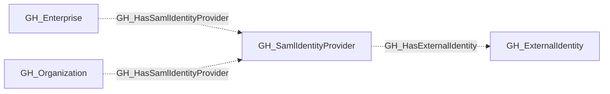
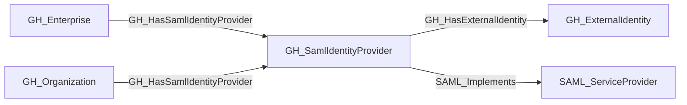

## General Information

Represents a SAML identity provider configured for the organization. This node captures the SAML SSO configuration details and serves as the parent container for external identity mappings. Through external identities, it enables linking GitHub users to their corporate identities in the identity provider.

## Properties

| Property | Type | Description |
| --- | --- | --- |
| `name` | `string` | The node name used for matching and display. |
| `displayname` | `string` | The human-readable display name. |
| `environmentid` | `string` | The identifier of the GitHub environment where this node was collected. |
| `last_seen` | `datetime` | The timestamp when this node was last observed during collection. |
| `node_id` | `string` | The stable identifier used as the OpenGraph node ID; this is the native GitHub node ID where available. |
| `issuer` | `string` | The SAML issuer URL. |
| `sso_url` | `string` | The SAML single sign-on URL. |
| `signature_method` | `string` | The signature method used by the SAML provider. |
| `digest_method` | `string` | The digest method used by the SAML provider. |
| `idp_certificate` | `string` | The identity provider's X.509 certificate. |
| `environment_name` | `string` | The name of the environment (GitHub organization). |
| `foreign_environment_id` | `string` | The ID of the foreign environment linked to this provider. |
| `github_deployment_id` | `string` | The github deployment id value. |
| `github_web_origin` | `string` | The github web origin value. |
| `query_environments` | `string` | Query for environments. |
| `query_external_identities` | `string` | Query for external identities. |

## Diagram

```mermaid
graph LR
    n0["GH_Enterprise"]
    n1["GH_SamlIdentityProvider"]
    n2["GH_Organization"]
    n3["GH_ExternalIdentity"]
    n0 -.->|GH_HasSamlIdentityProvider| n1
    n2 -.->|GH_HasSamlIdentityProvider| n1
    n1 -.->|GH_HasExternalIdentity| n3
```

## Edges

<Note>
The tables below list edges defined by the GitHub extension only. Additional edges to or from this node may be created by other extensions.
</Note>

```mermaid
flowchart LR

    GH_Enterprise["GH_Enterprise"]
    GH_ExternalIdentity["GH_ExternalIdentity"]
    GH_Organization["GH_Organization"]
    GH_SamlIdentityProvider["GH_SamlIdentityProvider"]
    SAML_ServiceProvider["SAML_ServiceProvider"]
    GH_Enterprise -- GH_HasSamlIdentityProvider --> GH_SamlIdentityProvider
    GH_Organization -- GH_HasSamlIdentityProvider --> GH_SamlIdentityProvider
    GH_SamlIdentityProvider -- GH_HasExternalIdentity --> GH_ExternalIdentity
    GH_SamlIdentityProvider -- SAML_Implements --> SAML_ServiceProvider
```

### Inbound Edges

| Edge Type | Source Node Types | Traversable |
| --------- | ----------------- | ----------- |
| [GH_HasSamlIdentityProvider](https://github.com/SpecterOps/bloodhound-docs/blob/main//opengraph/extensions/github/edges/gh_hassamlidentityprovider) | [GH_Enterprise](https://github.com/SpecterOps/bloodhound-docs/blob/main//opengraph/extensions/github/nodes/gh_enterprise), [GH_Organization](https://github.com/SpecterOps/bloodhound-docs/blob/main//opengraph/extensions/github/nodes/gh_organization) | ❌ |

### Outbound Edges

| Edge Type | Destination Node Types | Traversable |
| --------- | ---------------------- | ----------- |
| [GH_HasExternalIdentity](https://github.com/SpecterOps/bloodhound-docs/blob/main//opengraph/extensions/github/edges/gh_hasexternalidentity) | [GH_ExternalIdentity](https://github.com/SpecterOps/bloodhound-docs/blob/main//opengraph/extensions/github/nodes/gh_externalidentity) | ❌ |
| SAML_Implements | SAML_ServiceProvider | ❌ |

## Properties

| Property | Type | Description |
| -------- | ---- | ----------- |
| `name` | `str` | - |
| `displayname` | `str` | - |
| `environmentid` | `str` | - |
| `last_seen` | `datetime` | - |
| `node_id` | `str` | - |
| `issuer` | `str \| None` | The SAML issuer URL. |
| `sso_url` | `str \| None` | The SAML single sign-on URL. |
| `signature_method` | `str \| None` | The signature method used by the SAML provider. |
| `digest_method` | `str \| None` | The digest method used by the SAML provider. |
| `idp_certificate` | `str \| None` | The identity provider's X.509 certificate. |
| `environment_name` | `str \| None` | The name of the environment (GitHub organization). |
| `foreign_environment_id` | `str \| None` | The ID of the foreign environment linked to this provider. |
| `github_deployment_id` | `str \| None` | - |
| `github_web_origin` | `str \| None` | - |
| `query_environments` | `str \| None` | Query for environments. |
| `query_external_identities` | `str \| None` | Query for external identities. |
