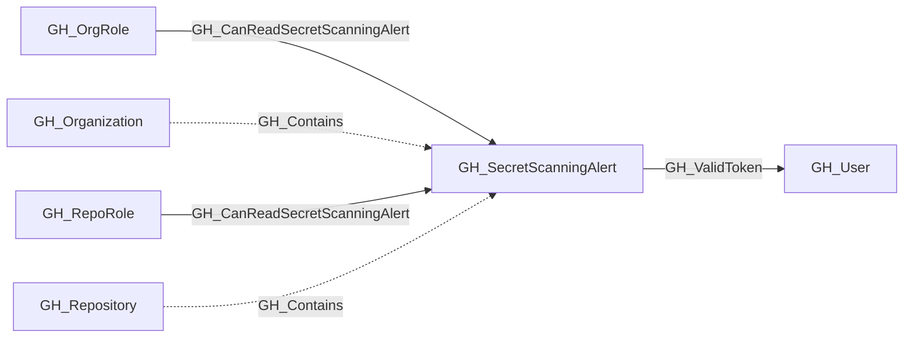
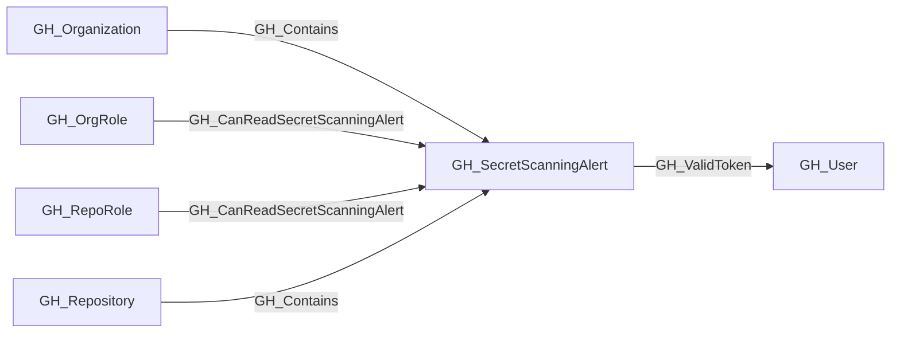

## General Information

Represents a GitHub secret scanning alert detected in a repository. Secret scanning alerts are raised when GitHub detects a known secret pattern (such as an API key, token, or credential) committed to a repository. The alert captures the secret type, validity status, and current resolution state.

## Properties

| Property | Type | Description |
| --- | --- | --- |
| `name` | `string` | The node name used for matching and display. |
| `displayname` | `string` | The human-readable display name. |
| `environmentid` | `string` | The identifier of the GitHub environment where this node was collected. |
| `last_seen` | `datetime` | The timestamp when this node was last observed during collection. |
| `node_id` | `string` | The stable identifier used as the OpenGraph node ID; this is the native GitHub node ID where available. |
| `repository_name` | `string` | The name of the repository where the secret was detected. |
| `secret_type` | `string` | The type of secret detected (e.g., `github_personal_access_token`, `aws_access_key_id`). |
| `secret_type_display_name` | `string` | A human-readable name for the secret type. |
| `validity` | `string` | The validity status of the detected secret (e.g., `active`, `inactive`, `unknown`). |
| `state` | `string` | The alert state (e.g., `open`, `resolved`). |
| `url` | `string` | The HTML URL to view the alert on GitHub. |
| `query_repository` | `string` | Query for repository. |
| `query_alert_viewers` | `string` | Query for alert viewers. |

## Diagram

## Edges

<Note>
The tables below list edges defined by the GitHub extension only. Additional edges to or from this node may be created by other extensions.
</Note>

### Inbound Edges

| Edge Type | Source Node Types | Traversable |
| --------- | ----------------- | ----------- |
| [GH_CanReadSecretScanningAlert](https://github.com/SpecterOps/bloodhound-docs/blob/main//opengraph/extensions/github/edges/gh_canreadsecretscanningalert) | [GH_OrgRole](https://github.com/SpecterOps/bloodhound-docs/blob/main//opengraph/extensions/github/nodes/gh_orgrole), [GH_RepoRole](https://github.com/SpecterOps/bloodhound-docs/blob/main//opengraph/extensions/github/nodes/gh_reporole) | ✅ |
| [GH_Contains](https://github.com/SpecterOps/bloodhound-docs/blob/main//opengraph/extensions/github/edges/gh_contains) | [GH_Organization](https://github.com/SpecterOps/bloodhound-docs/blob/main//opengraph/extensions/github/nodes/gh_organization), [GH_Repository](https://github.com/SpecterOps/bloodhound-docs/blob/main//opengraph/extensions/github/nodes/gh_repository) | ❌ |

### Outbound Edges

| Edge Type | Destination Node Types | Traversable |
| --------- | ---------------------- | ----------- |
| [GH_ValidToken](https://github.com/SpecterOps/bloodhound-docs/blob/main//opengraph/extensions/github/edges/gh_validtoken) | [GH_User](https://github.com/SpecterOps/bloodhound-docs/blob/main//opengraph/extensions/github/nodes/gh_user) | ✅ |

## Properties

| Property | Type | Description |
| -------- | ---- | ----------- |
| `name` | `str` | - |
| `displayname` | `str` | - |
| `environmentid` | `str` | - |
| `last_seen` | `datetime` | - |
| `node_id` | `str` | - |
| `repository_name` | `str \| None` | The name of the repository where the secret was detected. |
| `secret_type` | `str \| None` | The type of secret detected (e.g., `github_personal_access_token`, `aws_access_key_id`). |
| `secret_type_display_name` | `str \| None` | A human-readable name for the secret type. |
| `validity` | `str \| None` | The validity status of the detected secret (e.g., `active`, `inactive`, `unknown`). |
| `state` | `str \| None` | The alert state (e.g., `open`, `resolved`). |
| `url` | `str \| None` | The HTML URL to view the alert on GitHub. |
| `query_repository` | `str \| None` | Query for repository. |
| `query_alert_viewers` | `str \| None` | Query for alert viewers. |
