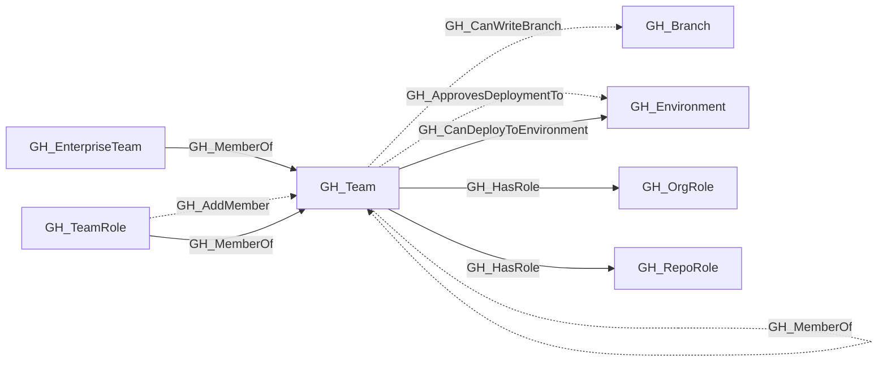
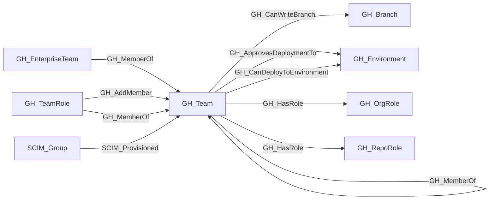

## General Information

Represents a GitHub team within the organization. Teams can have parent-child relationships, contain members with different roles (Member, Maintainer), and be assigned to repository roles.

## Properties

| Property | Type | Description |
| --- | --- | --- |
| `name` | `string` | The node name used for matching and display. |
| `displayname` | `string` | The human-readable display name. |
| `environmentid` | `string` | The identifier of the GitHub environment where this node was collected. |
| `last_seen` | `datetime` | The timestamp when this node was last observed during collection. |
| `node_id` | `string` | The stable identifier used as the OpenGraph node ID; this is the native GitHub node ID where available. |
| `collected` | `boolean` | Collected/generated by OpenHound. |
| `github_team_id` | `string` | The raw GitHub team node ID. |
| `slug` | `string` | The team's URL-safe slug identifier. |
| `description` | `string` | The team's description. |
| `privacy` | `string` | The team's privacy level (e.g., `visible`, `secret`). |
| `type` | `string` | The team type, such as `enterprise` for projected enterprise teams. |
| `external_group_id` | `integer` | GitHub's org-scoped external IdP group identifier. |
| `external_group_name` | `string` | The external IdP group name reported by GitHub. |
| `environment_name` | `string` | The name of the environment (GitHub organization). |
| `query_first_degree_members` | `string` | Query for first degree members. |
| `query_unrolled_members` | `string` | Query for unrolled members. |
| `query_first_degree_maintainers` | `string` | Query for first degree maintainers. |
| `query_unrolled_maintainers` | `string` | Query for unrolled maintainers. |
| `query_repositories` | `string` | Query for repositories. |
| `query_child_teams` | `string` | Query for child teams. |

## Diagram

```mermaid
graph LR
    n0["GH_EnterpriseTeam"]
    n1["GH_Team"]
    n2["GH_Branch"]
    n3["GH_Environment"]
    n4["GH_OrgRole"]
    n5["GH_RepoRole"]
    n6["GH_TeamRole"]
    n0 -->|GH_MemberOf| n1
    n1 -.->|GH_CanWriteBranch| n2
    n1 -.->|GH_ApprovesDeploymentTo| n3
    n1 -->|GH_CanDeployToEnvironment| n3
    n1 -->|GH_HasRole| n4
    n1 -->|GH_HasRole| n5
    n1 -.->|GH_MemberOf| n1
    n6 -.->|GH_AddMember| n1
    n6 -->|GH_MemberOf| n1
```

## Edges

<Note>
The tables below list edges defined by the GitHub extension only. Additional edges to or from this node may be created by other extensions.
</Note>

```mermaid
flowchart LR

    GH_Branch["GH_Branch"]
    GH_EnterpriseTeam["GH_EnterpriseTeam"]
    GH_Environment["GH_Environment"]
    GH_OrgRole["GH_OrgRole"]
    GH_RepoRole["GH_RepoRole"]
    GH_Team["GH_Team"]
    GH_TeamRole["GH_TeamRole"]
    SCIM_Group["SCIM_Group"]
    GH_EnterpriseTeam -- GH_MemberOf --> GH_Team
    GH_Team -- GH_ApprovesDeploymentTo --> GH_Environment
    GH_Team -- GH_CanDeployToEnvironment --> GH_Environment
    GH_Team -- GH_CanWriteBranch --> GH_Branch
    GH_Team -- GH_HasRole --> GH_OrgRole
    GH_Team -- GH_HasRole --> GH_RepoRole
    GH_Team -- GH_MemberOf --> GH_Team
    GH_TeamRole -- GH_AddMember --> GH_Team
    GH_TeamRole -- GH_MemberOf --> GH_Team
    SCIM_Group -- SCIM_Provisioned --> GH_Team
```

### Inbound Edges

| Edge Type | Source Node Types | Traversable |
| --------- | ----------------- | ----------- |
| [GH_AddMember](https://github.com/SpecterOps/bloodhound-docs/blob/main//opengraph/extensions/github/edges/gh_addmember) | [GH_TeamRole](https://github.com/SpecterOps/bloodhound-docs/blob/main//opengraph/extensions/github/nodes/gh_teamrole) | ❌ |
| [GH_MemberOf](https://github.com/SpecterOps/bloodhound-docs/blob/main//opengraph/extensions/github/edges/gh_memberof) | [GH_EnterpriseTeam](https://github.com/SpecterOps/bloodhound-docs/blob/main//opengraph/extensions/github/nodes/gh_enterpriseteam), [GH_Team](https://github.com/SpecterOps/bloodhound-docs/blob/main//opengraph/extensions/github/nodes/gh_team), [GH_TeamRole](https://github.com/SpecterOps/bloodhound-docs/blob/main//opengraph/extensions/github/nodes/gh_teamrole) | ✅ |
| SCIM_Provisioned | SCIM_Group | ❌ |

### Outbound Edges

| Edge Type | Destination Node Types | Traversable |
| --------- | ---------------------- | ----------- |
| [GH_ApprovesDeploymentTo](https://github.com/SpecterOps/bloodhound-docs/blob/main//opengraph/extensions/github/edges/gh_approvesdeploymentto) | [GH_Environment](https://github.com/SpecterOps/bloodhound-docs/blob/main//opengraph/extensions/github/nodes/gh_environment) | ❌ |
| [GH_CanDeployToEnvironment](https://github.com/SpecterOps/bloodhound-docs/blob/main//opengraph/extensions/github/edges/gh_candeploytoenvironment) | [GH_Environment](https://github.com/SpecterOps/bloodhound-docs/blob/main//opengraph/extensions/github/nodes/gh_environment) | ✅ |
| [GH_CanWriteBranch](https://github.com/SpecterOps/bloodhound-docs/blob/main//opengraph/extensions/github/edges/gh_canwritebranch) | [GH_Branch](https://github.com/SpecterOps/bloodhound-docs/blob/main//opengraph/extensions/github/nodes/gh_branch) | ✅ |
| [GH_HasRole](https://github.com/SpecterOps/bloodhound-docs/blob/main//opengraph/extensions/github/edges/gh_hasrole) | [GH_OrgRole](https://github.com/SpecterOps/bloodhound-docs/blob/main//opengraph/extensions/github/nodes/gh_orgrole), [GH_RepoRole](https://github.com/SpecterOps/bloodhound-docs/blob/main//opengraph/extensions/github/nodes/gh_reporole) | ✅ |
| [GH_MemberOf](https://github.com/SpecterOps/bloodhound-docs/blob/main//opengraph/extensions/github/edges/gh_memberof) | [GH_Team](https://github.com/SpecterOps/bloodhound-docs/blob/main//opengraph/extensions/github/nodes/gh_team) | ✅ |

## Properties

| Property | Type | Description |
| -------- | ---- | ----------- |
| `name` | `str` | - |
| `displayname` | `str` | - |
| `environmentid` | `str` | - |
| `last_seen` | `datetime` | - |
| `node_id` | `str` | - |
| `collected` | `bool` | Collected/generated by OpenHound |
| `github_team_id` | `str \| None` | The raw GitHub team node ID. |
| `slug` | `str \| None` | The team's URL-safe slug identifier. |
| `description` | `str \| None` | The team's description. |
| `privacy` | `str \| None` | The team's privacy level (e.g., `visible`, `secret`). |
| `type` | `str \| None` | The team type, such as `enterprise` for projected enterprise teams. |
| `external_group_id` | `int \| None` | GitHub's org-scoped external IdP group identifier. |
| `external_group_name` | `str \| None` | The external IdP group name reported by GitHub. |
| `environment_name` | `str \| None` | The name of the environment (GitHub organization). |
| `query_first_degree_members` | `str \| None` | Query for first degree members. |
| `query_unrolled_members` | `str \| None` | Query for unrolled members. |
| `query_first_degree_maintainers` | `str \| None` | Query for first degree maintainers. |
| `query_unrolled_maintainers` | `str \| None` | Query for unrolled maintainers. |
| `query_repositories` | `str \| None` | Query for repositories. |
| `query_child_teams` | `str \| None` | Query for child teams. |
