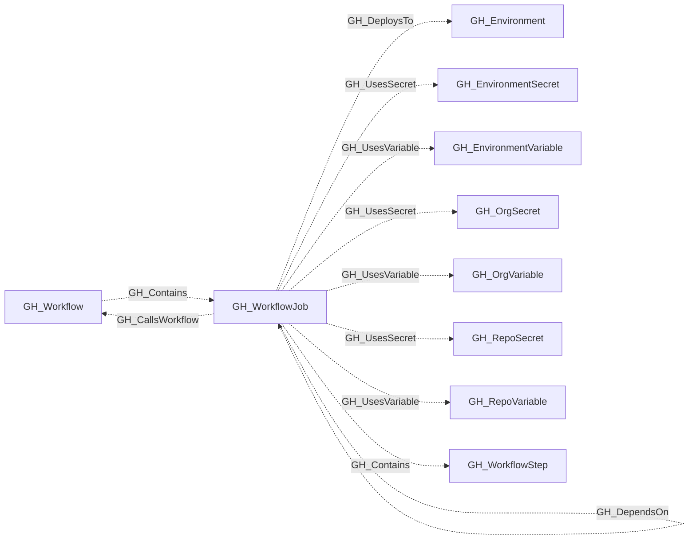
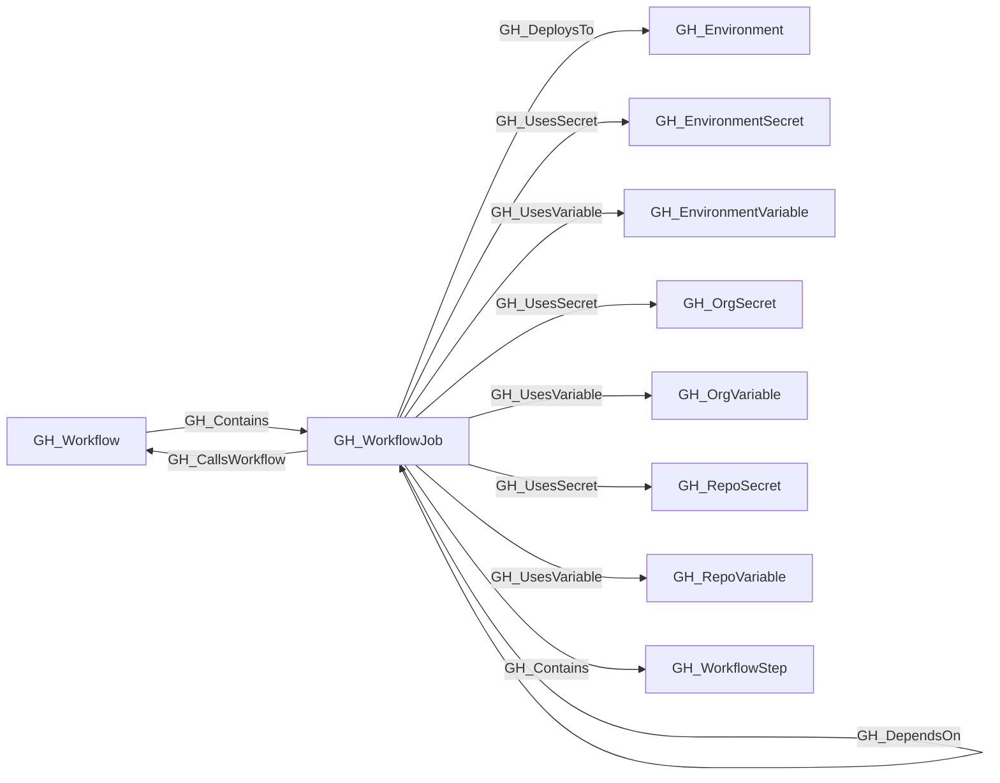

## General Information

Represents a single job within a GitHub Actions workflow. Jobs are the top-level execution units of a workflow — they run on a runner, hold a set of steps, and can declare permissions, environments, and dependencies on other jobs.

## Properties

| Property | Type | Description |
| --- | --- | --- |
| `name` | `string` | The node name used for matching and display. |
| `displayname` | `string` | The human-readable display name. |
| `environmentid` | `string` | The identifier of the GitHub environment where this node was collected. |
| `last_seen` | `datetime` | The timestamp when this node was last observed during collection. |
| `node_id` | `string` | The stable identifier used as the OpenGraph node ID; this is the native GitHub node ID where available. |
| `job_key` | `string` | The YAML key for the job. |
| `runs_on` | `list[string]` | The runner label expression for the job. |
| `is_self_hosted` | `boolean` | Whether the job targets self-hosted runners. |
| `container` | `string` | The optional container configuration. |
| `environment` | `string` | The deployment environment name. |
| `permissions` | `list[string]` | Effective job permissions. |
| `uses_reusable` | `string` | The reusable workflow reference used by this job. |
| `workflow_node_id` | `string` | The parent workflow node ID. |
| `repository_name` | `string` | The containing repository name. |
| `repository_id` | `string` | The containing repository node ID. |
| `environment_name` | `string` | The name of the GitHub organization. |
| `query_repository` | `string` | Query for repository. |
| `query_steps` | `string` | Query for workflow steps. |
| `query_references` | `string` | Query for workflow references (secrets and variables). |

## Diagram

```mermaid
graph LR
    n0["GH_Workflow"]
    n1["GH_WorkflowJob"]
    n2["GH_Environment"]
    n3["GH_EnvironmentSecret"]
    n4["GH_EnvironmentVariable"]
    n5["GH_OrgSecret"]
    n6["GH_OrgVariable"]
    n7["GH_RepoSecret"]
    n8["GH_RepoVariable"]
    n9["GH_WorkflowStep"]
    n0 -.->|GH_Contains| n1
    n1 -.->|GH_DeploysTo| n2
    n1 -.->|GH_UsesSecret| n3
    n1 -.->|GH_UsesVariable| n4
    n1 -.->|GH_UsesSecret| n5
    n1 -.->|GH_UsesVariable| n6
    n1 -.->|GH_UsesSecret| n7
    n1 -.->|GH_UsesVariable| n8
    n1 -.->|GH_CallsWorkflow| n0
    n1 -.->|GH_DependsOn| n1
    n1 -.->|GH_Contains| n9
```

## Edges

<Note>
The tables below list edges defined by the GitHub extension only. Additional edges to or from this node may be created by other extensions.
</Note>

```mermaid
flowchart LR

    GH_Environment["GH_Environment"]
    GH_EnvironmentSecret["GH_EnvironmentSecret"]
    GH_EnvironmentVariable["GH_EnvironmentVariable"]
    GH_OrgSecret["GH_OrgSecret"]
    GH_OrgVariable["GH_OrgVariable"]
    GH_RepoSecret["GH_RepoSecret"]
    GH_RepoVariable["GH_RepoVariable"]
    GH_Workflow["GH_Workflow"]
    GH_WorkflowJob["GH_WorkflowJob"]
    GH_WorkflowStep["GH_WorkflowStep"]
    GH_Workflow -- GH_Contains --> GH_WorkflowJob
    GH_WorkflowJob -- GH_CallsWorkflow --> GH_Workflow
    GH_WorkflowJob -- GH_Contains --> GH_WorkflowStep
    GH_WorkflowJob -- GH_DependsOn --> GH_WorkflowJob
    GH_WorkflowJob -- GH_DeploysTo --> GH_Environment
    GH_WorkflowJob -- GH_UsesSecret --> GH_EnvironmentSecret
    GH_WorkflowJob -- GH_UsesSecret --> GH_OrgSecret
    GH_WorkflowJob -- GH_UsesSecret --> GH_RepoSecret
    GH_WorkflowJob -- GH_UsesVariable --> GH_EnvironmentVariable
    GH_WorkflowJob -- GH_UsesVariable --> GH_OrgVariable
    GH_WorkflowJob -- GH_UsesVariable --> GH_RepoVariable
```

### Inbound Edges

| Edge Type | Source Node Types | Traversable |
| --------- | ----------------- | ----------- |
| [GH_Contains](https://github.com/SpecterOps/bloodhound-docs/blob/main//opengraph/extensions/github/edges/gh_contains) | [GH_Workflow](https://github.com/SpecterOps/bloodhound-docs/blob/main//opengraph/extensions/github/nodes/gh_workflow) | ❌ |
| [GH_DependsOn](https://github.com/SpecterOps/bloodhound-docs/blob/main//opengraph/extensions/github/edges/gh_dependson) | [GH_WorkflowJob](https://github.com/SpecterOps/bloodhound-docs/blob/main//opengraph/extensions/github/nodes/gh_workflowjob) | ❌ |

### Outbound Edges

| Edge Type | Destination Node Types | Traversable |
| --------- | ---------------------- | ----------- |
| [GH_CallsWorkflow](https://github.com/SpecterOps/bloodhound-docs/blob/main//opengraph/extensions/github/edges/gh_callsworkflow) | [GH_Workflow](https://github.com/SpecterOps/bloodhound-docs/blob/main//opengraph/extensions/github/nodes/gh_workflow) | ❌ |
| [GH_Contains](https://github.com/SpecterOps/bloodhound-docs/blob/main//opengraph/extensions/github/edges/gh_contains) | [GH_WorkflowStep](https://github.com/SpecterOps/bloodhound-docs/blob/main//opengraph/extensions/github/nodes/gh_workflowstep) | ❌ |
| [GH_DependsOn](https://github.com/SpecterOps/bloodhound-docs/blob/main//opengraph/extensions/github/edges/gh_dependson) | [GH_WorkflowJob](https://github.com/SpecterOps/bloodhound-docs/blob/main//opengraph/extensions/github/nodes/gh_workflowjob) | ❌ |
| [GH_DeploysTo](https://github.com/SpecterOps/bloodhound-docs/blob/main//opengraph/extensions/github/edges/gh_deploysto) | [GH_Environment](https://github.com/SpecterOps/bloodhound-docs/blob/main//opengraph/extensions/github/nodes/gh_environment) | ❌ |
| [GH_UsesSecret](https://github.com/SpecterOps/bloodhound-docs/blob/main//opengraph/extensions/github/edges/gh_usessecret) | [GH_EnvironmentSecret](https://github.com/SpecterOps/bloodhound-docs/blob/main//opengraph/extensions/github/nodes/gh_environmentsecret), [GH_OrgSecret](https://github.com/SpecterOps/bloodhound-docs/blob/main//opengraph/extensions/github/nodes/gh_orgsecret), [GH_RepoSecret](https://github.com/SpecterOps/bloodhound-docs/blob/main//opengraph/extensions/github/nodes/gh_reposecret) | ❌ |
| [GH_UsesVariable](https://github.com/SpecterOps/bloodhound-docs/blob/main//opengraph/extensions/github/edges/gh_usesvariable) | [GH_EnvironmentVariable](https://github.com/SpecterOps/bloodhound-docs/blob/main//opengraph/extensions/github/nodes/gh_environmentvariable), [GH_OrgVariable](https://github.com/SpecterOps/bloodhound-docs/blob/main//opengraph/extensions/github/nodes/gh_orgvariable), [GH_RepoVariable](https://github.com/SpecterOps/bloodhound-docs/blob/main//opengraph/extensions/github/nodes/gh_repovariable) | ❌ |

## Properties

| Property | Type | Description |
| -------- | ---- | ----------- |
| `name` | `str` | - |
| `displayname` | `str` | - |
| `environmentid` | `str` | - |
| `last_seen` | `datetime` | - |
| `node_id` | `str` | - |
| `job_key` | `str \| None` | The YAML key for the job. |
| `runs_on` | `list[str] \| None` | The runner label expression for the job. |
| `is_self_hosted` | `bool` | Whether the job targets self-hosted runners. |
| `container` | `str \| None` | The optional container configuration. |
| `environment` | `str \| None` | The deployment environment name. |
| `permissions` | `list[str] \| None` | Effective job permissions. |
| `uses_reusable` | `str \| None` | The reusable workflow reference used by this job. |
| `workflow_node_id` | `str \| None` | The parent workflow node ID. |
| `repository_name` | `str \| None` | The containing repository name. |
| `repository_id` | `str \| None` | The containing repository node ID. |
| `environment_name` | `str \| None` | The name of the GitHub organization. |
| `query_repository` | `str \| None` | Query for repository. |
| `query_steps` | `str \| None` | Query for workflow steps. |
| `query_references` | `str \| None` | Query for workflow references (secrets and variables). |
