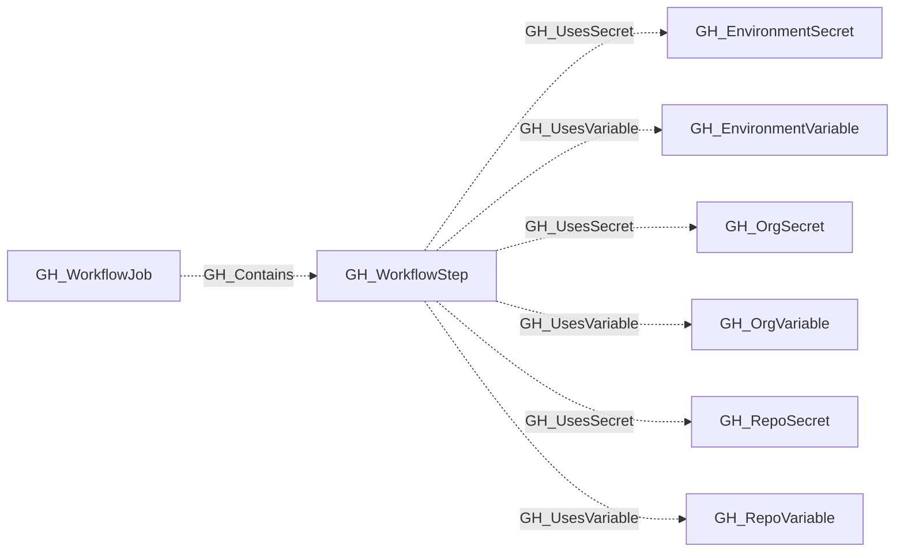
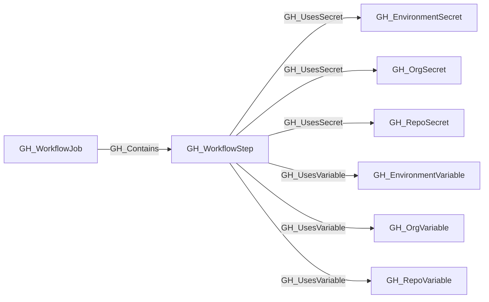

## General Information

Represents a single step within a GitHub Actions job. A step is either a `uses:` action reference or a `run:` shell command. Steps are the leaf nodes of the workflow execution tree and are the primary location where secrets and variables are consumed.

## Properties

| Property | Type | Description |
| --- | --- | --- |
| `name` | `string` | The node name used for matching and display. |
| `displayname` | `string` | The human-readable display name. |
| `environmentid` | `string` | The identifier of the GitHub environment where this node was collected. |
| `last_seen` | `datetime` | The timestamp when this node was last observed during collection. |
| `node_id` | `string` | The stable identifier used as the OpenGraph node ID; this is the native GitHub node ID where available. |
| `step_index` | `integer` | The zero-based step index within the parent job. |
| `type` | `string` | The step type: `uses`, `run`, or `unknown`. |
| `action` | `string` | The full action reference from `uses`. |
| `action_slug` | `string` | The action owner/name without ref. |
| `action_owner` | `string` | The action owner. |
| `action_name` | `string` | The action name. |
| `action_ref` | `string` | The action ref. |
| `is_pinned` | `boolean` | Whether the action ref is a full commit SHA. |
| `run` | `string` | The shell command body for `run` steps. |
| `contents` | `string` | The full parsed step definition. |
| `job_node_id` | `string` | The parent workflow job node ID. |
| `workflow_node_id` | `string` | The parent workflow node ID. |
| `repository_name` | `string` | The containing repository name. |
| `repository_id` | `string` | The containing repository node ID. |
| `environment_name` | `string` | The name of the GitHub organization. |
| `query_repository` | `string` | Query for containing repository. |
| `query_references` | `string` | Query for secrets and variables referenced by the step. |

## Diagram

```mermaid
graph LR
    n0["GH_WorkflowJob"]
    n1["GH_WorkflowStep"]
    n2["GH_EnvironmentSecret"]
    n3["GH_EnvironmentVariable"]
    n4["GH_OrgSecret"]
    n5["GH_OrgVariable"]
    n6["GH_RepoSecret"]
    n7["GH_RepoVariable"]
    n0 -.->|GH_Contains| n1
    n1 -.->|GH_UsesSecret| n2
    n1 -.->|GH_UsesVariable| n3
    n1 -.->|GH_UsesSecret| n4
    n1 -.->|GH_UsesVariable| n5
    n1 -.->|GH_UsesSecret| n6
    n1 -.->|GH_UsesVariable| n7
```

## Edges

<Note>
The tables below list edges defined by the GitHub extension only. Additional edges to or from this node may be created by other extensions.
</Note>

```mermaid
flowchart LR

    GH_EnvironmentSecret["GH_EnvironmentSecret"]
    GH_EnvironmentVariable["GH_EnvironmentVariable"]
    GH_OrgSecret["GH_OrgSecret"]
    GH_OrgVariable["GH_OrgVariable"]
    GH_RepoSecret["GH_RepoSecret"]
    GH_RepoVariable["GH_RepoVariable"]
    GH_WorkflowJob["GH_WorkflowJob"]
    GH_WorkflowStep["GH_WorkflowStep"]
    GH_WorkflowJob -- GH_Contains --> GH_WorkflowStep
    GH_WorkflowStep -- GH_UsesSecret --> GH_EnvironmentSecret
    GH_WorkflowStep -- GH_UsesSecret --> GH_OrgSecret
    GH_WorkflowStep -- GH_UsesSecret --> GH_RepoSecret
    GH_WorkflowStep -- GH_UsesVariable --> GH_EnvironmentVariable
    GH_WorkflowStep -- GH_UsesVariable --> GH_OrgVariable
    GH_WorkflowStep -- GH_UsesVariable --> GH_RepoVariable
```

### Inbound Edges

| Edge Type | Source Node Types | Traversable |
| --------- | ----------------- | ----------- |
| [GH_Contains](https://github.com/SpecterOps/bloodhound-docs/blob/main//opengraph/extensions/github/edges/gh_contains) | [GH_WorkflowJob](https://github.com/SpecterOps/bloodhound-docs/blob/main//opengraph/extensions/github/nodes/gh_workflowjob) | ❌ |

### Outbound Edges

| Edge Type | Destination Node Types | Traversable |
| --------- | ---------------------- | ----------- |
| [GH_UsesSecret](https://github.com/SpecterOps/bloodhound-docs/blob/main//opengraph/extensions/github/edges/gh_usessecret) | [GH_EnvironmentSecret](https://github.com/SpecterOps/bloodhound-docs/blob/main//opengraph/extensions/github/nodes/gh_environmentsecret), [GH_OrgSecret](https://github.com/SpecterOps/bloodhound-docs/blob/main//opengraph/extensions/github/nodes/gh_orgsecret), [GH_RepoSecret](https://github.com/SpecterOps/bloodhound-docs/blob/main//opengraph/extensions/github/nodes/gh_reposecret) | ❌ |
| [GH_UsesVariable](https://github.com/SpecterOps/bloodhound-docs/blob/main//opengraph/extensions/github/edges/gh_usesvariable) | [GH_EnvironmentVariable](https://github.com/SpecterOps/bloodhound-docs/blob/main//opengraph/extensions/github/nodes/gh_environmentvariable), [GH_OrgVariable](https://github.com/SpecterOps/bloodhound-docs/blob/main//opengraph/extensions/github/nodes/gh_orgvariable), [GH_RepoVariable](https://github.com/SpecterOps/bloodhound-docs/blob/main//opengraph/extensions/github/nodes/gh_repovariable) | ❌ |

## Properties

| Property | Type | Description |
| -------- | ---- | ----------- |
| `name` | `str` | - |
| `displayname` | `str` | - |
| `environmentid` | `str` | - |
| `last_seen` | `datetime` | - |
| `node_id` | `str` | - |
| `step_index` | `int \| None` | The zero-based step index within the parent job. |
| `type` | `str \| None` | The step type: `uses`, `run`, or `unknown`. |
| `action` | `str \| None` | The full action reference from `uses`. |
| `action_slug` | `str \| None` | The action owner/name without ref. |
| `action_owner` | `str \| None` | The action owner. |
| `action_name` | `str \| None` | The action name. |
| `action_ref` | `str \| None` | The action ref. |
| `is_pinned` | `bool` | Whether the action ref is a full commit SHA. |
| `run` | `str \| None` | The shell command body for `run` steps. |
| `contents` | `str \| None` | The full parsed step definition. |
| `job_node_id` | `str \| None` | The parent workflow job node ID. |
| `workflow_node_id` | `str \| None` | The parent workflow node ID. |
| `repository_name` | `str \| None` | The containing repository name. |
| `repository_id` | `str \| None` | The containing repository node ID. |
| `environment_name` | `str \| None` | The name of the GitHub organization. |
| `query_repository` | `str \| None` | Query for containing repository. |
| `query_references` | `str \| None` | Query for secrets and variables referenced by the step. |
