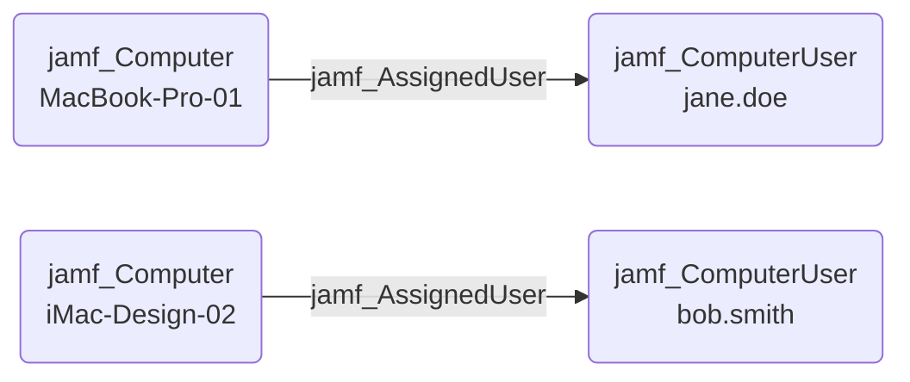

## Edge Schema

- Source: [jamf_Computer](https://github.com/SpecterOps/bloodhound-docs/blob/main//opengraph/extensions/jamf/nodes/jamf_computer) 
- Destination: [jamf_ComputerUser](https://github.com/SpecterOps/bloodhound-docs/blob/main//opengraph/extensions/jamf/nodes/jamf_computeruser)
- Traversable: ✅

## General Information

The traversable jamf_AssignedUser edge represents the user assignment relationship on a Jamf-managed computer. The specified user is assigned to the source computer, establishing the physical access relationship between a device and its primary user.

