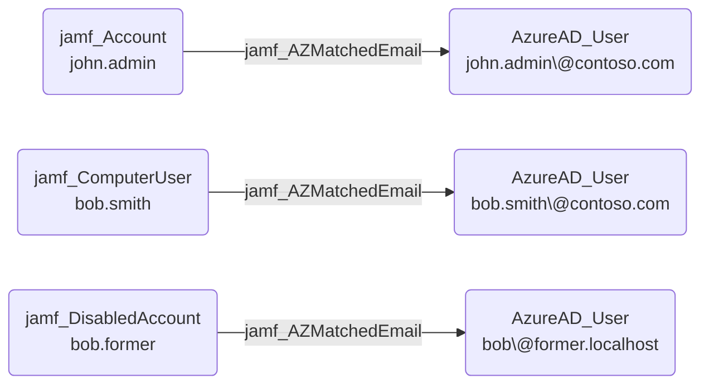

## Edge Schema

- Source: [jamf_Account](https://github.com/SpecterOps/bloodhound-docs/blob/main//opengraph/extensions/jamf/nodes/jamf_account), [jamf_DisabledAccount](https://github.com/SpecterOps/bloodhound-docs/blob/main//opengraph/extensions/jamf/nodes/jamf_disabledaccount), [jamf_ComputerUser](https://github.com/SpecterOps/bloodhound-docs/blob/main//opengraph/extensions/jamf/nodes/jamf_computeruser) 
- Destination: [AZUser](https://github.com/SpecterOps/bloodhound-docs/blob/main//resources/nodes/az-user)
- Traversable: ❌

## General Information

The non-traversable jamf_AZMatchedEmail edge represents a cross-platform identity correlation created during post-processing. When the Jamf principal's email attribute matches an Azure AD account's email, this edge links the identities across environments.

