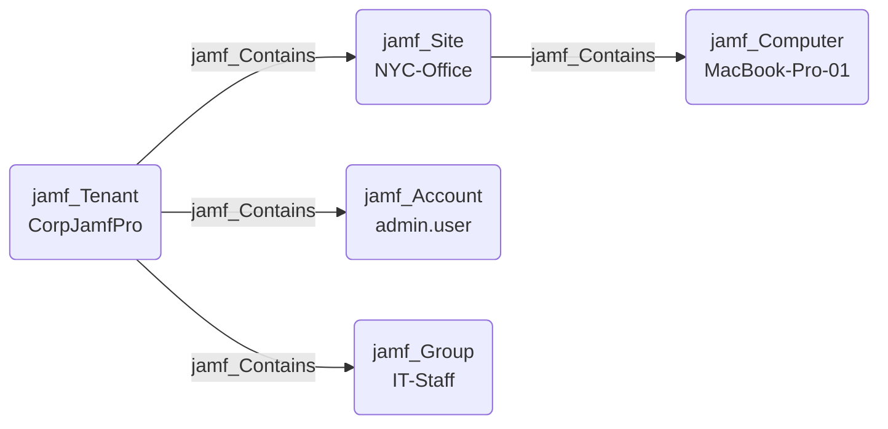

## Edge Schema

- Source: [jamf_Tenant](https://github.com/SpecterOps/bloodhound-docs/blob/main//opengraph/extensions/jamf/nodes/jamf_tenant), [jamf_Site](https://github.com/SpecterOps/bloodhound-docs/blob/main//opengraph/extensions/jamf/nodes/jamf_site) 
- Destination: [jamf_Account](https://github.com/SpecterOps/bloodhound-docs/blob/main//opengraph/extensions/jamf/nodes/jamf_account), [jamf_DisabledAccount](https://github.com/SpecterOps/bloodhound-docs/blob/main//opengraph/extensions/jamf/nodes/jamf_disabledaccount), [jamf_Group](https://github.com/SpecterOps/bloodhound-docs/blob/main//opengraph/extensions/jamf/nodes/jamf_group), [jamf_Computer](https://github.com/SpecterOps/bloodhound-docs/blob/main//opengraph/extensions/jamf/nodes/jamf_computer), [jamf_ComputerUser](https://github.com/SpecterOps/bloodhound-docs/blob/main//opengraph/extensions/jamf/nodes/jamf_computeruser), [jamf_Site](https://github.com/SpecterOps/bloodhound-docs/blob/main//opengraph/extensions/jamf/nodes/jamf_site), [jamf_ApiClient](https://github.com/SpecterOps/bloodhound-docs/blob/main//opengraph/extensions/jamf/nodes/jamf_apiclient), [jamf_DisabledApiClient](https://github.com/SpecterOps/bloodhound-docs/blob/main//opengraph/extensions/jamf/nodes/jamf_disabledapiclient), [jamf_SSOIntegration](https://github.com/SpecterOps/bloodhound-docs/blob/main//opengraph/extensions/jamf/nodes/jamf_ssointegration)
- Traversable: ✅

## General Information

The traversable `jamf_Contains` edge represents a structural containment relationship where the source node contains the target resource. The Jamf tenant contains all top-level resources, while sites contain resources scoped to that site. Resources not assigned to a specific site are contained directly by the tenant. ComputerUser nodes are only contained by sites or tenant indirectly through their parent computer, not directly by Contains edges.

