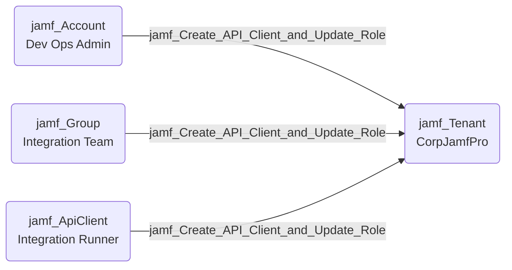

## Edge Schema

- Source: [jamf_Account](https://github.com/SpecterOps/bloodhound-docs/blob/main//opengraph/extensions/jamf/nodes/jamf_account), [jamf_DisabledAccount](https://github.com/SpecterOps/bloodhound-docs/blob/main//opengraph/extensions/jamf/nodes/jamf_disabledaccount), [jamf_Group](https://github.com/SpecterOps/bloodhound-docs/blob/main//opengraph/extensions/jamf/nodes/jamf_group), [jamf_ApiClient](https://github.com/SpecterOps/bloodhound-docs/blob/main//opengraph/extensions/jamf/nodes/jamf_apiclient), [jamf_DisabledApiClient](https://github.com/SpecterOps/bloodhound-docs/blob/main//opengraph/extensions/jamf/nodes/jamf_disabledapiclient) 
- Destination: [jamf_Tenant](https://github.com/SpecterOps/bloodhound-docs/blob/main//opengraph/extensions/jamf/nodes/jamf_tenant)
- Traversable: ✅

## General Information

The traversable `jamf_Create_API_Client_and_Update_Role` edge represents a combined privilege escalation path. The source possesses 'Create API Integrations' and 'Update API Roles' permissions and at least one API role exists, allowing creation of new API clients, modifying existing role permissions, and retrieving credentials for authentication.

