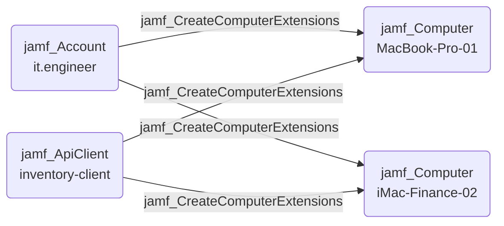

## Edge Schema

- Source: [jamf_Account](https://github.com/SpecterOps/bloodhound-docs/blob/main//opengraph/extensions/jamf/nodes/jamf_account), [jamf_DisabledAccount](https://github.com/SpecterOps/bloodhound-docs/blob/main//opengraph/extensions/jamf/nodes/jamf_disabledaccount), [jamf_Group](https://github.com/SpecterOps/bloodhound-docs/blob/main//opengraph/extensions/jamf/nodes/jamf_group), [jamf_ApiClient](https://github.com/SpecterOps/bloodhound-docs/blob/main//opengraph/extensions/jamf/nodes/jamf_apiclient), [jamf_DisabledApiClient](https://github.com/SpecterOps/bloodhound-docs/blob/main//opengraph/extensions/jamf/nodes/jamf_disabledapiclient) 
- Destination: [jamf_Computer](https://github.com/SpecterOps/bloodhound-docs/blob/main//opengraph/extensions/jamf/nodes/jamf_computer)
- Traversable: ✅

## General Information

The traversable `jamf_CreateComputerExtensions` edge represents the ability to create computer extension attributes that execute code on all computers in the Jamf tenant. Extension attributes can run scripts during inventory collection, providing a code execution vector.

