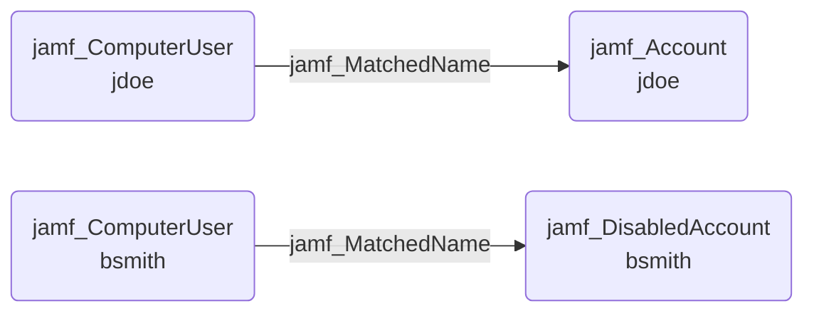

## Edge Schema

- Source: [jamf_ComputerUser](https://github.com/SpecterOps/bloodhound-docs/blob/main//opengraph/extensions/jamf/nodes/jamf_computeruser) 
- Destination: [jamf_Account](https://github.com/SpecterOps/bloodhound-docs/blob/main//opengraph/extensions/jamf/nodes/jamf_account), [jamf_DisabledAccount](https://github.com/SpecterOps/bloodhound-docs/blob/main//opengraph/extensions/jamf/nodes/jamf_disabledaccount)
- Traversable: ✅

## General Information

The traversable jamf_MatchedName edge represents an identity correlation where the Jamf computer user's displayname matches the Jamf account's name or displayname. This links physical device access to Jamf administrative privileges.

