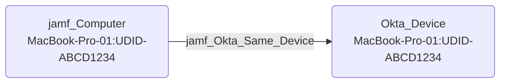

## Edge Schema

- Source: [jamf_Computer](https://github.com/SpecterOps/bloodhound-docs/blob/main//opengraph/extensions/jamf/nodes/jamf_computer) 
- Destination: [Okta_Device](https://github.com/SpecterOps/bloodhound-docs/blob/main//opengraph/extensions/okta/nodes/okta_device)
- Traversable: ✅

## General Information

The traversable jamf_Okta_Same_Device edge represents a hybrid cross-platform device correlation where the Jamf Pro registered computer's UDID matches the registered device UDID in Okta. This edge links the Jamf device graph to the corresponding Okta device.

