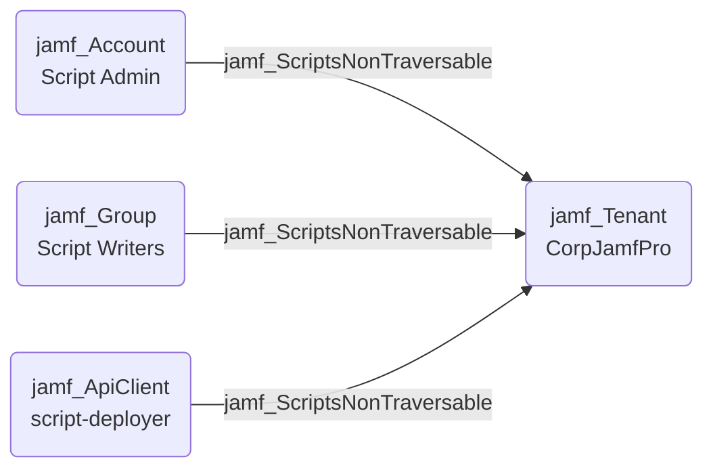

## Edge Schema

- Source: [jamf_Account](https://github.com/SpecterOps/bloodhound-docs/blob/main//opengraph/extensions/jamf/nodes/jamf_account), [jamf_DisabledAccount](https://github.com/SpecterOps/bloodhound-docs/blob/main//opengraph/extensions/jamf/nodes/jamf_disabledaccount), [jamf_Group](https://github.com/SpecterOps/bloodhound-docs/blob/main//opengraph/extensions/jamf/nodes/jamf_group), [jamf_ApiClient](https://github.com/SpecterOps/bloodhound-docs/blob/main//opengraph/extensions/jamf/nodes/jamf_apiclient), [jamf_DisabledApiClient](https://github.com/SpecterOps/bloodhound-docs/blob/main//opengraph/extensions/jamf/nodes/jamf_disabledapiclient) 
- Destination: [jamf_Tenant](https://github.com/SpecterOps/bloodhound-docs/blob/main//opengraph/extensions/jamf/nodes/jamf_tenant)
- Traversable: ❌

## General Information

The non-traversable `jamf_ScriptsNonTraversable` edge represents the ability to create or update scripts on the target. This edge is non-traversable because script creation/modification alone does not enable code execution — a policy must also be configured to run the script.

