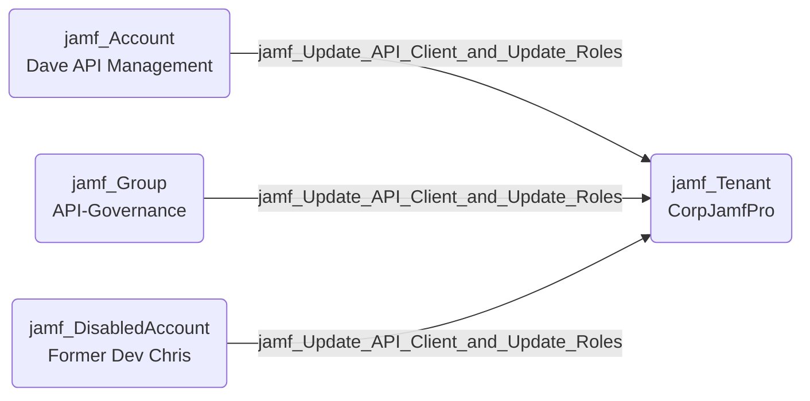

## Edge Schema

- Source: [jamf_Account](https://github.com/SpecterOps/bloodhound-docs/blob/main//opengraph/extensions/jamf/nodes/jamf_account), [jamf_DisabledAccount](https://github.com/SpecterOps/bloodhound-docs/blob/main//opengraph/extensions/jamf/nodes/jamf_disabledaccount), [jamf_Group](https://github.com/SpecterOps/bloodhound-docs/blob/main//opengraph/extensions/jamf/nodes/jamf_group) 
- Destination: [jamf_Tenant](https://github.com/SpecterOps/bloodhound-docs/blob/main//opengraph/extensions/jamf/nodes/jamf_tenant)
- Traversable: ❌

## General Information

The non-traversable `jamf_Update_API_Client_and_Update_Roles` edge represents a combined permission where the source can update existing API clients and update existing API roles. This is non-traversable because Jamf accounts and groups cannot retrieve API client credentials without the 'Create API Integration' permission.

