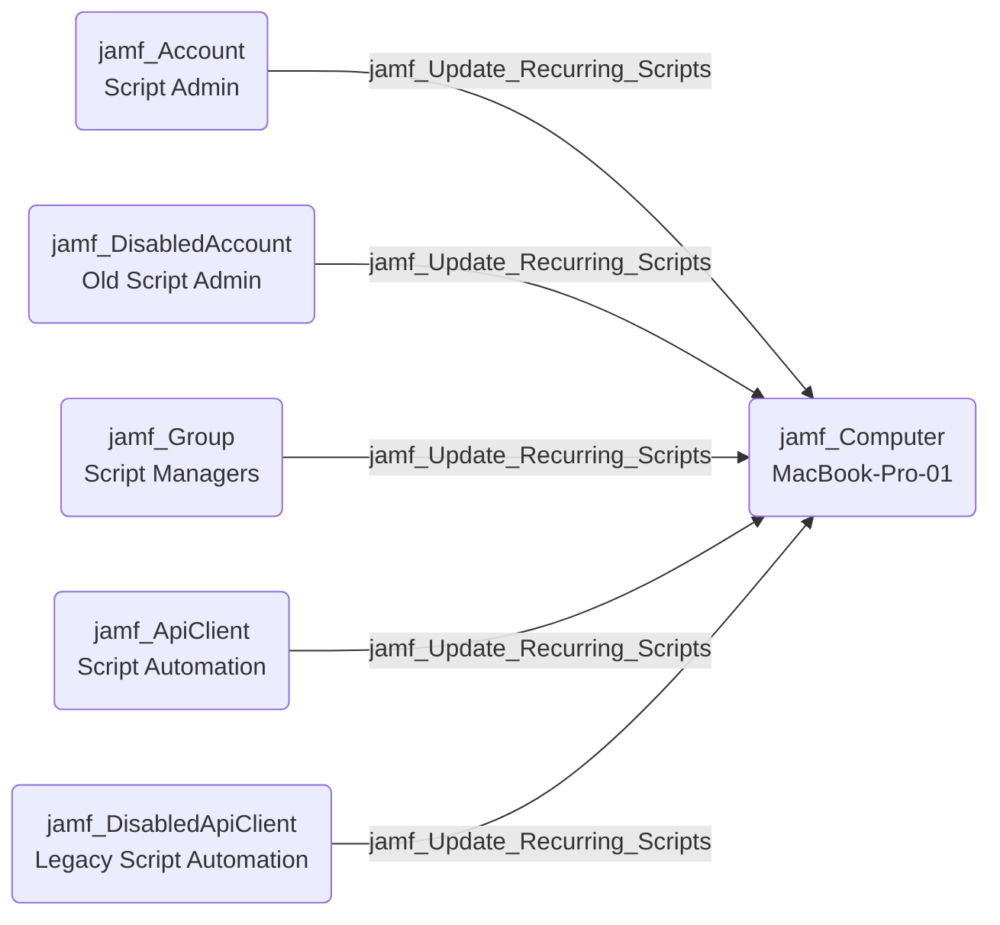

## Edge Schema

- Source: [jamf_Account](https://github.com/SpecterOps/bloodhound-docs/blob/main//opengraph/extensions/jamf/nodes/jamf_account), [jamf_DisabledAccount](https://github.com/SpecterOps/bloodhound-docs/blob/main//opengraph/extensions/jamf/nodes/jamf_disabledaccount), [jamf_Group](https://github.com/SpecterOps/bloodhound-docs/blob/main//opengraph/extensions/jamf/nodes/jamf_group), [jamf_ApiClient](https://github.com/SpecterOps/bloodhound-docs/blob/main//opengraph/extensions/jamf/nodes/jamf_apiclient), [jamf_DisabledApiClient](https://github.com/SpecterOps/bloodhound-docs/blob/main//opengraph/extensions/jamf/nodes/jamf_disabledapiclient) 
- Destination: [jamf_Computer](https://github.com/SpecterOps/bloodhound-docs/blob/main//opengraph/extensions/jamf/nodes/jamf_computer)
- Traversable: ✅

## General Information

The traversable `jamf_Update_Recurring_Scripts` edge represents a code execution path where the source has 'Update Scripts' permission and there are scripts configured to run repeatedly on target computers via enabled policies. The source can modify these scripts to execute arbitrary code on the in-scope computers at the next policy execution cycle.

