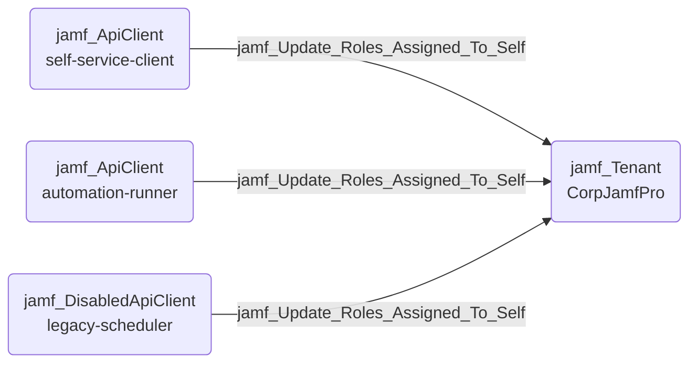

## Edge Schema

- Source: [jamf_ApiClient](https://github.com/SpecterOps/bloodhound-docs/blob/main//opengraph/extensions/jamf/nodes/jamf_apiclient), [jamf_DisabledApiClient](https://github.com/SpecterOps/bloodhound-docs/blob/main//opengraph/extensions/jamf/nodes/jamf_disabledapiclient) 
- Destination: [jamf_Tenant](https://github.com/SpecterOps/bloodhound-docs/blob/main//opengraph/extensions/jamf/nodes/jamf_tenant)
- Traversable: ✅

## General Information

The traversable jamf_Update_Roles_Assigned_To_Self edge represents an API client possessing the 'Update API Roles' privilege which allows updating existing API roles with any permissions, including roles assigned to itself. Since the source already has an assigned role, it can escalate its own privileges by modifying its own role definitions.

