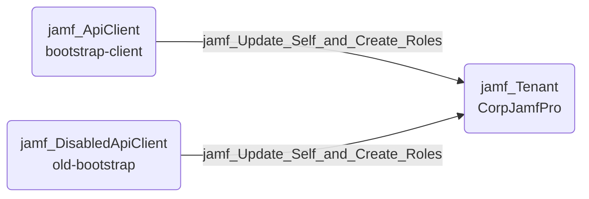

## Edge Schema

- Source: [jamf_ApiClient](https://github.com/SpecterOps/bloodhound-docs/blob/main//opengraph/extensions/jamf/nodes/jamf_apiclient), [jamf_DisabledApiClient](https://github.com/SpecterOps/bloodhound-docs/blob/main//opengraph/extensions/jamf/nodes/jamf_disabledapiclient) 
- Destination: [jamf_Tenant](https://github.com/SpecterOps/bloodhound-docs/blob/main//opengraph/extensions/jamf/nodes/jamf_tenant)
- Traversable: ✅

## General Information

The traversable `jamf_Update_Self_and_Create_Roles` edge represents an API client that possesses 'Update API Integrations' and 'Create API Roles' permissions. This allows the client to update itself or other API clients and assign new roles with any included permissions. Traversable because the source is already an authenticated API client.

