Represents a disabled Jamf Pro account. Disabled accounts retain their permission configuration but cannot actively authenticate. If re-enabled, they regain all assigned privileges.

> This node shares its property set with [jamf_Account](https://github.com/SpecterOps/bloodhound-docs/blob/main//opengraph/extensions/jamf/nodes/jamf_account). The difference is that the account's `enabled` property is set to "Disabled".

## Created by

`process_account_nodes` in `lib/preprocess.py`

## Edges

<Note>
The tables below list edges defined by the JamfHound extension only. Additional edges to or from this node may be created by other extensions.
</Note>

### Inbound Edges

| Edge Type | Source Node Types | Traversable |
| --------- | ----------------- | ----------- |
| [jamf_Contains](https://github.com/SpecterOps/bloodhound-docs/blob/main//opengraph/extensions/jamf/edges/jamf_contains) | [jamf_Tenant](https://github.com/SpecterOps/bloodhound-docs/blob/main//opengraph/extensions/jamf/nodes/jamf_tenant), [jamf_Site](https://github.com/SpecterOps/bloodhound-docs/blob/main//opengraph/extensions/jamf/nodes/jamf_site) | ✅ |
| [jamf_MatchedEmail](https://github.com/SpecterOps/bloodhound-docs/blob/main//opengraph/extensions/jamf/edges/jamf_matchedemail) | [jamf_ComputerUser](https://github.com/SpecterOps/bloodhound-docs/blob/main//opengraph/extensions/jamf/nodes/jamf_computeruser) | ✅ |
| [jamf_MatchedName](https://github.com/SpecterOps/bloodhound-docs/blob/main//opengraph/extensions/jamf/edges/jamf_matchedname) | [jamf_ComputerUser](https://github.com/SpecterOps/bloodhound-docs/blob/main//opengraph/extensions/jamf/nodes/jamf_computeruser) | ✅ |
| [jamf_SSO_Login](https://github.com/SpecterOps/bloodhound-docs/blob/main//opengraph/extensions/jamf/edges/jamf_sso_login) | [jamf_SSOIntegration](https://github.com/SpecterOps/bloodhound-docs/blob/main//opengraph/extensions/jamf/nodes/jamf_ssointegration) | ✅ |
| [jamf_Update_SSO_Settings](https://github.com/SpecterOps/bloodhound-docs/blob/main//opengraph/extensions/jamf/edges/jamf_update_sso_settings) | [jamf_Account](https://github.com/SpecterOps/bloodhound-docs/blob/main//opengraph/extensions/jamf/nodes/jamf_account), [jamf_DisabledAccount](https://github.com/SpecterOps/bloodhound-docs/blob/main//opengraph/extensions/jamf/nodes/jamf_disabledaccount), [jamf_Group](https://github.com/SpecterOps/bloodhound-docs/blob/main//opengraph/extensions/jamf/nodes/jamf_group), [jamf_ApiClient](https://github.com/SpecterOps/bloodhound-docs/blob/main//opengraph/extensions/jamf/nodes/jamf_apiclient), [jamf_DisabledApiClient](https://github.com/SpecterOps/bloodhound-docs/blob/main//opengraph/extensions/jamf/nodes/jamf_disabledapiclient) | ✅ |

### Outbound Edges

| Edge Type | Destination Node Types | Traversable |
| --------- | ---------------------- | ----------- |
| [jamf_AdminTo](https://github.com/SpecterOps/bloodhound-docs/blob/main//opengraph/extensions/jamf/edges/jamf_adminto) | [jamf_Tenant](https://github.com/SpecterOps/bloodhound-docs/blob/main//opengraph/extensions/jamf/nodes/jamf_tenant) | ✅ |
| [jamf_AdminToSite](https://github.com/SpecterOps/bloodhound-docs/blob/main//opengraph/extensions/jamf/edges/jamf_admintosite) | [jamf_Site](https://github.com/SpecterOps/bloodhound-docs/blob/main//opengraph/extensions/jamf/nodes/jamf_site) | ✅ |
| [jamf_AZMatchedEmail](https://github.com/SpecterOps/bloodhound-docs/blob/main//opengraph/extensions/jamf/edges/jamf_azmatchedemail) | [AZUser](https://github.com/SpecterOps/bloodhound-docs/blob/main//resources/nodes/az-user) | ❌ |
| [jamf_Create_API_Client_and_Assign_Role](https://github.com/SpecterOps/bloodhound-docs/blob/main//opengraph/extensions/jamf/edges/jamf_create_api_client_and_assign_role) | [jamf_Tenant](https://github.com/SpecterOps/bloodhound-docs/blob/main//opengraph/extensions/jamf/nodes/jamf_tenant) | ✅ |
| [jamf_Create_API_Client_and_Create_Role](https://github.com/SpecterOps/bloodhound-docs/blob/main//opengraph/extensions/jamf/edges/jamf_create_api_client_and_create_role) | [jamf_Tenant](https://github.com/SpecterOps/bloodhound-docs/blob/main//opengraph/extensions/jamf/nodes/jamf_tenant) | ✅ |
| [jamf_Create_API_Client_and_Update_Role](https://github.com/SpecterOps/bloodhound-docs/blob/main//opengraph/extensions/jamf/edges/jamf_create_api_client_and_update_role) | [jamf_Tenant](https://github.com/SpecterOps/bloodhound-docs/blob/main//opengraph/extensions/jamf/nodes/jamf_tenant) | ✅ |
| [jamf_CreateAccounts](https://github.com/SpecterOps/bloodhound-docs/blob/main//opengraph/extensions/jamf/edges/jamf_createaccounts) | [jamf_Tenant](https://github.com/SpecterOps/bloodhound-docs/blob/main//opengraph/extensions/jamf/nodes/jamf_tenant) | ✅ |
| [jamf_CreateAPIRoles](https://github.com/SpecterOps/bloodhound-docs/blob/main//opengraph/extensions/jamf/edges/jamf_createapiroles) | [jamf_Tenant](https://github.com/SpecterOps/bloodhound-docs/blob/main//opengraph/extensions/jamf/nodes/jamf_tenant) | ❌ |
| [jamf_CreateComputerExtensions](https://github.com/SpecterOps/bloodhound-docs/blob/main//opengraph/extensions/jamf/edges/jamf_createcomputerextensions) | [jamf_Computer](https://github.com/SpecterOps/bloodhound-docs/blob/main//opengraph/extensions/jamf/nodes/jamf_computer) | ✅ |
| [jamf_CreatePolicies](https://github.com/SpecterOps/bloodhound-docs/blob/main//opengraph/extensions/jamf/edges/jamf_createpolicies) | [jamf_Computer](https://github.com/SpecterOps/bloodhound-docs/blob/main//opengraph/extensions/jamf/nodes/jamf_computer) | ✅ |
| [jamf_MemberOf](https://github.com/SpecterOps/bloodhound-docs/blob/main//opengraph/extensions/jamf/edges/jamf_memberof) | [jamf_Group](https://github.com/SpecterOps/bloodhound-docs/blob/main//opengraph/extensions/jamf/nodes/jamf_group) | ✅ |
| [jamf_ScriptsNonTraversable](https://github.com/SpecterOps/bloodhound-docs/blob/main//opengraph/extensions/jamf/edges/jamf_scriptsnontraversable) | [jamf_Tenant](https://github.com/SpecterOps/bloodhound-docs/blob/main//opengraph/extensions/jamf/nodes/jamf_tenant) | ❌ |
| [jamf_Update_API_Client_and_Assign_Role](https://github.com/SpecterOps/bloodhound-docs/blob/main//opengraph/extensions/jamf/edges/jamf_update_api_client_and_assign_role) | [jamf_Tenant](https://github.com/SpecterOps/bloodhound-docs/blob/main//opengraph/extensions/jamf/nodes/jamf_tenant) | ❌ |
| [jamf_Update_API_Client_and_Create_Roles](https://github.com/SpecterOps/bloodhound-docs/blob/main//opengraph/extensions/jamf/edges/jamf_update_api_client_and_create_roles) | [jamf_Tenant](https://github.com/SpecterOps/bloodhound-docs/blob/main//opengraph/extensions/jamf/nodes/jamf_tenant) | ❌ |
| [jamf_Update_API_Client_and_Update_Roles](https://github.com/SpecterOps/bloodhound-docs/blob/main//opengraph/extensions/jamf/edges/jamf_update_api_client_and_update_roles) | [jamf_Tenant](https://github.com/SpecterOps/bloodhound-docs/blob/main//opengraph/extensions/jamf/nodes/jamf_tenant) | ❌ |
| [jamf_Update_Recurring_Scripts](https://github.com/SpecterOps/bloodhound-docs/blob/main//opengraph/extensions/jamf/edges/jamf_update_recurring_scripts) | [jamf_Computer](https://github.com/SpecterOps/bloodhound-docs/blob/main//opengraph/extensions/jamf/nodes/jamf_computer) | ✅ |
| [jamf_Update_SSO_Settings](https://github.com/SpecterOps/bloodhound-docs/blob/main//opengraph/extensions/jamf/edges/jamf_update_sso_settings) | [jamf_SSOIntegration](https://github.com/SpecterOps/bloodhound-docs/blob/main//opengraph/extensions/jamf/nodes/jamf_ssointegration), [jamf_Account](https://github.com/SpecterOps/bloodhound-docs/blob/main//opengraph/extensions/jamf/nodes/jamf_account), [jamf_DisabledAccount](https://github.com/SpecterOps/bloodhound-docs/blob/main//opengraph/extensions/jamf/nodes/jamf_disabledaccount), [jamf_Group](https://github.com/SpecterOps/bloodhound-docs/blob/main//opengraph/extensions/jamf/nodes/jamf_group) | ✅ |
| [jamf_UpdateAccounts](https://github.com/SpecterOps/bloodhound-docs/blob/main//opengraph/extensions/jamf/edges/jamf_updateaccounts) | [jamf_Tenant](https://github.com/SpecterOps/bloodhound-docs/blob/main//opengraph/extensions/jamf/nodes/jamf_tenant) | ✅ |
| [jamf_UpdateAPIRoles](https://github.com/SpecterOps/bloodhound-docs/blob/main//opengraph/extensions/jamf/edges/jamf_updateapiroles) | [jamf_Tenant](https://github.com/SpecterOps/bloodhound-docs/blob/main//opengraph/extensions/jamf/nodes/jamf_tenant) | ❌ |
| [jamf_UpdateComputerExtensions](https://github.com/SpecterOps/bloodhound-docs/blob/main//opengraph/extensions/jamf/edges/jamf_updatecomputerextensions) | [jamf_Computer](https://github.com/SpecterOps/bloodhound-docs/blob/main//opengraph/extensions/jamf/nodes/jamf_computer) | ✅ |
| [jamf_UpdatePolicies](https://github.com/SpecterOps/bloodhound-docs/blob/main//opengraph/extensions/jamf/edges/jamf_updatepolicies) | [jamf_Computer](https://github.com/SpecterOps/bloodhound-docs/blob/main//opengraph/extensions/jamf/nodes/jamf_computer) | ✅ |

## Properties

| Property Name | Data Type | Description |
|---|---|---|
| displayname | string | Full name of the account holder |
| privilegeSet | string | Privilege set assigned (Administrator, Custom, etc.) |
| objectid | string | Unique identifier for the Account |
| name | string | Username of the account |
| email | string | Email address associated with the account |
| siteID | integer | ID of the site the account is assigned to |
| accessLevel | string | Access level (Full Access, Site Access, Group Access) |
| enabled | string | Whether the account is enabled (always "Disabled") |
| Tier | integer | Security tier classification (0 for administrators) |
| localAccount | boolean | Whether this is a local Jamf account (not directory) |
| privilegesJSSObjects | string[] | JSS Object permissions granted to the account |
| privilegesJSSActions | string[] | JSS Action permissions granted |
| privilegesJSSOSettings | string[] | JSS Settings permissions granted |
| Groups | integer | Group assignment indicator |

## Relationship Diagram

> **Note:** Some non-traversable edges have been omitted for clarity. The diagram shows all traversable edges and structurally important non-traversable edges. Omitted edges include: `jamf_Update_API_Client_and_Update_Roles`, `jamf_Update_API_Client_and_Create_Roles`, `jamf_Update_API_Client_and_Assign_Role`, `jamf_CreateAPIRoles`, and `jamf_UpdateAPIRoles`.

```mermaid
flowchart TD
    DisabledAccount[fa:fa-circle-user jamf_DisabledAccount]
    Tenant[fa:fa-cloud jamf_Tenant]
    Site[fa:fa-circle-nodes jamf_Site]
    Computer[fa:fa-display jamf_Computer]
    Group[fa:fa-people-group jamf_Group]
    ComputerUser[fa:fa-circle-user jamf_ComputerUser]
    SSOIntegration[fa:fa-address-card jamf_SSOIntegration]

    DisabledAccount -->|jamf_AdminTo| Tenant
    DisabledAccount -->|jamf_AdminToSite| Site
    DisabledAccount -->|jamf_UpdateAccounts| Tenant
    DisabledAccount -->|jamf_CreateAccounts| Tenant
    DisabledAccount -->|jamf_CreatePolicies| Computer
    DisabledAccount -->|jamf_UpdatePolicies| Computer
    DisabledAccount -->|jamf_MemberOf| Group
    DisabledAccount -->|jamf_CreateComputerExtensions| Computer
    DisabledAccount -->|jamf_UpdateComputerExtensions| Computer
    DisabledAccount -->|jamf_Create_API_Client_and_Create_Role| Tenant
    DisabledAccount -->|jamf_Create_API_Client_and_Update_Role| Tenant
    DisabledAccount -->|jamf_Create_API_Client_and_Assign_Role| Tenant
    DisabledAccount -->|jamf_Update_Recurring_Scripts| Computer
    DisabledAccount -.->|jamf_ScriptsNonTraversable| Tenant
    DisabledAccount -.->|jamf_ScriptsNonTraversable| Site

    Tenant -->|jamf_Contains| DisabledAccount
    Site -->|jamf_Contains| DisabledAccount
    ComputerUser -->|jamf_MatchedEmail| DisabledAccount
    ComputerUser -->|jamf_MatchedName| DisabledAccount
    SSOIntegration -->|jamf_SSO_Login| DisabledAccount

    style DisabledAccount fill:#909090,stroke:#333,stroke-width:3px,color:#000
    style Tenant fill:#00C08D,stroke:#333,stroke-width:1px,color:#000
    style Site fill:#D67500,stroke:#333,stroke-width:1px,color:#000
    style Computer fill:#D6001C,stroke:#333,stroke-width:1px,color:#fff
    style Group fill:#F0FC03,stroke:#333,stroke-width:1px,color:#000
    style ComputerUser fill:#FC03A5,stroke:#333,stroke-width:1px,color:#000
    style SSOIntegration fill:#FFFFFF,stroke:#333,stroke-width:1px,color:#000
```

