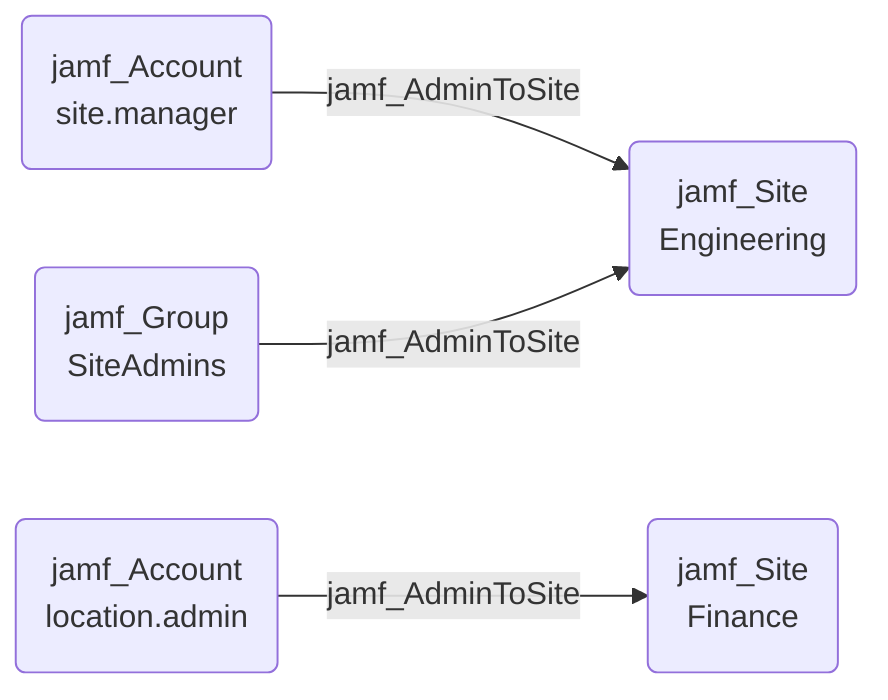

## Edge Schema

- Source: [jamf_Account](https://github.com/SpecterOps/bloodhound-docs/blob/main//opengraph/extensions/jamfhound/reference/nodes/jamf_account), [jamf_DisabledAccount](https://github.com/SpecterOps/bloodhound-docs/blob/main//opengraph/extensions/jamfhound/reference/nodes/jamf_disabledaccount), [jamf_Group](https://github.com/SpecterOps/bloodhound-docs/blob/main//opengraph/extensions/jamfhound/reference/nodes/jamf_group) 
- Destination: [jamf_Site](https://github.com/SpecterOps/bloodhound-docs/blob/main//opengraph/extensions/jamfhound/reference/nodes/jamf_site)
- Traversable: ✅

## General Information

The traversable `jamf_AdminToSite` edge represents administrative control over a specific Jamf Pro site. This edge is created when an account or group has "Site Access" access level and "Administrator" privilege set, granting control over all resources within that site including creating policies, managing devices, and administering site computers.

