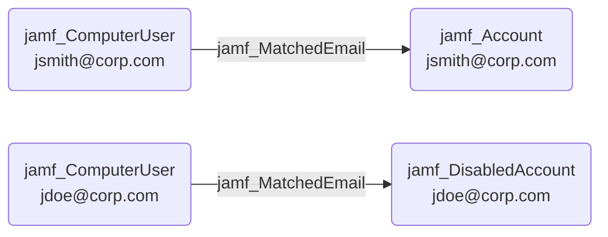

## Edge Schema

- Source: [jamf_ComputerUser](https://github.com/SpecterOps/bloodhound-docs/blob/main//opengraph/extensions/jamfhound/reference/nodes/jamf_computeruser) 
- Destination: [jamf_Account](https://github.com/SpecterOps/bloodhound-docs/blob/main//opengraph/extensions/jamfhound/reference/nodes/jamf_account), [jamf_DisabledAccount](https://github.com/SpecterOps/bloodhound-docs/blob/main//opengraph/extensions/jamfhound/reference/nodes/jamf_disabledaccount)
- Traversable: ✅

## General Information

The traversable `jamf_MatchedEmail` edge represents an identity correlation where the Jamf computer user's email attribute matches the Jamf account's email, indicating they are likely the same person. This links physical device access to Jamf administrative privileges.

