Represents a disabled Jamf Pro API client integration. Disabled API clients retain their role assignments but cannot authenticate. If re-enabled, they regain all assigned permissions.

> This node shares its property set with [jamf_ApiClient](https://github.com/SpecterOps/bloodhound-docs/blob/main//opengraph/extensions/jamfhound/reference/nodes/jamf_apiclient). The difference is that the client's `enabled` property is false.

## Created by

`process_api_client_nodes` in `lib/preprocess.py`

## Edges

<Note>
The tables below list edges defined by the JamfHound extension only. Additional edges to or from this node may be created by other extensions.
</Note>

### Inbound Edges

| Edge Type | Source Node Types | Traversable |
| --------- | ----------------- | ----------- |
| [jamf_Contains](https://github.com/SpecterOps/bloodhound-docs/blob/main//opengraph/extensions/jamfhound/reference/edges/jamf_contains) | [jamf_Tenant](https://github.com/SpecterOps/bloodhound-docs/blob/main//opengraph/extensions/jamfhound/reference/nodes/jamf_tenant), [jamf_Site](https://github.com/SpecterOps/bloodhound-docs/blob/main//opengraph/extensions/jamfhound/reference/nodes/jamf_site) | ✅ |

### Outbound Edges

| Edge Type | Destination Node Types | Traversable |
| --------- | ---------------------- | ----------- |
| [jamf_Create_API_Client_and_Assign_Role](https://github.com/SpecterOps/bloodhound-docs/blob/main//opengraph/extensions/jamfhound/reference/edges/jamf_create_api_client_and_assign_role) | [jamf_Tenant](https://github.com/SpecterOps/bloodhound-docs/blob/main//opengraph/extensions/jamfhound/reference/nodes/jamf_tenant) | ✅ |
| [jamf_Create_API_Client_and_Create_Role](https://github.com/SpecterOps/bloodhound-docs/blob/main//opengraph/extensions/jamfhound/reference/edges/jamf_create_api_client_and_create_role) | [jamf_Tenant](https://github.com/SpecterOps/bloodhound-docs/blob/main//opengraph/extensions/jamfhound/reference/nodes/jamf_tenant) | ✅ |
| [jamf_Create_API_Client_and_Update_Role](https://github.com/SpecterOps/bloodhound-docs/blob/main//opengraph/extensions/jamfhound/reference/edges/jamf_create_api_client_and_update_role) | [jamf_Tenant](https://github.com/SpecterOps/bloodhound-docs/blob/main//opengraph/extensions/jamfhound/reference/nodes/jamf_tenant) | ✅ |
| [jamf_CreateAccounts](https://github.com/SpecterOps/bloodhound-docs/blob/main//opengraph/extensions/jamfhound/reference/edges/jamf_createaccounts) | [jamf_Tenant](https://github.com/SpecterOps/bloodhound-docs/blob/main//opengraph/extensions/jamfhound/reference/nodes/jamf_tenant) | ✅ |
| [jamf_CreateAPIRoles](https://github.com/SpecterOps/bloodhound-docs/blob/main//opengraph/extensions/jamfhound/reference/edges/jamf_createapiroles) | [jamf_Tenant](https://github.com/SpecterOps/bloodhound-docs/blob/main//opengraph/extensions/jamfhound/reference/nodes/jamf_tenant) | ❌ |
| [jamf_CreateComputerExtensions](https://github.com/SpecterOps/bloodhound-docs/blob/main//opengraph/extensions/jamfhound/reference/edges/jamf_createcomputerextensions) | [jamf_Computer](https://github.com/SpecterOps/bloodhound-docs/blob/main//opengraph/extensions/jamfhound/reference/nodes/jamf_computer) | ✅ |
| [jamf_CreatePolicies](https://github.com/SpecterOps/bloodhound-docs/blob/main//opengraph/extensions/jamfhound/reference/edges/jamf_createpolicies) | [jamf_Computer](https://github.com/SpecterOps/bloodhound-docs/blob/main//opengraph/extensions/jamfhound/reference/nodes/jamf_computer) | ✅ |
| [jamf_ScriptsNonTraversable](https://github.com/SpecterOps/bloodhound-docs/blob/main//opengraph/extensions/jamfhound/reference/edges/jamf_scriptsnontraversable) | [jamf_Tenant](https://github.com/SpecterOps/bloodhound-docs/blob/main//opengraph/extensions/jamfhound/reference/nodes/jamf_tenant) | ❌ |
| [jamf_Update_Recurring_Scripts](https://github.com/SpecterOps/bloodhound-docs/blob/main//opengraph/extensions/jamfhound/reference/edges/jamf_update_recurring_scripts) | [jamf_Computer](https://github.com/SpecterOps/bloodhound-docs/blob/main//opengraph/extensions/jamfhound/reference/nodes/jamf_computer) | ✅ |
| [jamf_Update_Roles_Assigned_To_Self](https://github.com/SpecterOps/bloodhound-docs/blob/main//opengraph/extensions/jamfhound/reference/edges/jamf_update_roles_assigned_to_self) | [jamf_Tenant](https://github.com/SpecterOps/bloodhound-docs/blob/main//opengraph/extensions/jamfhound/reference/nodes/jamf_tenant) | ✅ |
| [jamf_Update_Self_and_Assign_Roles](https://github.com/SpecterOps/bloodhound-docs/blob/main//opengraph/extensions/jamfhound/reference/edges/jamf_update_self_and_assign_roles) | [jamf_Tenant](https://github.com/SpecterOps/bloodhound-docs/blob/main//opengraph/extensions/jamfhound/reference/nodes/jamf_tenant) | ✅ |
| [jamf_Update_Self_and_Create_Roles](https://github.com/SpecterOps/bloodhound-docs/blob/main//opengraph/extensions/jamfhound/reference/edges/jamf_update_self_and_create_roles) | [jamf_Tenant](https://github.com/SpecterOps/bloodhound-docs/blob/main//opengraph/extensions/jamfhound/reference/nodes/jamf_tenant) | ✅ |
| [jamf_Update_Self_and_Update_Roles](https://github.com/SpecterOps/bloodhound-docs/blob/main//opengraph/extensions/jamfhound/reference/edges/jamf_update_self_and_update_roles) | [jamf_Tenant](https://github.com/SpecterOps/bloodhound-docs/blob/main//opengraph/extensions/jamfhound/reference/nodes/jamf_tenant) | ✅ |
| [jamf_Update_SSO_Settings](https://github.com/SpecterOps/bloodhound-docs/blob/main//opengraph/extensions/jamfhound/reference/edges/jamf_update_sso_settings) | [jamf_SSOIntegration](https://github.com/SpecterOps/bloodhound-docs/blob/main//opengraph/extensions/jamfhound/reference/nodes/jamf_ssointegration), [jamf_Account](https://github.com/SpecterOps/bloodhound-docs/blob/main//opengraph/extensions/jamfhound/reference/nodes/jamf_account), [jamf_DisabledAccount](https://github.com/SpecterOps/bloodhound-docs/blob/main//opengraph/extensions/jamfhound/reference/nodes/jamf_disabledaccount), [jamf_Group](https://github.com/SpecterOps/bloodhound-docs/blob/main//opengraph/extensions/jamfhound/reference/nodes/jamf_group) | ✅ |
| [jamf_UpdateAccounts](https://github.com/SpecterOps/bloodhound-docs/blob/main//opengraph/extensions/jamfhound/reference/edges/jamf_updateaccounts) | [jamf_Tenant](https://github.com/SpecterOps/bloodhound-docs/blob/main//opengraph/extensions/jamfhound/reference/nodes/jamf_tenant) | ✅ |
| [jamf_UpdateComputerExtensions](https://github.com/SpecterOps/bloodhound-docs/blob/main//opengraph/extensions/jamfhound/reference/edges/jamf_updatecomputerextensions) | [jamf_Computer](https://github.com/SpecterOps/bloodhound-docs/blob/main//opengraph/extensions/jamfhound/reference/nodes/jamf_computer) | ✅ |
| [jamf_UpdatePolicies](https://github.com/SpecterOps/bloodhound-docs/blob/main//opengraph/extensions/jamfhound/reference/edges/jamf_updatepolicies) | [jamf_Computer](https://github.com/SpecterOps/bloodhound-docs/blob/main//opengraph/extensions/jamfhound/reference/nodes/jamf_computer) | ✅ |

## Properties

| Property Name | Data Type | Description |
|---|---|---|
| displayName | string | Display name of the API client |
| name | string | Name of the API client |
| enabled | boolean | Whether the API client is enabled (always false) |
| authorizationScopes | string[] | API roles assigned to this client |
| privileges | string[] | Resolved list of all privileges from assigned roles |
| Tier | integer | Security tier classification |

## Relationship Diagram

> **Note:** Some non-traversable edges have been omitted for clarity. The diagram shows all traversable edges and structurally important non-traversable edges.

```mermaid
flowchart TD
    DisabledApiClient[fa:fa-user-gear jamf_DisabledApiClient]
    Tenant[fa:fa-cloud jamf_Tenant]
    Computer[fa:fa-display jamf_Computer]

    DisabledApiClient -->|jamf_UpdateAccounts| Tenant
    DisabledApiClient -->|jamf_CreateAccounts| Tenant
    DisabledApiClient -->|jamf_CreatePolicies| Computer
    DisabledApiClient -->|jamf_UpdatePolicies| Computer
    DisabledApiClient -->|jamf_CreateComputerExtensions| Computer
    DisabledApiClient -->|jamf_UpdateComputerExtensions| Computer
    DisabledApiClient -->|jamf_Create_API_Client_and_Create_Role| Tenant
    DisabledApiClient -->|jamf_Create_API_Client_and_Update_Role| Tenant
    DisabledApiClient -->|jamf_Create_API_Client_and_Assign_Role| Tenant
    DisabledApiClient -->|jamf_Update_Self_and_Update_Roles| Tenant
    DisabledApiClient -->|jamf_Update_Self_and_Create_Roles| Tenant
    DisabledApiClient -->|jamf_Update_Self_and_Assign_Roles| Tenant
    DisabledApiClient -->|jamf_Update_Roles_Assigned_To_Self| Tenant
    DisabledApiClient -->|jamf_Update_Recurring_Scripts| Computer
    DisabledApiClient -.->|jamf_CreateAPIRoles| Tenant
    DisabledApiClient -.->|jamf_ScriptsNonTraversable| Tenant

    Tenant -->|jamf_Contains| DisabledApiClient

    style DisabledApiClient fill:#909090,stroke:#333,stroke-width:3px,color:#000
    style Tenant fill:#00C08D,stroke:#333,stroke-width:1px,color:#000
    style Computer fill:#D6001C,stroke:#333,stroke-width:1px,color:#fff
```

