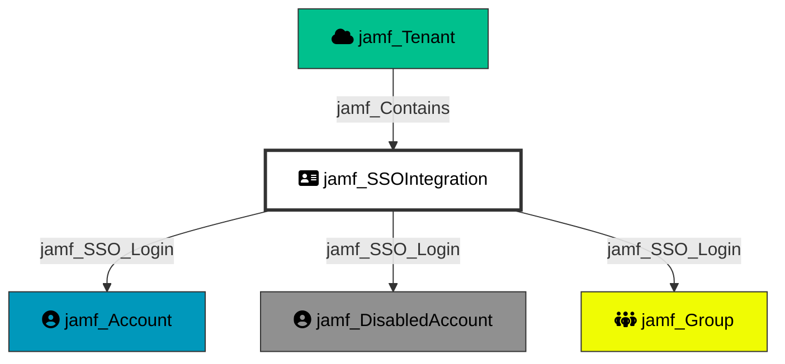

Represents the Single Sign-On (SSO) integration configured in the Jamf Pro tenant. When enabled, the SSO provider can map attributes to authenticate as any Jamf account or group, making it a Tier 0 node with significant security implications.

## Created by

`process_sso_node` in `lib/preprocess.py`

## Edges

<Note>
The tables below list edges defined by the JamfHound extension only. Additional edges to or from this node may be created by other extensions.
</Note>

### Inbound Edges

| Edge Type | Source Node Types | Traversable |
| --------- | ----------------- | ----------- |
| [jamf_Contains](https://github.com/SpecterOps/bloodhound-docs/blob/main//opengraph/extensions/jamfhound/reference/edges/jamf_contains) | [jamf_Tenant](https://github.com/SpecterOps/bloodhound-docs/blob/main//opengraph/extensions/jamfhound/reference/nodes/jamf_tenant), [jamf_Site](https://github.com/SpecterOps/bloodhound-docs/blob/main//opengraph/extensions/jamfhound/reference/nodes/jamf_site) | ✅ |
| [jamf_Update_SSO_Settings](https://github.com/SpecterOps/bloodhound-docs/blob/main//opengraph/extensions/jamfhound/reference/edges/jamf_update_sso_settings) | [jamf_Account](https://github.com/SpecterOps/bloodhound-docs/blob/main//opengraph/extensions/jamfhound/reference/nodes/jamf_account), [jamf_DisabledAccount](https://github.com/SpecterOps/bloodhound-docs/blob/main//opengraph/extensions/jamfhound/reference/nodes/jamf_disabledaccount), [jamf_Group](https://github.com/SpecterOps/bloodhound-docs/blob/main//opengraph/extensions/jamfhound/reference/nodes/jamf_group), [jamf_ApiClient](https://github.com/SpecterOps/bloodhound-docs/blob/main//opengraph/extensions/jamfhound/reference/nodes/jamf_apiclient), [jamf_DisabledApiClient](https://github.com/SpecterOps/bloodhound-docs/blob/main//opengraph/extensions/jamfhound/reference/nodes/jamf_disabledapiclient) | ✅ |

### Outbound Edges

| Edge Type | Destination Node Types | Traversable |
| --------- | ---------------------- | ----------- |
| [jamf_SSO_Login](https://github.com/SpecterOps/bloodhound-docs/blob/main//opengraph/extensions/jamfhound/reference/edges/jamf_sso_login) | [jamf_Account](https://github.com/SpecterOps/bloodhound-docs/blob/main//opengraph/extensions/jamfhound/reference/nodes/jamf_account), [jamf_DisabledAccount](https://github.com/SpecterOps/bloodhound-docs/blob/main//opengraph/extensions/jamfhound/reference/nodes/jamf_disabledaccount), [jamf_Group](https://github.com/SpecterOps/bloodhound-docs/blob/main//opengraph/extensions/jamfhound/reference/nodes/jamf_group) | ✅ |

## Properties

| Property Name | Data Type | Description |
|---|---|---|
| ssoEnabled | boolean | Whether SSO is enabled |
| idpUrl | string | Identity Provider URL |
| idpProviderType | string | Type of identity provider |
| entityId | string | SAML entity ID |
| groupAttributeName | string | Attribute name for group mapping |
| groupRdnKey | string | RDN key for group lookups |
| siteID | string | Site ID (always "-1" for global) |
| Tier | integer | Security tier classification (0) |
| name | string | Name of the SSO integration |
| enrollmentSsoConfig | string | Enrollment SSO configuration |

## Relationship Diagram

