Represents the top-level Jamf Pro tenant environment. This is the root container node for all Jamf resources.

## Created by

`prepare_graph` in `lib/preprocess.py`

## Edges

<Note>
The tables below list edges defined by the JamfHound extension only. Additional edges to or from this node may be created by other extensions.
</Note>

### Inbound Edges

| Edge Type | Source Node Types | Traversable |
| --------- | ----------------- | ----------- |
| [jamf_AdminTo](https://github.com/SpecterOps/bloodhound-docs/blob/main//opengraph/extensions/jamfhound/reference/edges/jamf_adminto) | [jamf_Account](https://github.com/SpecterOps/bloodhound-docs/blob/main//opengraph/extensions/jamfhound/reference/nodes/jamf_account), [jamf_DisabledAccount](https://github.com/SpecterOps/bloodhound-docs/blob/main//opengraph/extensions/jamfhound/reference/nodes/jamf_disabledaccount) | ✅ |
| [jamf_Create_API_Client_and_Assign_Role](https://github.com/SpecterOps/bloodhound-docs/blob/main//opengraph/extensions/jamfhound/reference/edges/jamf_create_api_client_and_assign_role) | [jamf_Account](https://github.com/SpecterOps/bloodhound-docs/blob/main//opengraph/extensions/jamfhound/reference/nodes/jamf_account), [jamf_DisabledAccount](https://github.com/SpecterOps/bloodhound-docs/blob/main//opengraph/extensions/jamfhound/reference/nodes/jamf_disabledaccount), [jamf_Group](https://github.com/SpecterOps/bloodhound-docs/blob/main//opengraph/extensions/jamfhound/reference/nodes/jamf_group), [jamf_ApiClient](https://github.com/SpecterOps/bloodhound-docs/blob/main//opengraph/extensions/jamfhound/reference/nodes/jamf_apiclient), [jamf_DisabledApiClient](https://github.com/SpecterOps/bloodhound-docs/blob/main//opengraph/extensions/jamfhound/reference/nodes/jamf_disabledapiclient) | ✅ |
| [jamf_Create_API_Client_and_Create_Role](https://github.com/SpecterOps/bloodhound-docs/blob/main//opengraph/extensions/jamfhound/reference/edges/jamf_create_api_client_and_create_role) | [jamf_Account](https://github.com/SpecterOps/bloodhound-docs/blob/main//opengraph/extensions/jamfhound/reference/nodes/jamf_account), [jamf_DisabledAccount](https://github.com/SpecterOps/bloodhound-docs/blob/main//opengraph/extensions/jamfhound/reference/nodes/jamf_disabledaccount), [jamf_Group](https://github.com/SpecterOps/bloodhound-docs/blob/main//opengraph/extensions/jamfhound/reference/nodes/jamf_group), [jamf_ApiClient](https://github.com/SpecterOps/bloodhound-docs/blob/main//opengraph/extensions/jamfhound/reference/nodes/jamf_apiclient), [jamf_DisabledApiClient](https://github.com/SpecterOps/bloodhound-docs/blob/main//opengraph/extensions/jamfhound/reference/nodes/jamf_disabledapiclient) | ✅ |
| [jamf_Create_API_Client_and_Update_Role](https://github.com/SpecterOps/bloodhound-docs/blob/main//opengraph/extensions/jamfhound/reference/edges/jamf_create_api_client_and_update_role) | [jamf_Account](https://github.com/SpecterOps/bloodhound-docs/blob/main//opengraph/extensions/jamfhound/reference/nodes/jamf_account), [jamf_DisabledAccount](https://github.com/SpecterOps/bloodhound-docs/blob/main//opengraph/extensions/jamfhound/reference/nodes/jamf_disabledaccount), [jamf_Group](https://github.com/SpecterOps/bloodhound-docs/blob/main//opengraph/extensions/jamfhound/reference/nodes/jamf_group), [jamf_ApiClient](https://github.com/SpecterOps/bloodhound-docs/blob/main//opengraph/extensions/jamfhound/reference/nodes/jamf_apiclient), [jamf_DisabledApiClient](https://github.com/SpecterOps/bloodhound-docs/blob/main//opengraph/extensions/jamfhound/reference/nodes/jamf_disabledapiclient) | ✅ |
| [jamf_CreateAccounts](https://github.com/SpecterOps/bloodhound-docs/blob/main//opengraph/extensions/jamfhound/reference/edges/jamf_createaccounts) | [jamf_Account](https://github.com/SpecterOps/bloodhound-docs/blob/main//opengraph/extensions/jamfhound/reference/nodes/jamf_account), [jamf_DisabledAccount](https://github.com/SpecterOps/bloodhound-docs/blob/main//opengraph/extensions/jamfhound/reference/nodes/jamf_disabledaccount), [jamf_Group](https://github.com/SpecterOps/bloodhound-docs/blob/main//opengraph/extensions/jamfhound/reference/nodes/jamf_group), [jamf_ApiClient](https://github.com/SpecterOps/bloodhound-docs/blob/main//opengraph/extensions/jamfhound/reference/nodes/jamf_apiclient), [jamf_DisabledApiClient](https://github.com/SpecterOps/bloodhound-docs/blob/main//opengraph/extensions/jamfhound/reference/nodes/jamf_disabledapiclient) | ✅ |
| [jamf_CreateAPIRoles](https://github.com/SpecterOps/bloodhound-docs/blob/main//opengraph/extensions/jamfhound/reference/edges/jamf_createapiroles) | [jamf_Account](https://github.com/SpecterOps/bloodhound-docs/blob/main//opengraph/extensions/jamfhound/reference/nodes/jamf_account), [jamf_DisabledAccount](https://github.com/SpecterOps/bloodhound-docs/blob/main//opengraph/extensions/jamfhound/reference/nodes/jamf_disabledaccount), [jamf_Group](https://github.com/SpecterOps/bloodhound-docs/blob/main//opengraph/extensions/jamfhound/reference/nodes/jamf_group), [jamf_ApiClient](https://github.com/SpecterOps/bloodhound-docs/blob/main//opengraph/extensions/jamfhound/reference/nodes/jamf_apiclient), [jamf_DisabledApiClient](https://github.com/SpecterOps/bloodhound-docs/blob/main//opengraph/extensions/jamfhound/reference/nodes/jamf_disabledapiclient) | ❌ |
| [jamf_ScriptsNonTraversable](https://github.com/SpecterOps/bloodhound-docs/blob/main//opengraph/extensions/jamfhound/reference/edges/jamf_scriptsnontraversable) | [jamf_Account](https://github.com/SpecterOps/bloodhound-docs/blob/main//opengraph/extensions/jamfhound/reference/nodes/jamf_account), [jamf_DisabledAccount](https://github.com/SpecterOps/bloodhound-docs/blob/main//opengraph/extensions/jamfhound/reference/nodes/jamf_disabledaccount), [jamf_Group](https://github.com/SpecterOps/bloodhound-docs/blob/main//opengraph/extensions/jamfhound/reference/nodes/jamf_group), [jamf_ApiClient](https://github.com/SpecterOps/bloodhound-docs/blob/main//opengraph/extensions/jamfhound/reference/nodes/jamf_apiclient), [jamf_DisabledApiClient](https://github.com/SpecterOps/bloodhound-docs/blob/main//opengraph/extensions/jamfhound/reference/nodes/jamf_disabledapiclient) | ❌ |
| [jamf_Update_API_Client_and_Assign_Role](https://github.com/SpecterOps/bloodhound-docs/blob/main//opengraph/extensions/jamfhound/reference/edges/jamf_update_api_client_and_assign_role) | [jamf_Account](https://github.com/SpecterOps/bloodhound-docs/blob/main//opengraph/extensions/jamfhound/reference/nodes/jamf_account), [jamf_DisabledAccount](https://github.com/SpecterOps/bloodhound-docs/blob/main//opengraph/extensions/jamfhound/reference/nodes/jamf_disabledaccount), [jamf_Group](https://github.com/SpecterOps/bloodhound-docs/blob/main//opengraph/extensions/jamfhound/reference/nodes/jamf_group) | ❌ |
| [jamf_Update_API_Client_and_Create_Roles](https://github.com/SpecterOps/bloodhound-docs/blob/main//opengraph/extensions/jamfhound/reference/edges/jamf_update_api_client_and_create_roles) | [jamf_Account](https://github.com/SpecterOps/bloodhound-docs/blob/main//opengraph/extensions/jamfhound/reference/nodes/jamf_account), [jamf_DisabledAccount](https://github.com/SpecterOps/bloodhound-docs/blob/main//opengraph/extensions/jamfhound/reference/nodes/jamf_disabledaccount), [jamf_Group](https://github.com/SpecterOps/bloodhound-docs/blob/main//opengraph/extensions/jamfhound/reference/nodes/jamf_group) | ❌ |
| [jamf_Update_API_Client_and_Update_Roles](https://github.com/SpecterOps/bloodhound-docs/blob/main//opengraph/extensions/jamfhound/reference/edges/jamf_update_api_client_and_update_roles) | [jamf_Account](https://github.com/SpecterOps/bloodhound-docs/blob/main//opengraph/extensions/jamfhound/reference/nodes/jamf_account), [jamf_DisabledAccount](https://github.com/SpecterOps/bloodhound-docs/blob/main//opengraph/extensions/jamfhound/reference/nodes/jamf_disabledaccount), [jamf_Group](https://github.com/SpecterOps/bloodhound-docs/blob/main//opengraph/extensions/jamfhound/reference/nodes/jamf_group) | ❌ |
| [jamf_Update_Roles_Assigned_To_Self](https://github.com/SpecterOps/bloodhound-docs/blob/main//opengraph/extensions/jamfhound/reference/edges/jamf_update_roles_assigned_to_self) | [jamf_ApiClient](https://github.com/SpecterOps/bloodhound-docs/blob/main//opengraph/extensions/jamfhound/reference/nodes/jamf_apiclient), [jamf_DisabledApiClient](https://github.com/SpecterOps/bloodhound-docs/blob/main//opengraph/extensions/jamfhound/reference/nodes/jamf_disabledapiclient) | ✅ |
| [jamf_Update_Self_and_Assign_Roles](https://github.com/SpecterOps/bloodhound-docs/blob/main//opengraph/extensions/jamfhound/reference/edges/jamf_update_self_and_assign_roles) | [jamf_ApiClient](https://github.com/SpecterOps/bloodhound-docs/blob/main//opengraph/extensions/jamfhound/reference/nodes/jamf_apiclient), [jamf_DisabledApiClient](https://github.com/SpecterOps/bloodhound-docs/blob/main//opengraph/extensions/jamfhound/reference/nodes/jamf_disabledapiclient) | ✅ |
| [jamf_Update_Self_and_Create_Roles](https://github.com/SpecterOps/bloodhound-docs/blob/main//opengraph/extensions/jamfhound/reference/edges/jamf_update_self_and_create_roles) | [jamf_ApiClient](https://github.com/SpecterOps/bloodhound-docs/blob/main//opengraph/extensions/jamfhound/reference/nodes/jamf_apiclient), [jamf_DisabledApiClient](https://github.com/SpecterOps/bloodhound-docs/blob/main//opengraph/extensions/jamfhound/reference/nodes/jamf_disabledapiclient) | ✅ |
| [jamf_Update_Self_and_Update_Roles](https://github.com/SpecterOps/bloodhound-docs/blob/main//opengraph/extensions/jamfhound/reference/edges/jamf_update_self_and_update_roles) | [jamf_ApiClient](https://github.com/SpecterOps/bloodhound-docs/blob/main//opengraph/extensions/jamfhound/reference/nodes/jamf_apiclient), [jamf_DisabledApiClient](https://github.com/SpecterOps/bloodhound-docs/blob/main//opengraph/extensions/jamfhound/reference/nodes/jamf_disabledapiclient) | ✅ |
| [jamf_UpdateAccounts](https://github.com/SpecterOps/bloodhound-docs/blob/main//opengraph/extensions/jamfhound/reference/edges/jamf_updateaccounts) | [jamf_Account](https://github.com/SpecterOps/bloodhound-docs/blob/main//opengraph/extensions/jamfhound/reference/nodes/jamf_account), [jamf_DisabledAccount](https://github.com/SpecterOps/bloodhound-docs/blob/main//opengraph/extensions/jamfhound/reference/nodes/jamf_disabledaccount), [jamf_Group](https://github.com/SpecterOps/bloodhound-docs/blob/main//opengraph/extensions/jamfhound/reference/nodes/jamf_group), [jamf_ApiClient](https://github.com/SpecterOps/bloodhound-docs/blob/main//opengraph/extensions/jamfhound/reference/nodes/jamf_apiclient), [jamf_DisabledApiClient](https://github.com/SpecterOps/bloodhound-docs/blob/main//opengraph/extensions/jamfhound/reference/nodes/jamf_disabledapiclient) | ✅ |
| [jamf_UpdateAPIRoles](https://github.com/SpecterOps/bloodhound-docs/blob/main//opengraph/extensions/jamfhound/reference/edges/jamf_updateapiroles) | [jamf_Account](https://github.com/SpecterOps/bloodhound-docs/blob/main//opengraph/extensions/jamfhound/reference/nodes/jamf_account), [jamf_DisabledAccount](https://github.com/SpecterOps/bloodhound-docs/blob/main//opengraph/extensions/jamfhound/reference/nodes/jamf_disabledaccount), [jamf_Group](https://github.com/SpecterOps/bloodhound-docs/blob/main//opengraph/extensions/jamfhound/reference/nodes/jamf_group) | ❌ |

### Outbound Edges

| Edge Type | Destination Node Types | Traversable |
| --------- | ---------------------- | ----------- |
| [jamf_Contains](https://github.com/SpecterOps/bloodhound-docs/blob/main//opengraph/extensions/jamfhound/reference/edges/jamf_contains) | [jamf_Account](https://github.com/SpecterOps/bloodhound-docs/blob/main//opengraph/extensions/jamfhound/reference/nodes/jamf_account), [jamf_DisabledAccount](https://github.com/SpecterOps/bloodhound-docs/blob/main//opengraph/extensions/jamfhound/reference/nodes/jamf_disabledaccount), [jamf_Group](https://github.com/SpecterOps/bloodhound-docs/blob/main//opengraph/extensions/jamfhound/reference/nodes/jamf_group), [jamf_Computer](https://github.com/SpecterOps/bloodhound-docs/blob/main//opengraph/extensions/jamfhound/reference/nodes/jamf_computer), [jamf_ComputerUser](https://github.com/SpecterOps/bloodhound-docs/blob/main//opengraph/extensions/jamfhound/reference/nodes/jamf_computeruser), [jamf_Site](https://github.com/SpecterOps/bloodhound-docs/blob/main//opengraph/extensions/jamfhound/reference/nodes/jamf_site), [jamf_ApiClient](https://github.com/SpecterOps/bloodhound-docs/blob/main//opengraph/extensions/jamfhound/reference/nodes/jamf_apiclient), [jamf_DisabledApiClient](https://github.com/SpecterOps/bloodhound-docs/blob/main//opengraph/extensions/jamfhound/reference/nodes/jamf_disabledapiclient), [jamf_SSOIntegration](https://github.com/SpecterOps/bloodhound-docs/blob/main//opengraph/extensions/jamfhound/reference/nodes/jamf_ssointegration) | ✅ |

## Properties

| Property Name | Data Type | Description |
|---|---|---|
| name | string | Domain name of the Jamf Pro tenant |
| type | string | Hosting type (cloud-hosted or on-premesis) |
| objectid | string | Unique identifier matching the tenant name |
| displayname | string | Display name of the Tenant |
| Tier | integer | Security tier classification |

## Relationship Diagram

> **Note:** Some non-traversable edges have been omitted for clarity. The diagram shows all traversable edges and structurally important non-traversable edges. Omitted edges include: `jamf_Update_API_Client_and_Update_Roles`, `jamf_Update_API_Client_and_Create_Roles`, `jamf_Update_API_Client_and_Assign_Role`, `jamf_CreateAPIRoles`, and `jamf_UpdateAPIRoles`.

```mermaid
flowchart TD
    Tenant[fa:fa-cloud jamf_Tenant]
    Account[fa:fa-circle-user jamf_Account]
    DisabledAccount[fa:fa-circle-user jamf_DisabledAccount]
    Group[fa:fa-people-group jamf_Group]
    ApiClient[fa:fa-user-gear jamf_ApiClient]
    DisabledApiClient[fa:fa-user-gear jamf_DisabledApiClient]

    Tenant -->|jamf_Contains| Tenant
    Account -->|jamf_AdminTo| Tenant
    DisabledAccount -->|jamf_AdminTo| Tenant
    Account -->|jamf_UpdateAccounts| Tenant
    DisabledAccount -->|jamf_UpdateAccounts| Tenant
    Group -->|jamf_UpdateAccounts| Tenant
    ApiClient -->|jamf_UpdateAccounts| Tenant
    DisabledApiClient -->|jamf_UpdateAccounts| Tenant
    Account -->|jamf_CreateAccounts| Tenant
    DisabledAccount -->|jamf_CreateAccounts| Tenant
    Group -->|jamf_CreateAccounts| Tenant
    ApiClient -->|jamf_CreateAccounts| Tenant
    DisabledApiClient -->|jamf_CreateAccounts| Tenant
    Account -->|jamf_Create_API_Client_and_Create_Role| Tenant
    Group -->|jamf_Create_API_Client_and_Create_Role| Tenant
    ApiClient -->|jamf_Create_API_Client_and_Create_Role| Tenant
    Account -->|jamf_Create_API_Client_and_Update_Role| Tenant
    Group -->|jamf_Create_API_Client_and_Update_Role| Tenant
    ApiClient -->|jamf_Create_API_Client_and_Update_Role| Tenant
    Account -->|jamf_Create_API_Client_and_Assign_Role| Tenant
    Group -->|jamf_Create_API_Client_and_Assign_Role| Tenant
    ApiClient -->|jamf_Create_API_Client_and_Assign_Role| Tenant
    ApiClient -->|jamf_Update_Self_and_Update_Roles| Tenant
    DisabledApiClient -->|jamf_Update_Self_and_Update_Roles| Tenant
    ApiClient -->|jamf_Update_Self_and_Create_Roles| Tenant
    DisabledApiClient -->|jamf_Update_Self_and_Create_Roles| Tenant
    ApiClient -->|jamf_Update_Self_and_Assign_Roles| Tenant
    DisabledApiClient -->|jamf_Update_Self_and_Assign_Roles| Tenant
    ApiClient -->|jamf_Update_Roles_Assigned_To_Self| Tenant
    DisabledApiClient -->|jamf_Update_Roles_Assigned_To_Self| Tenant
    Account -.->|jamf_ScriptsNonTraversable| Tenant
    DisabledAccount -.->|jamf_ScriptsNonTraversable| Tenant
    Group -.->|jamf_ScriptsNonTraversable| Tenant

    style Tenant fill:#00C08D,stroke:#333,stroke-width:3px,color:#000
    style Account fill:#0098BB,stroke:#333,stroke-width:1px,color:#000
    style DisabledAccount fill:#909090,stroke:#333,stroke-width:1px,color:#000
    style Group fill:#F0FC03,stroke:#333,stroke-width:1px,color:#000
    style ApiClient fill:#8803FC,stroke:#333,stroke-width:1px,color:#fff
    style DisabledApiClient fill:#909090,stroke:#333,stroke-width:1px,color:#000
```

