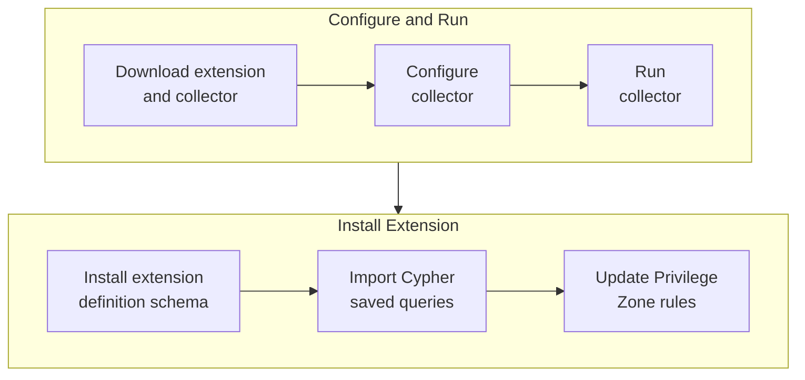
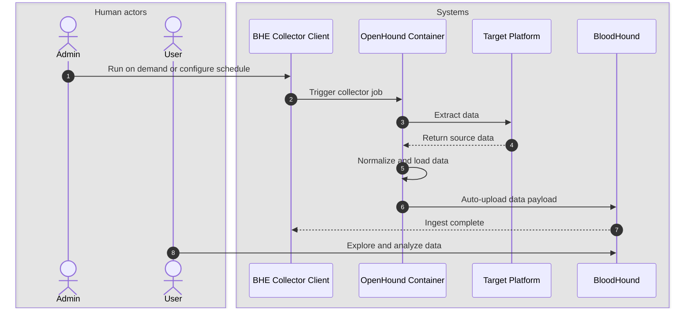
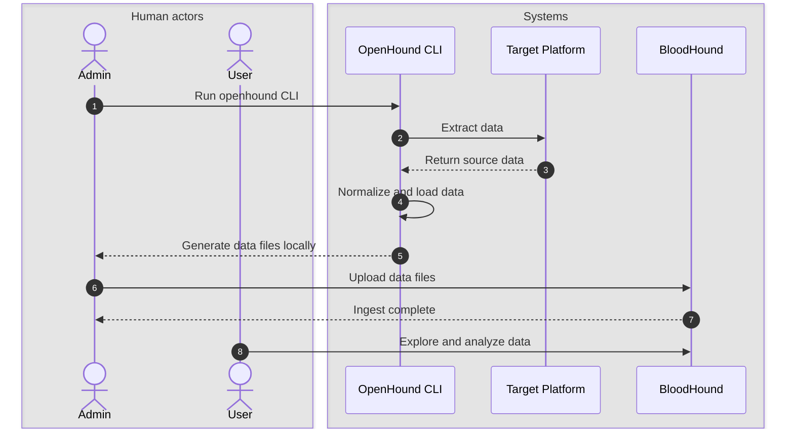

As described in the [OpenGraph Overview](https://github.com/SpecterOps/bloodhound-docs/blob/main//opengraph/overview), extensions that include an extension definition schema enrich collector-generated <Tooltip tip="The formatted data generated by an OpenGraph collector that you upload in BloodHound." cta="Learn more" href="/opengraph/developer/graph-data">data payloads</Tooltip> to produce structured graphs. Structured graphs enable enhanced features in BloodHound, such as pathfinding, findings, and metrics.

<Note>
  Extensions that do not include an extension definition schema produce generic graphs.
</Note>

Extensions can include the following components:

| Component | Description |
|---|---|
| **Extension definition schema** | A file that defines graph structure, including node types, edge types, traversability behavior, and visual configurations. Both BloodHound Community and BloodHound Enterprise use the same extension definition schema format. |
| **Collector** | A tool (for example, OpenHound, AzureHound, or SharpHound) that authenticates to a third-party platform, collects the data of interest, and packages it into a standardized data payload that BloodHound can ingest. |
| **Cypher saved queries** | Custom Cypher queries provided by extension developers. |
| **Privilege Zone rules** | Custom rules provided by extension developers to categorize nodes into Privilege Zones based on their properties and relationships. |
| **Findings** | Insights or observations provided by extension developers derived from the ingested data, which can be used to identify risk and remediation guidance. Findings are visible in BloodHound Enterprise only. |

SpecterOps has developed several extensions that follow this model, including:

<CardGroup cols={2}>
  <Card title="GitHub" icon="cubes" href="/opengraph/extensions/github/overview" horizontal iconType="solid">
    Visualize and analyze your GitHub configurations in BloodHound.
  </Card>

  <Card title="Jamf" icon="cubes" href="/opengraph/extensions/jamf/overview" horizontal iconType="solid">
    Visualize and analyze your Jamf configurations in BloodHound.
  </Card>

  <Card title="Okta" icon="cubes" href="/opengraph/extensions/okta/overview" horizontal iconType="solid">
    Visualize and analyze your Okta configurations in BloodHound.
  </Card>

  <Card title="SCIM" icon="cubes" href="/opengraph/extensions/scim/overview" horizontal iconType="solid">
    Visualize SCIM-provisioned users and groups as nodes in BloodHound.
  </Card>
</CardGroup>
<Note>
  Only users with the Administrator [role](https://github.com/SpecterOps/bloodhound-docs/blob/main//manage-bloodhound/auth/users-and-roles#user-role-definitions) can upload and delete extension definition schemas. Non-administrator users can view installed extensions, findings, and edges.
</Note>

### Before you begin

Complete the following steps before installing an extension or uploading structured graph data:

<Note>
  Only users with the Administrator [role](https://github.com/SpecterOps/bloodhound-docs/blob/main//manage-bloodhound/auth/users-and-roles#user-role-definitions) can manage extensions.
</Note>

<Steps>
	<Step title="Confirm OpenGraph Extension Management availability">
		The OpenGraph Extension Management feature must be enabled before you can manage extensions.
		
		Enable this feature on the **Administration** > **Early Access Features** page.

		<Note>
    	  Support for extension-defined **Findings** in BloodHound Enterprise is a SpecterOps-managed feature. If it is not enabled in your environment, contact your account team for assistance.
  		</Note>
	</Step>
	<Step title="Get extension artifacts">
		How you obtain extensions and collectors depends on your BloodHound edition and how they are distributed:

		- **BloodHound Community**: Users can download and use [publicly available](https://github.com/SpecterOps/bloodhound-docs/blob/main//opengraph/library) community-built extensions and collectors from GitHub repositories.

		- **BloodHound Enterprise**: Customers can also use publicly available extensions and collectors, but they may also acquire official SpecterOps-provided extensions. Official extensions include detailed findings and remediation guidance.
		
		  <Note>
		    Contact your account team for availability.
		  </Note>
	</Step>
	<Step title="Review prerequisites">
		After you obtain an extension and collector, review the prerequisites in the extension-specific setup documentation.
		
		For [OpenHound](https://github.com/SpecterOps/bloodhound-docs/blob/main//openhound/overview)-based collectors (GitHub, Jamf, and Okta), review edition-specific deployment information (Enterprise or Community) and the collector-specific documentation for details on permissions, platform API configuration, and deployment options.
	</Step>
</Steps>

### Workflow

The workflow for generic and structured OpenGraph data is largely the same. The main difference is that structured graphs require an Administrator to install the extension during initial setup. After that, users with read access can view installed extensions and use the resulting structured graph data, while only Administrators can upload or delete extension definition schemas. See [User Role Definitions](https://github.com/SpecterOps/bloodhound-docs/blob/main//manage-bloodhound/auth/users-and-roles#user-role-definitions) for a full breakdown of permissions.

<Note>
	For [OpenHound](https://github.com/SpecterOps/bloodhound-docs/blob/main//openhound/overview) collectors (GitHub, Jamf, and Okta), upload behavior depends on both deployment model and BloodHound edition. Only BloodHound Enterprise can accept payloads directly through the API. BloodHound Community requires manual file upload.
</Note>

#### Initial setup

The following diagram provides a high-level overview of the recommended workflow to prepare BloodHound for producing structured graphs from OpenGraph extensions.

The initial setup workflow is not strictly linear and not all steps are required. For example, importing Saved Queries and creating extension-specific Privilege Zone rules are optional.

<Note>
  For generic graphs, the workflow is minimal: users may optionally import Saved Queries (if any). Installing an extension definition schema and updating Privilege Zone rules is not required.
</Note>

#### Operational cycle

After initial setup, the following diagrams illustrate the recurring cycle of operations to keep extension data current.

For OpenHound collectors, upload behavior depends on edition and runtime model: Enterprise can ingest through the API (often automatic when using a collector client), while Community requires manual file upload from locally run collector executables.

The following diagrams illustrate the OpenHound workflow for both Enterprise and Community editions.

**BloodHound Enterprise (containerized)**

**BloodHound Community (CLI)**

### Install an extension

Installing an extension involves uploading the extension definition schema to BloodHound, which validates the schema and makes it available for use with compatible data payloads.

<Note>
  Only users with the Administrator [role](https://github.com/SpecterOps/bloodhound-docs/blob/main//manage-bloodhound/auth/users-and-roles#user-role-definitions) can upload and delete extension definition schemas.
</Note>

After installing, BloodHound produces structured graphs for data payloads that conform to the extension.

<Steps>
  <Step title="Open the OpenGraph Management page">
	In the left menu, click **Administration** > **OpenGraph Management**.
  </Step>
  <Step title="Upload the extension definition schema">
	1. Click **Upload File** to open a file system dialog or drag and drop an extension definition schema file onto the canvas.

	1. Click **Upload** to begin the schema installation and validation process.

	   
  </Step>
  <Step title="Confirm installation">
	Confirm the extension appears in the list of active extensions.

	<Note>
	You may need to refresh the page to see the newly installed extension in the list of active extensions.
	</Note>

	<Frame>
	  
	</Frame>
  </Step>
</Steps>

### Update an extension

Collectors and extensions are versioned separately to allow for more flexible updates, but this requires coordination to maintain compatibility and support. Follow these guidelines for managing updates:

- Do not update collectors independently without confirming extension definition schema compatibility.
- Update collectors and extension definition schemas together whenever possible.
- If you use SpecterOps-provided extensions or collectors, coordinate update cycles with your account team.

To update an extension, upload the new version using the same process as installing a new extension. BloodHound validates the new extension definition schema and replaces the old version with the new one.

### Delete an extension

Deleting an extension removes the extension definition schema from BloodHound, but leaves the underlying data intact. Associated data reverts to generic graphs—structured graph capabilities are no longer available—but you can still use node search and Cypher queries on the [Explore](https://github.com/SpecterOps/bloodhound-docs/blob/main//analyze-data/explore/search#search) page to explore the data.

If you want to delete the data associated with an extension, you can do so separately on the **Database Management** page.

To delete an extension, click the <Icon icon="trash"/> (trash) icon next to it in the list of active extensions and confirm the deletion in the prompt.

<Note>You cannot delete built-in extensions that come with BloodHound, but you can delete custom extensions that you have installed.</Note>

## Upload data

After an Administrator installs an extension, users can upload data payloads that conform to the extension definition schema and take advantage of structured graph capabilities in BloodHound.

For extensions that use OpenHound collectors (GitHub, Jamf, and Okta), AzureHound, or SharpHound, how data is uploaded depends on your BloodHound edition:

- **BloodHound Enterprise**: The collector client can upload data directly through the API. In containerized deployments, upload is typically automatic.
- **BloodHound Community**: After running the OpenHound, AzureHound, or SharpHound collector executables locally and generating data files, follow the manual upload steps below.

  <Note>
	For extensions that do not use OpenHound collectors, follow the manual upload steps below.
  </Note>

<Steps>
  <Step title="Upload data">
	Upload a data payload that conforms to the installed extension definition schema.

	1. In the left menu, click <Icon icon="arrow-up-from-bracket"/> **Quick Upload**.

	1. Click the **Upload File** canvas to open a file system dialog or drag and drop the data payload file(s) onto the canvas.

	1. Click **Upload** to begin the data ingestion and validation process.

	   <Tip>
	   The file either uploads successfully or fails in the modal. You can then go to the [File Ingest](https://github.com/SpecterOps/bloodhound-docs/blob/main//collect-data/enterprise-collection/monitor#file-ingest) page to review ingest and analysis progress.
	   </Tip>
  </Step>

  <Step title="Explore and analyze">
    Use the enhanced features enabled by the extension to explore and analyze your OpenGraph data in BloodHound.

	| Feature | Description |
	|---|---|
	| Pathfinding | Use [Pathfinding](https://github.com/SpecterOps/bloodhound-docs/blob/main//analyze-data/explore/search#pathfinding) to identify attack paths and analyze traversable relationships across all platforms and environments, including built-in and extension-defined kinds. |
	| Saved queries | [Import](https://github.com/SpecterOps/bloodhound-docs/blob/main//analyze-data/explore/cypher-search#import-and-export) extension-specific saved queries so you can quickly run pre-defined Cypher queries on the **Explore** page. |
	| Privilege Zone rules | If your Administrator configured extension-specific Privilege Zone [rules](https://github.com/SpecterOps/bloodhound-docs/blob/main//analyze-data/privilege-zones/rules) during initial setup, BloodHound automatically assigns matching nodes to zones, giving you clearer prioritization and zone-aware analysis. |
	| Findings and remediation | When available, use findings and remediation information to prioritize and address issues in your environment. |
  </Step>
</Steps>