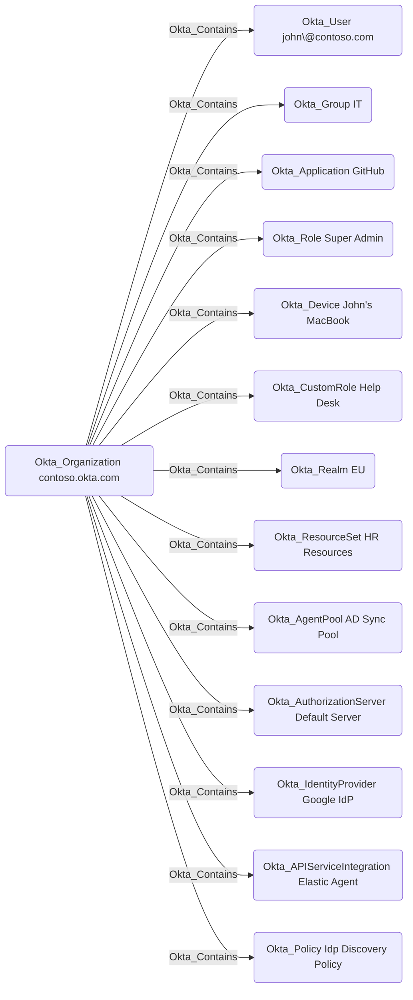

## Edge Schema

- Source: [Okta_Organization](https://github.com/SpecterOps/bloodhound-docs/blob/main//opengraph/extensions/okta/nodes/okta_organization)
- Destination: [Okta_User](https://github.com/SpecterOps/bloodhound-docs/blob/main//opengraph/extensions/okta/nodes/okta_user), [Okta_Group](https://github.com/SpecterOps/bloodhound-docs/blob/main//opengraph/extensions/okta/nodes/okta_group), [Okta_Device](https://github.com/SpecterOps/bloodhound-docs/blob/main//opengraph/extensions/okta/nodes/okta_device), [Okta_Application](https://github.com/SpecterOps/bloodhound-docs/blob/main//opengraph/extensions/okta/nodes/okta_application), [Okta_ApiServiceIntegration](https://github.com/SpecterOps/bloodhound-docs/blob/main//opengraph/extensions/okta/nodes/okta_apiserviceintegration), [Okta_ResourceSet](https://github.com/SpecterOps/bloodhound-docs/blob/main//opengraph/extensions/okta/nodes/okta_resourceset), [Okta_Role](https://github.com/SpecterOps/bloodhound-docs/blob/main//opengraph/extensions/okta/nodes/okta_role), [Okta_CustomRole](https://github.com/SpecterOps/bloodhound-docs/blob/main//opengraph/extensions/okta/nodes/okta_customrole), [Okta_RoleAssignment](https://github.com/SpecterOps/bloodhound-docs/blob/main//opengraph/extensions/okta/nodes/okta_roleassignment), [Okta_Realm](https://github.com/SpecterOps/bloodhound-docs/blob/main//opengraph/extensions/okta/nodes/okta_realm), [Okta_AgentPool](https://github.com/SpecterOps/bloodhound-docs/blob/main//opengraph/extensions/okta/nodes/okta_agentpool), [Okta_IdentityProvider](https://github.com/SpecterOps/bloodhound-docs/blob/main//opengraph/extensions/okta/nodes/okta_identityprovider), [Okta_AuthorizationServer](https://github.com/SpecterOps/bloodhound-docs/blob/main//opengraph/extensions/okta/nodes/okta_authorizationserver), [Okta_Policy](https://github.com/SpecterOps/bloodhound-docs/blob/main//opengraph/extensions/okta/nodes/okta_policy)
- Traversable: ✅

## General Information

The traversable Okta_Contains edges represent the containment relationships between the organization and other entities in Okta. The organization node will have Okta_Contains edges to all other nodes in the graph, with some exceptions.

