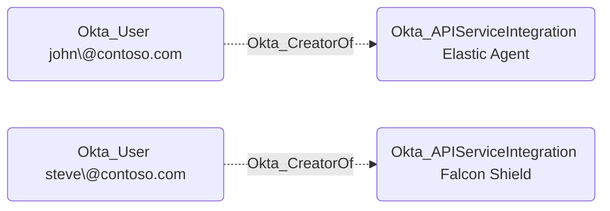

## Edge Schema

- Source: [Okta_User](https://github.com/SpecterOps/bloodhound-docs/blob/main//opengraph/extensions/okta/nodes/okta_user), [Okta_Application](https://github.com/SpecterOps/bloodhound-docs/blob/main//opengraph/extensions/okta/nodes/okta_application), [Okta_ApiServiceIntegration](https://github.com/SpecterOps/bloodhound-docs/blob/main//opengraph/extensions/okta/nodes/okta_apiserviceintegration)
- Destination: [Okta_ApiServiceIntegration](https://github.com/SpecterOps/bloodhound-docs/blob/main//opengraph/extensions/okta/nodes/okta_apiserviceintegration)
- Traversable: ❌

## General Information

The non-traversable `Okta_CreatorOf` edges represent the creator relationships between API Service Integration instances and users in Okta:

