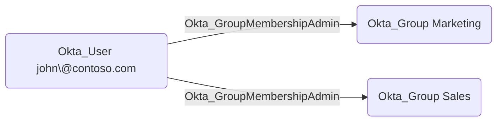

## Edge Schema

- Source: [Okta_User](https://github.com/SpecterOps/bloodhound-docs/blob/main//opengraph/extensions/okta/nodes/okta_user), [Okta_Group](https://github.com/SpecterOps/bloodhound-docs/blob/main//opengraph/extensions/okta/nodes/okta_group), [Okta_Application](https://github.com/SpecterOps/bloodhound-docs/blob/main//opengraph/extensions/okta/nodes/okta_application)
- Destination: [Okta_Group](https://github.com/SpecterOps/bloodhound-docs/blob/main//opengraph/extensions/okta/nodes/okta_group)
- Traversable: ✅

## General Information

The traversable Okta_GroupMembershipAdmin edges represent Group Membership Administrator role assignments. Group Membership Administrators can add and remove members from groups within their assigned scope but cannot modify the groups themselves.

