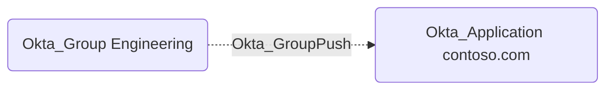

## Edge Schema

- Source: [Okta_Group](https://github.com/SpecterOps/bloodhound-docs/blob/main//opengraph/extensions/okta/nodes/okta_group)
- Destination: [Okta_Application](https://github.com/SpecterOps/bloodhound-docs/blob/main//opengraph/extensions/okta/nodes/okta_application)
- Traversable: ❌

## General Information

The non-traversable `Okta_GroupPush` edges represent the group push assignments to applications.
This indicates group provisioning and membership synchronization from Okta to external applications.

