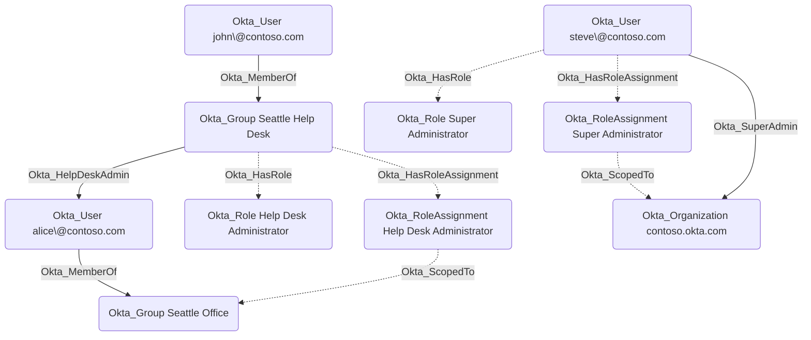

## Edge Schema

- Source: [Okta_User](https://github.com/SpecterOps/bloodhound-docs/blob/main//opengraph/extensions/okta/nodes/okta_user), [Okta_Group](https://github.com/SpecterOps/bloodhound-docs/blob/main//opengraph/extensions/okta/nodes/okta_group), [Okta_Application](https://github.com/SpecterOps/bloodhound-docs/blob/main//opengraph/extensions/okta/nodes/okta_application)
- Destination: [Okta_RoleAssignment](https://github.com/SpecterOps/bloodhound-docs/blob/main//opengraph/extensions/okta/nodes/okta_roleassignment)
- Traversable: ❌

## General Information

The Okta_HasRoleAssignment edges connect users, groups, and applications to their respective [Okta_RoleAssignment](https://github.com/SpecterOps/bloodhound-docs/blob/main//opengraph/extensions/okta/nodes/okta_roleassignment) nodes. The [Okta_ScopedTo](https://github.com/SpecterOps/bloodhound-docs/blob/main//opengraph/extensions/okta/edges/okta_scopedto) edges connect the [Okta_RoleAssignment](https://github.com/SpecterOps/bloodhound-docs/blob/main//opengraph/extensions/okta/nodes/okta_roleassignment) nodes to the resources they are scoped to, such as the organization or specific groups or applications.

