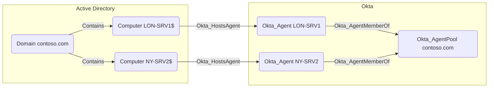

## Edge Schema

- Source: [Computer](https://github.com/SpecterOps/bloodhound-docs/blob/main//resources/nodes/computer)
- Destination: [Okta_Agent](https://github.com/SpecterOps/bloodhound-docs/blob/main//opengraph/extensions/okta/nodes/okta_agent)
- Traversable: ✅

## General Information

Hybrid Okta_HostsAgent edges connect an AD Computer node to the [Okta_Agent](https://github.com/SpecterOps/bloodhound-docs/blob/main//opengraph/extensions/okta/nodes/okta_agent) running on that host.

