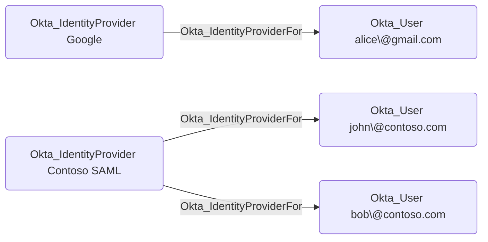

## Edge Schema

- Source: [Okta_IdentityProvider](https://github.com/SpecterOps/bloodhound-docs/blob/main//opengraph/extensions/okta/nodes/okta_identityprovider)
- Destination: [Okta_User](https://github.com/SpecterOps/bloodhound-docs/blob/main//opengraph/extensions/okta/nodes/okta_user)
- Traversable: ✅

## General Information

The traversable `Okta_IdentityProviderFor` edges represent the relationships between identity providers and the users who authenticate through them:

