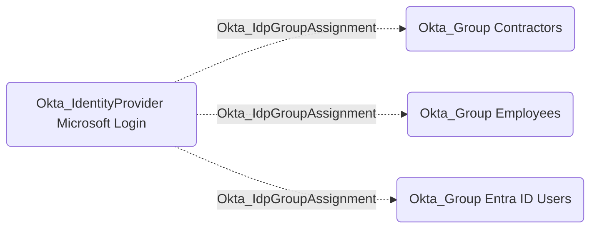

## Edge Schema

- Source: [Okta_IdentityProvider](https://github.com/SpecterOps/bloodhound-docs/blob/main//opengraph/extensions/okta/nodes/okta_identityprovider)
- Destination: [Okta_Group](https://github.com/SpecterOps/bloodhound-docs/blob/main//opengraph/extensions/okta/nodes/okta_group)
- Traversable: ❌

## General Information

The non-traversable Okta_IdpGroupAssignment edges represent groups automatically assigned to users based on identity provider attributes or user claims:

