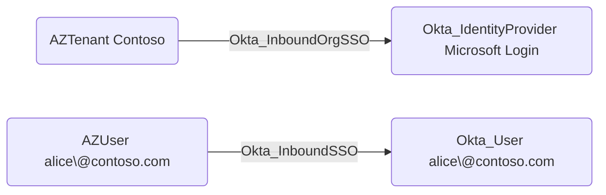

## Edge Schema

- Source: [AZUser](https://github.com/SpecterOps/bloodhound-docs/blob/main//resources/nodes/az-user)
- Destination: [Okta_User](https://github.com/SpecterOps/bloodhound-docs/blob/main//opengraph/extensions/okta/nodes/okta_user)
- Traversable: ✅

## General Information

The [Okta_InboundOrgSSO](https://github.com/SpecterOps/bloodhound-docs/blob/main//opengraph/extensions/okta/edges/okta_inboundorgsso) and Okta_InboundSSO hybrid edges connect external tenants and users to Okta entities:

