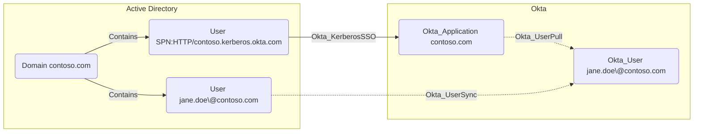

## Edge Schema

- Source: [User](https://github.com/SpecterOps/bloodhound-docs/blob/main//resources/nodes/user)
- Destination: [Okta_Application](https://github.com/SpecterOps/bloodhound-docs/blob/main//opengraph/extensions/okta/nodes/okta_application)
- Traversable: ✅

## General Information

Hybrid traversable Okta_KerberosSSO edges represent [agentless desktop SSO](https://help.okta.com/en-us/content/topics/directory/ad-dsso-about-workflow.htm) trust from an on-prem AD User account to an AD-backed [Okta_Application](https://github.com/SpecterOps/bloodhound-docs/blob/main//opengraph/extensions/okta/nodes/okta_application).

