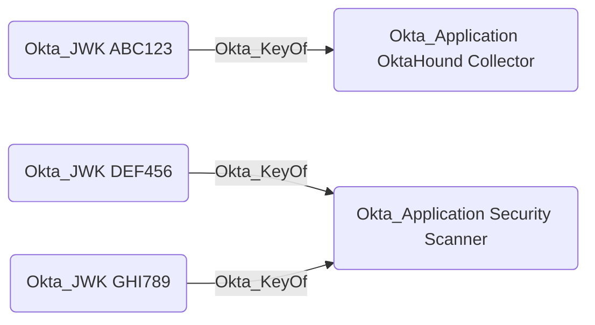

## Edge Schema

- Source: [Okta_JWK](https://github.com/SpecterOps/bloodhound-docs/blob/main//opengraph/extensions/okta/nodes/okta_jwk)
- Destination: [Okta_Application](https://github.com/SpecterOps/bloodhound-docs/blob/main//opengraph/extensions/okta/nodes/okta_application)
- Traversable: ✅

## General Information

The traversable `Okta_KeyOf` edges represent the relationships between applications ([Okta_Application](https://github.com/SpecterOps/bloodhound-docs/blob/main/../nodes/okta_application)) and their JWKs:

Possession of the private key corresponding to a JWK allows an attacker to authenticate as the application.
The `Okta_KeyOf` edge can be used in BloodHound to understand which applications use JWK-based authentication and trace potential attack paths involving compromised private keys.
