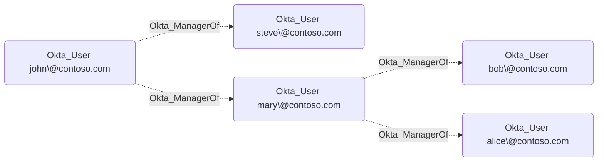

## Edge Schema

- Source: [Okta_User](https://github.com/SpecterOps/bloodhound-docs/blob/main//opengraph/extensions/okta/nodes/okta_user)
- Destination: [Okta_User](https://github.com/SpecterOps/bloodhound-docs/blob/main//opengraph/extensions/okta/nodes/okta_user)
- Traversable: ❌

## General Information

Okta uses the `Manager` and `ManagerId` user profile attributes to represent managerial relationships. Unfortunately, these attributes can have any arbitrary value and their referential integrity is not enforced by Okta. They are not even synchronized from external directories by default.

Our recommendation is to map the `ManagerId` attribute to the login of the manager in Okta. When synchronizing users from Active Directory,
the `getManagerUser("active_directory").login` mapping expression can be used to achieve this. Such values are automatically recognized by `OktaHound`.

The **non-traversable** `Okta_ManagerOf` edges represent the organizational structure in BloodHound:

