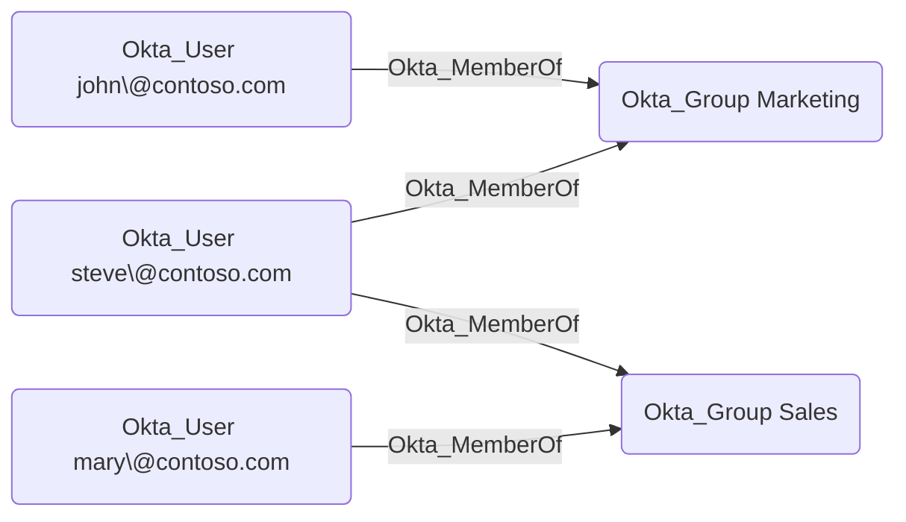

## Edge Schema

- Source: [Okta_User](https://github.com/SpecterOps/bloodhound-docs/blob/main//opengraph/extensions/okta/nodes/okta_user)
- Destination: [Okta_Group](https://github.com/SpecterOps/bloodhound-docs/blob/main//opengraph/extensions/okta/nodes/okta_group)
- Traversable: ✅

## General Information

The traversable Okta_MemberOf edges represent the membership relationships between users and groups in Okta:

